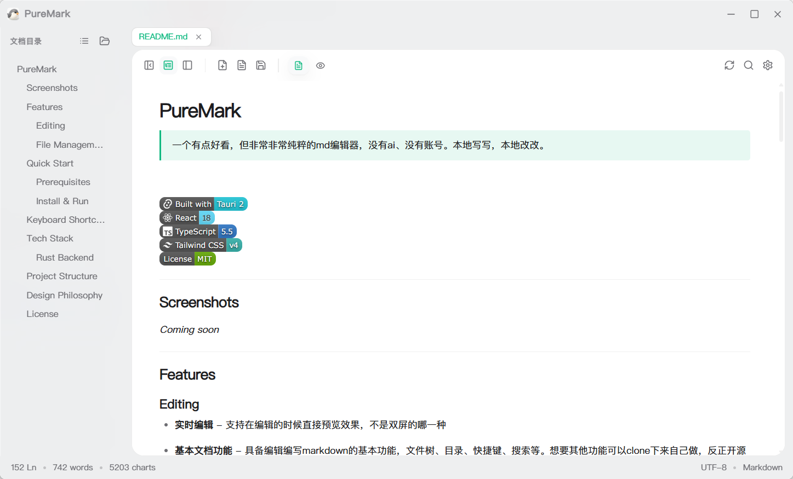

# PureMark

> 一个有点好看，但非常非常纯粹的md编辑器，没有ai、没有账号。本地写写，本地改改。

---

## Screenshots

---

## Features

### Editing

- **实时编辑** - 支持在编辑的时候直接预览效果，不是双屏的哪一种
- **基本文档功能** - 具备编辑编写markdown的基本功能，文件树、目录、快捷键、搜索等。想要其他功能可以clone下来自己做，反正开源的。
- **现代设计风格** - 卡片加亚克力材质，支持切换或自定义主题色
- **快捷键小设计** - 支持`Ctrl+D` 复制一行, `Alt+↑` / `Alt+↓` 上下行移动，copy idea来的

### File Management

- **文件树侧栏** — 只显示markdown文件
- **默认打开** — 支持设为windows打开markdown的默认app，macos没试过，因为主包还买不起
- **文件冲突** — 可以查看文件内容冲突，适合人和ai一起处理一个文档时使用
- **多种中文编码** — 自动匹配 GBK / GB2312 / GB18030 / Big5 / UTF-16

---

## Quick Start

### Prerequisites

- [Node.js](https://nodejs.org/) (v18+)
- [pnpm](https://pnpm.io/) (or npm)
- [Rust](https://www.rust-lang.org/tools/install) (for Tauri)

### Install & Run

```bash
# Clone the repository
git clone https://github.com/<your-username>/puremark.git
cd puremark

# Install dependencies
pnpm install

# Development mode (hot reload)
pnpm tauri dev

# Type check only
npx tsc -p tsconfig.app.json --noEmit

# Run tests
npx vitest run

# Production build
pnpm tauri build
```

The built executable will be in `src-tauri/target/release/`.

---

## Keyboard Shortcuts

| Shortcut | Action |
| --- | --- |
| `Ctrl+S` | Save file |
| `Ctrl+N` | New document |
| `Ctrl+W` | Close current tab |
| `Ctrl+F` | Open search panel |
| `Ctrl+D` | Duplicate current block |
| `Alt+↑` | Move block up |
| `Alt+↓` | Move block down |
| `Ctrl+R` / `F5` | Refresh (with dirty guard) |

---

## Tech Stack

| Layer | Technology |
| --- | --- |
| Desktop shell | [Tauri 2](https://tauri.app) (Rust + WebView2) |
| Frontend | [React 18](https://react.dev) + [TypeScript 5.5](https://www.typescriptlang.org) |
| Build | [Vite 5](https://vitejs.dev) |
| Styling | [Tailwind CSS v4](https://tailwindcss.com) (`@theme inline` token system) |
| Source editor | [CodeMirror 6](https://codemirror.net) |
| Live editor | [TipTap 2](https://tiptap.dev) / [ProseMirror](https://prosemirror.net) |
| State management | [Zustand](https://github.com/pmndrs/zustand) |
| Icons | [Lucide](https://lucide.dev) |
| Code highlighting | [highlight.js](https://highlightjs.org) (via lowlight) |
| Testing | [Vitest](https://vitest.dev) |

### Rust Backend

Custom Tauri commands:

- `build_tree` — recursive directory scan for Markdown files
- `read_text_auto` — encoding-aware text reading (GBK/Big5/UTF-16 auto-detection)
- `write_text_enc` — encoding-preserving text writing
- `write_binary_file` — binary file write (clipboard image saving)
- `take_launch_file` — retrieve file path from CLI argument (file association)

---

## Project Structure

```plaintext
prueMd/
├── src/                          # Frontend (React + TypeScript)
│   ├── components/
│   │   ├── Header/               # Custom titlebar + window controls
│   │   ├── Sidebar/              # File tree + TOC panel
│   │   ├── Workspace/            # TabBar, CodeEditor (CM6), MarkdownView (TipTap)
│   │   ├── dialogs/              # Search, Settings, Unsaved, Conflict resolution
│   │   └── ui/                   # Icon, Button, Select, Toggle primitives
│   ├── store/                    # Zustand stores (tabs, UI, config, panes)
│   ├── lib/                      # Pure logic (path, diff, search, TOC, theme, ...)
│   │   ├── cm/                   # CodeMirror 6 setup + theme + keymaps
│   │   └── prosemirror/          # TipTap extensions, serializer, block ops
│   ├── hooks/                    # React hooks (hotkeys, auto-save, theme, ...)
│   ├── commands/                 # Tauri command bridges (fs, dialog)
│   └── styles/                   # Global CSS + theme tokens
├── src-tauri/                    # Rust backend
│   ├── src/lib.rs                # Tauri commands + app builder
│   ├── capabilities/             # Permission configuration
│   └── tauri.conf.json           # Window / bundle / file association config
├── docs/                         # Design documents and user manual
└── public/                       # Static assets
```

---

## Design Philosophy

- **Local-first**: Your files are plain `.md` files on disk. No database, no vendor lock-in.
- **Minimal**: Clean UI with no distractions. The tool gets out of your way.
- **Performance**: Lightweight by design — marked for parsing, highlight.js for highlighting, no Electron bloat.
- **Byte-fidelity**: Source-preserving serializer ensures unchanged blocks are written back byte-identically.

---

## License

[MIT](LICENSE)