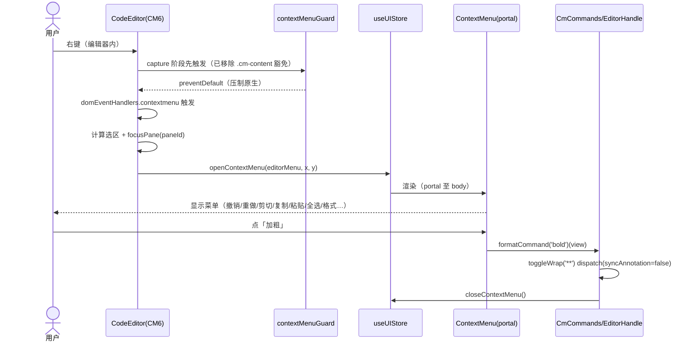
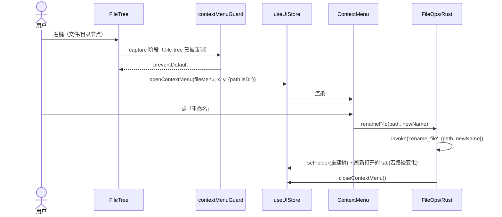
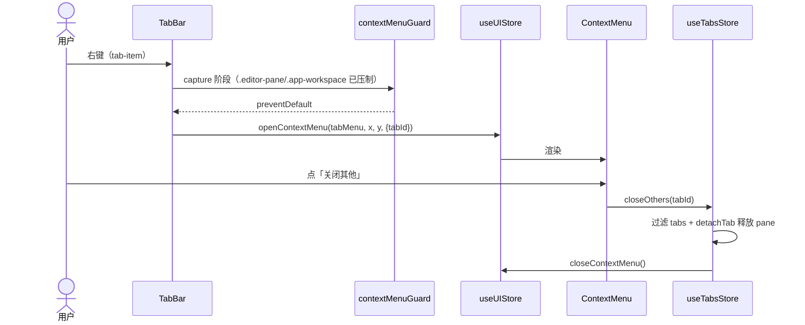
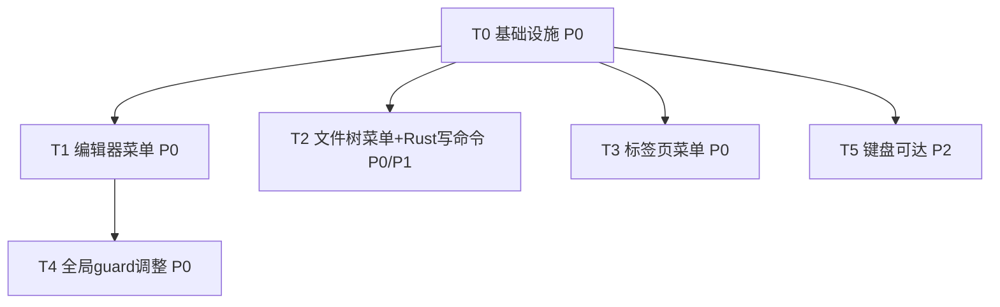

# 架构设计文档 · 禁用 WebView 右键菜单 + 自绘自定义菜单

> 阶段：架构设计（标准 SOP 架构阶段产出）
> 作者：高见远（Bob，架构师）
> 关联 PRD：`docs/PRD-禁用WebView右键菜单.md`
> 范围：PureMark「需求 2」——全面禁用 Tauri WebView 原生右键菜单，并在编辑器 / 文件树 / 标签页等需要表面提供自绘自定义上下文菜单
> 技术栈沿用：Tauri 2 + React 18 + CodeMirror 6（edit/live）+ ProseMirror/TipTap（live）+ Vite + Zustand + lucide-react（图标）
> 约定：本文档路径统一用正斜杠；所有新增/修改均基于已读真实源码（`contextMenuGuard.ts`、`App.tsx`、`CodeEditor.tsx`、`FileTree.tsx`、`TabBar.tsx`、`format.ts`、`cm/setup.ts`、`cm/markdownKeymap.ts`、`editorRegistry.ts`、`lib.rs`、`capabilities/default.json` 等）。
> 独立性声明：本需求与「需求 1（防脏写与刷新）」相互独立，本文档**不复用**需求 1 的结论，仅共享通用基础设施（store / 图标 / CM 扩展机制）。

---

## 1. 实现方案与框架选型

### 1.1 现状确认（基于真实代码）

- `src/lib/contextMenuGuard.ts`：`shouldSuppressContextMenu(target)` 在 capture 阶段 `preventDefault()` 抑制 `.app-workspace, .editor-pane, .file-tree, .pm-live` 的原生右键；EXEMPT 列表 `input, textarea, button, select, [contenteditable], .cm-content, .cm-editor` **保留原生菜单**（即编辑器内仍弹 CM/浏览器原生菜单）。`App.tsx` 已注册该 listener。
- `CodeEditor.tsx`：CM6 编辑器 `EditorView` 单次创建（`createEditorState` 在 `lib/cm/setup.ts`），通过 Compartment 动态 reconfigure；编辑命令经 `useDocSync` 的 `EditorHandle` 回写 store。
- `FileTree.tsx` / `TabBar.tsx`：当前**无任何 `onContextMenu`**；右键直接用全局 guard 抑制（无自定义菜单）。
- `format.ts`：已有 `applyFormat(command, value, sel)`，纯文本变换，编辑器格式项可直接复用（`markdownKeymap.ts` 用 `toggleWrap/toggleHeading/toggleLink` 经 CM 命令实现快捷键，可作为格式菜单项的实现参考）。
- `lib.rs`：仅 `build_tree` / `take_launch_file` 两个自定义命令；文件树写操作（重命名/删除/新建）**无命令**，需新增。
- `capabilities/default.json`：已含 `fs:allow-read-text-file` / `fs:allow-write-text-file`（path `**`）、`dialog:default` 等；新增 Rust 写命令需在此授权对应 `core` 权限（或直接用 `fs` plugin 能力，见 §6）。

### 1.2 关键设计决策（遵守用户已确认结论）

- **D1 — 输入框保留原生菜单**：搜索框 / 设置输入 / TOC 搜索等 `input, textarea, [contenteditable]` **不接管**，全局 guard 的 EXEMPT 列表**保留**这些选择器（结论 #1）。
- **D2 — 仅三类表面做自定义菜单**：编辑器（edit/live）、文件树、标签页（结论 #2）。预览窗格 `.pm-live` 仅禁用原生、不做自定义菜单（结论 #5）。
- **D3 — 编辑器接管方式**：不依赖全局 guard 弹菜单；改为在 CM6 扩展 `EditorView.domEventHandlers({ contextmenu })` 中 `preventDefault` + 弹出自定义 `ContextMenu`（结论 #2、PRD 风险 5）。全局 guard 同步**移除** `.cm-content` / `.cm-editor` 豁免，使编辑器内原生菜单被压制（结论 #6 / P0#1）。两者分工：guard 负责 capture 阶段 `preventDefault`（先于 CM），CM 扩展负责弹菜单。
- **D4 — 编辑器菜单命令走 CM**：撤销/重做/剪切/复制/粘贴/全选走 `@codemirror/commands` 的 `undo/redo/cut/copy/paste/selectAll`（保证 undo 栈与选区一致，结论 #6）；格式项复用 `markdownKeymap` 的 `toggleWrap/toggleHeading/toggleLink`（`applyFormat` 亦可作为备选，见 §7）。
- **D5 — 文件树写操作真实实现**：新增 Rust 命令 `rename_file` / `delete_file` / `create_file` / `create_dir`，并在 `capabilities` 授权（结论 #4）。
- **D6 — 菜单组件方案**：新增 `ContextMenu` 组件（portal 定位、受控于 `useUIStore.contextMenu` 字段），统一图标/禁用/分隔/子菜单；点击空白/滚动/Esc 关闭，视口翻转。输入框等表面不打开该 store（结论 #7）。

### 1.3 框架/库选型结论

- 菜单渲染：React 组件 + `createPortal` 到 `document.body`，定位用 `getBoundingClientRect` + 视口翻转；**不引入**新 UI 库。
- 状态：`useUIStore` 新增 `contextMenu: ContextMenuState | null`（轻量、与现有 searchOpen/configOpen 同范式），不新建独立 store（减少概念面）。
- 图标：复用 `src/components/ui/Icon.tsx`（lucide-react 受控集合），菜单项 `icon` 字段直接引用 `IconName`。
- 编辑器命令：复用 `@codemirror/commands`（`undo/redo/cut/copy/paste/selectAll`）+ `markdownKeymap` 的 `toggleWrap/toggleHeading/toggleLink`（导出为可调用命令）。
- 文件树写命令：新增 Rust 命令（见 §2），授权沿用现有 `fs(**)` 能力，新增命令本身无需额外 plugin（用 `std::fs` 实现）。

---

## 2. 文件列表（新增 + 修改）

| 相对路径 | 类型 | 职责 |
|---|---|---|
| `src/components/ContextMenu.tsx` | **新** | 受控自定义右键菜单组件：portal 定位、图标/禁用/分隔/子菜单、Esc/点击空白/滚动关闭、视口翻转 |
| `src/lib/contextMenuStore.ts` | **新**（或并入 `useUIStore`） | `ContextMenuState` 类型 + `openContextMenu(state)` / `closeContextMenu()` 动作（若并入 useUIStore 则本节省） |
| `src/types/index.ts` | 改 | 新增 `MenuItem`、`ContextMenuState`、`FileMenuTarget`、`TabMenuTarget` 等类型 |
| `src/store/useUIStore.ts` | 改 | 新增 `contextMenu: ContextMenuState \| null` 及 `openContextMenu` / `closeContextMenu` |
| `src/store/useTabsStore.ts` | 改 | 新增 `closeOthers(id)` / `closeRight(id)` / `closeLeft(id)` / `closeAll()`（标签页菜单需要） |
| `src/lib/contextMenuGuard.ts` | 改 | 移除 EXEMPT 中的 `.cm-content` / `.cm-editor`（编辑器改由 CM 扩展接管）；保留 `input/textarea/button/select/[contenteditable]`（D1）；其余表面继续压制原生 |
| `src/components/Workspace/CodeEditor.tsx` | 改 | 在 `createEditorState` 注入 `EditorView.domEventHandlers({ contextmenu })`：preventDefault + 读取选区/聚焦 pane + `openContextMenu(editorMenu)` |
| `src/lib/cm/markdownKeymap.ts` | 改（或新增导出） | 将 `toggleWrap/toggleHeading/toggleLink` 导出为可被菜单直接调用的 `Command`（如 `formatCommand(name): Command`），供 ContextMenu 复用 |
| `src/components/Sidebar/FileTree.tsx` | 改 | 文件/目录节点的 `onContextMenu` → `openContextMenu(fileMenu)`（含路径/isDir 信息） |
| `src/components/Workspace/TabBar.tsx` | 改 | `tab-item` 的 `onContextMenu` → `openContextMenu(tabMenu)`（含 tabId/路径） |
| `src/components/AppShell.tsx` | 改 | 挂载 `<ContextMenu />`（受 `useUIStore.contextMenu` 驱动，portal 至 body） |
| `src/lib/fileOps.ts` | **新** | 文件树写操作的 TS 封装：`renameFile` / `deleteFile` / `createFile` / `createDir` / `revealInExplorer` / `copyPath`（调用 Rust 命令 / clipboard） |
| `src/commands/fsCommands.ts` | 改 | 新增 `renameFile` / `deleteFile` / `createFile` / `createDir` / `revealInExplorer` 的 invoke 封装 |
| `src-tauri/src/lib.rs` | 改 | 新增 Rust 命令 `rename_file` / `delete_file` / `create_file` / `create_dir` / `reveal_in_explorer`，注册到 `invoke_handler` |
| `src-tauri/capabilities/default.json` | 改 | 为新增命令授权（见 §6） |

> 注：`src/lib/contextMenuStore.ts` 与并入 `useUIStore` 二选一；本设计选**并入 useUIStore**（与现有 overlay 状态一致，少一个文件）。下表任务分解按「并入 useUIStore」列出。

---

## 3. 数据结构与接口（类图）

```mermaid
classDiagram
    direction LR

    class MenuItem {
        +id: string
        +label: string
        +icon: IconName|null
        +shortcut: string|null
        +disabled: boolean
        +separator: boolean
        +submenu: MenuItem[]|null
        +run(): void
    }

    class ContextMenuState {
        +x: number
        +y: number
        +items: MenuItem[]
        +scope: 'editor'|'file'|'tab'
        +payload: object|null
    }

    class ContextMenu {
        +render()
        +positionWithFlip()
        +onClose()
    }

    class UseUIStore {
        +contextMenu: ContextMenuState|null
        +openContextMenu(state)
        +closeContextMenu()
    }

    class UseTabsStore {
        +closeTab(id)
        +closeOthers(id)
        +closeRight(id)
        +closeLeft(id)
        +closeAll()
    }

    class EditorHandle {
        +getValue(): string
        +getSelection(): {start,end}
        +replaceRange(from,to,insert,select?)
        +focus()
    }

    class CmCommands {
        +undo/view
        +redo/view
        +cut/view
        +copy/view
        +paste/view
        +selectAll/view
        +formatCommand(name): Command
    }

    class FileOps {
        +renameFile(path,newName)
        +deleteFile(path)
        +createFile(dir, name)
        +createDir(dir, name)
        +revealInExplorer(path)
        +copyPath(path)
    }

    class CodeEditor {
        +domEventHandlers(contextmenu)
    }

    class FileTree {
        +onContextMenu(node)
    }

    class TabBar {
        +onContextMenu(tab)
    }

    class ContextMenuGuard {
        +shouldSuppressContextMenu(target)
    }

    MenuItem "0..*" --* ContextMenuState : items
    ContextMenu ..> ContextMenuState : 读取
    ContextMenu ..> UseUIStore : 受控
    UseUIStore ..> ContextMenu : 驱动渲染
    CodeEditor ..> UseUIStore : openContextMenu(editor)
    FileTree ..> UseUIStore : openContextMenu(file)
    TabBar ..> UseUIStore : openContextMenu(tab)
    ContextMenuGuard ..> ContextMenu : 不接管输入/按钮(EXEMPT)
    CodeEditor ..> CmCommands : 命令
    CmCommands ..> EditorHandle : 操作视图
    FileTree ..> FileOps : 写操作
    FileOps ..> UseTabsStore : 刷新/树重建
    UseTabsStore ..> UseUIStore : setFolder(重建树)
```

**关键类型定义（伪代码）**
```ts
type IconName = keyof typeof Icons; // 复用 src/components/ui/Icon.tsx

interface MenuItem {
  id: string;
  label: string;
  icon?: IconName | null;
  shortcut?: string | null;
  disabled?: boolean;
  separator?: boolean;        // 为 true 时仅渲染分隔线
  submenu?: MenuItem[] | null;
  run?: () => void;           // separator 时为空
}

type MenuScope = 'editor' | 'file' | 'tab';

interface ContextMenuState {
  x: number;                 // 光标 clientX
  y: number;                 // 光标 clientY
  items: MenuItem[];
  scope: MenuScope;
  payload?: { path?: string; isDir?: boolean; tabId?: string } | null;
}
```

---

## 4. 程序调用流程（时序图）

### 4.1 编辑器右键菜单（edit / live）



### 4.2 文件树右键菜单（含 Rust 写命令）



### 4.3 标签页右键菜单



---

## 5. 任务列表（有序 + 依赖 + P 级）

> 规则遵守：≤5 个主任务已不满足（用户建议 T0–T5 共 6 个）；本需求用户**明确要求** T0→T5 的 6 段分解，故按用户指定拆分（属用户显式授权，优先于通用上限）。每任务 ≥3 文件，T0 为基础设施。

| 任务 | 名称 | 源文件 | 依赖 | 优先级 |
|---|---|---|---|---|
| **T0** | 基础设施：ContextMenu 组件 + 受控 store | `src/components/ContextMenu.tsx`、`src/store/useUIStore.ts`（contextMenu 字段+open/close）、`src/types/index.ts`（MenuItem/ContextMenuState）、`src/components/AppShell.tsx`（挂载 portal） | 无 | P0 |
| **T1** | 编辑器菜单（CM6 domEventHandlers 接管） | `src/components/Workspace/CodeEditor.tsx`（注入 contextmenu handler）、`src/lib/cm/markdownKeymap.ts`（导出 formatCommand）、`src/lib/cm/setup.ts`（可选：统一注入 handler 扩展） | T0 | P0 |
| **T2** | 文件树菜单 + Rust 写命令 | `src/components/Sidebar/FileTree.tsx`（onContextMenu）、`src/lib/fileOps.ts`（新建）、`src/commands/fsCommands.ts`（invoke 封装）、`src-tauri/src/lib.rs`（rename_file/delete_file/create_file/create_dir/reveal_in_explorer）、`src-tauri/capabilities/default.json`（授权） | T0 | P0（菜单壳）/P1（真实写命令，按结论#4 本期实现）|
| **T3** | 标签页菜单 | `src/components/Workspace/TabBar.tsx`（onContextMenu）、`src/store/useTabsStore.ts`（closeOthers/closeRight/closeLeft/closeAll） | T0 | P0 |
| **T4** | 全局 guard 调整（移除 .cm-content/.cm-editor 豁免、输入框保留原生） | `src/lib/contextMenuGuard.ts`（EXEMPT 调整）、`src/App.tsx`（注册不变，回归） | T1 | P0 |
| **T5** | 键盘可达 | `src/components/ContextMenu.tsx`（方向键导航 + Enter 触发 + Esc 关闭 + accent 高亮） | T0 | P2 |

### 任务依赖图



---

## 6. 依赖包列表

**基本无新增**（零新增 npm 依赖）：

- React / `createPortal`（已有）
- `@codemirror/commands`（`undo/redo/cut/copy/paste/selectAll`，已有）
- `@codemirror/view`（`EditorView.domEventHandlers`，已有）
- lucide-react（图标，已有）
- `zustand`（store，已有）

**Rust 侧改动（`src-tauri/src/lib.rs`）**：仅用标准库 `std::fs` / `std::process::Command` 实现新命令，**不引入**新 crate。

**capabilities 授权（`src-tauri/capabilities/default.json`）**：新增命令为自定义 `tauri::command`，默认受 `core:default` 的 `core:command:execute` 允许即可调用；写操作复用已授权的 `fs:allow-write-text-file`（`path: **`）。`reveal_in_explorer` 用 `std::process::Command` 直接 spawn `explorer`，无需 `shell` 插件。故 **default.json 改动极小**（仅确认命令在白名单，无需新增 permission 条目）。

---

## 7. 共享知识（跨文件约定）

1. **菜单项统一定义**：所有表面（编辑器/文件树/标签）的菜单项均为 `MenuItem[]`，经 `useUIStore.openContextMenu({x,y,items,scope,payload})` 打开，统一由 `<ContextMenu/>` 渲染。新增菜单只需构造 `MenuItem[]`，无需各自实现 UI。
2. **CM 命令映射（编辑器菜单）**：
   - 撤销 `undo`、重做 `redo`、全选 `selectAll`、剪切 `cut`、复制 `copy`、粘贴 `paste` —— 全部来自 `@codemirror/commands`，以 `Command` 形式作用于 focused `EditorView`。
   - 格式项：复用 `markdownKeymap.ts` 的 `toggleWrap`/`toggleHeading`/`toggleLink`，封装为 `formatCommand(name): Command`（bold→`**`、italic→`*`、strike→`~~`、code→`` ` ``、link→`toggleLink`、h1–h3→`toggleHeading(1..3)`）。这些命令 `dispatch` 时带 `syncAnnotation.of(false)`，与键盘快捷键完全一致 —— **保证 undo 栈/选区/分屏同步**。
   - 粘贴命令 `paste` 依赖 `navigator.clipboard` 权限（Tauri WebView 已授权）；若运行环境受限，回退为 `navigator.clipboard.readText()` + `view.dispatch(insert)`（保留 undo 栈）。
3. **focused pane 取视图**：菜单执行 CM 命令前需 `focusPane(paneId)` 并确保操作用户右键时的聚焦 pane；CM 命令作用在 `editorRegistry.getFocusedEditor()` 对应的 `EditorView` 上。
4. **Rust 写命令约定**：
   - `rename_file(path, new_name)`：对 `path` 的父目录执行 `std::fs::rename` 到新全路径；成功后前端需重建文件树并刷新「路径变化」的已打开 tab（或仅更新 tab.name/path）。
   - `delete_file(path)` / `delete_dir(path)`：`std::fs::remove_file` / `remove_dir_all`；删除前若对应 tab 打开，先经关闭守卫（复用需求 1 的 `requestCloseTab` 逻辑，或本期用原生确认）→ 关闭 tab → 重建树。
   - `create_file(dir, name)` / `create_dir(dir, name)`：`std::fs::write(dir/name, "")` / `create_dir`；成功后重建树并可选自动打开新建文件。
   - `reveal_in_explorer(path)`：`std::process::Command::new("explorer").args(["/select,", &path]).spawn()`（Windows）；非 Windows 可用 `open`/`xdg-open`。
5. **全局 guard 与 CM 分工（关键）**：`contextMenuGuard` 的 capture 监听**仅负责 `preventDefault`**（先于 CM）；编辑器内弹菜单由 CM 扩展的 `domEventHandlers.contextmenu` 负责。两者并存不冲突。EXEMPT 列表保留 `input, textarea, button, select, [contenteditable]`（输入框/按钮原生菜单保留，D1）；移除 `.cm-content` / `.cm-editor`（编辑器改由 CM 接管）。
6. **关闭行为复用**：文件树/标签的「关闭」类操作复用 `useTabsStore.closeTab` / `requestCloseTab`（后者含脏写确认）；新增的 `closeOthers/closeRight/closeLeft/closeAll` 内部对每项调用同一关闭路径，保证脏写守卫一致。
7. **菜单关闭时机**：点击菜单项、点击菜单外区域（`mousedown`/`click` 空白）、窗口滚动、按 `Esc` 均调用 `closeContextMenu()`；菜单打开时可选给 body 加 `contextmenu` 二次防护（避免再次触发全局 guard 弹重叠菜单）。

---

## 8. 待明确事项

- **Q-A**：`reveal_in_explorer`（在资源管理器中显示）的跨平台实现——本设计默认 Windows `explorer /select,"path"`；macOS/Linux 是否需支持？本期目标 Windows 为主，可仅实现 Windows 分支。
- **Q-B**：文件树「删除」是否复用需求 1 的脏写关闭守卫（`requestCloseTab`）做确认？本设计建议删除前对打开的 tab 走关闭守卫 + 二次 `confirm`（原生 `ask` 或自定义）；是否要自定义确认弹窗待定。
- **Q-C**：`rename_file` 后已打开 tab 的处理策略——（a）仅更新 `tab.name`/路径映射、（b）重新从磁盘读入内容。本设计默认（a）简单更新路径，避免误覆盖未保存改动；若路径变化导致内容不一致，交由需求 1 冲突检测兜底。
- **Q-D**：`paste` 命令在 Tauri WebView 的剪贴板权限是否稳定？若不确定，采用 `navigator.clipboard.readText()` 回退方案（见 §7.2）。
- **Q-E**：预览窗格（P1#7）本期是否实现？结论 #5 明确「暂不做自定义菜单，仅禁用原生」，故预览菜单推迟；如需「复制 / 复制 HTML」请告知。
- **Q-F**：菜单项是否随 accent 主题色高亮（P2#11）——本设计在 T5 预留 className 变量，具体配色随 `useConfigStore.accent` 接入。

---

## 9. 备选方案（仅作记录，不影响主设计）

> 用户未要求本需求提供「备选防冲突方案」（该要求仅针对需求 1）。此处仅列出 1 个与 PRD Q1 相关的可选路线，供参考：

- **输入框也做轻量自定义菜单（PRD P1#8）**：在搜索框/设置输入上提供含「粘贴/复制/剪切/全选」的自定义菜单，而非保留原生。结论 #1 已确定**保留原生**，故不采用；若未来用户改变主意，可在 `contextMenuGuard` 对 `input` 退出 EXEMPT 并单独构造输入框菜单（复用同一 `ContextMenu` 组件）。

---

> 文档结束。下阶段由 Engineer 依据 T0–T5 与 §7 共享知识实现；测试重点：编辑器右键走 CM 接管且原生被压制、输入框保留原生、文件树写命令真实生效并重建树、标签页关闭类操作、视口翻转与 Esc 关闭。
