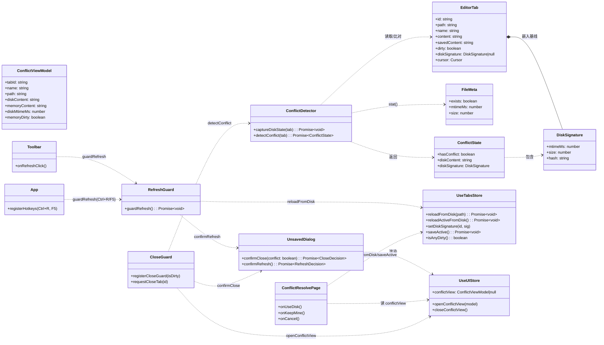
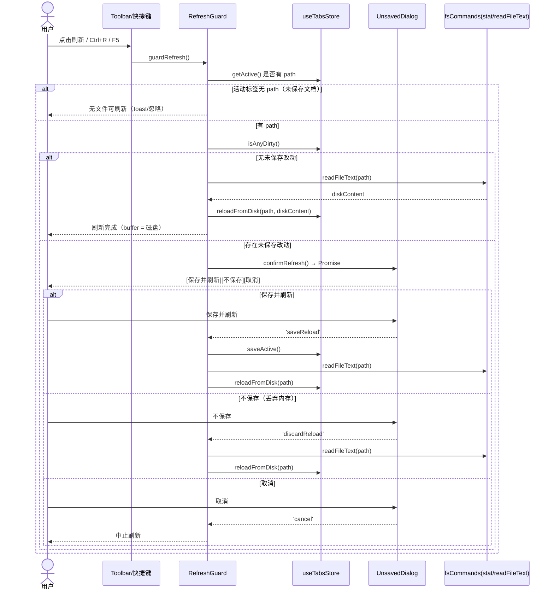
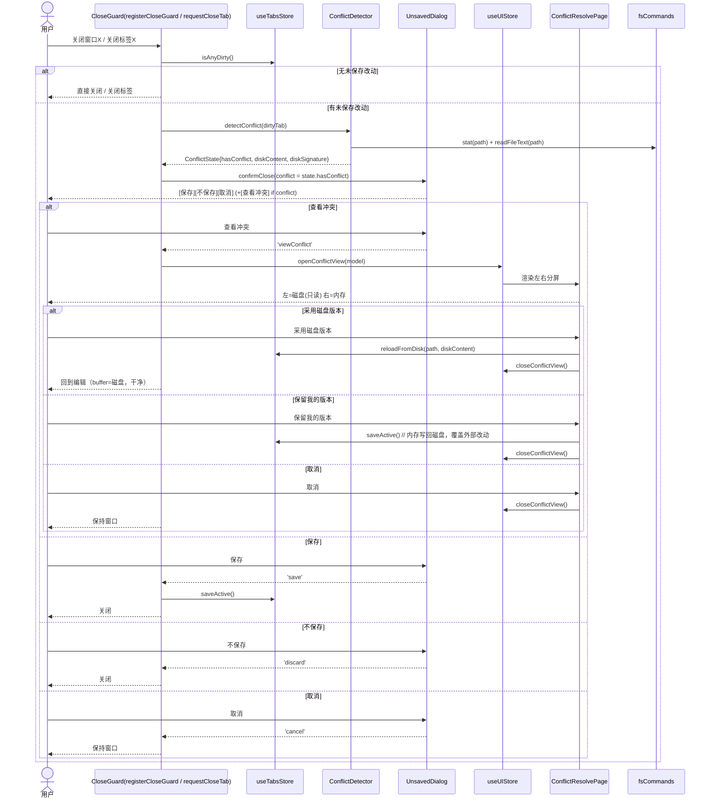
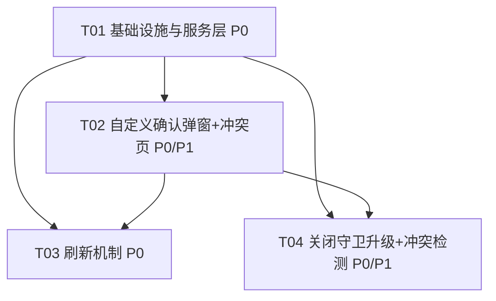

# 架构设计文档 · 防脏写与刷新 + 文件内容冲突解决

> 阶段：架构设计（标准 SOP 架构阶段产出）
> 作者：高见远（Bob，架构师）
> 关联 PRD：`docs/PRD-防脏写与刷新.md`
> 范围：PureMark「需求 1」——新增应用内刷新机制 + 刷新脏写守卫 +（P1）文件内容冲突检测与分屏解决
> 技术栈沿用：Tauri 2 + React 18 + CodeMirror 6（edit/live）+ ProseMirror/TipTap（live）+ Vite + Zustand
> 约定：本文档路径统一用正斜杠；所有新增/修改均基于已读真实源码（`src/lib/tauri.ts`、`closeGuard.ts`、`useTabsStore.ts`、`useHotkeys.ts`、`Toolbar.tsx`、`lib.rs` 等）。

---

## 1. 实现方案与框架选型

### 1.1 技术栈沿用（不引入新框架）

| 关注点 | 复用现有 | 说明 |
|---|---|---|
| 窗口/关闭守卫 | `src/lib/tauri.ts` 的 `registerCloseGuard` | 升级为「先检测冲突 → 自定义弹窗 → 决策」 |
| 标签关闭守卫 | `src/lib/closeGuard.ts` 的 `requestCloseTab` | 复用并升级为同一套确认弹窗 |
| 草稿自动保存 | `src/hooks/useAutoSave.ts` + `config.autoSave` | 保持「只写 store 草稿、不写原文件」语义 |
| 文件读写 | `src/commands/fsCommands.ts`（`readTextFile`/`writeTextFile`） | 刷新「从磁盘重载」直接复用 `readFileText` |
| 文件元信息 | `@tauri-apps/plugin-fs` 的 `stat()` | 取 `mtime`/`size`，**无需新增 Rust 命令** |
| 文本差异 | `src/lib/textDiff.ts` 的 `minimalChange` | 新增 `diffLines`（行级 LCS）供冲突页高亮 |
| 弹窗挂载 | `src/components/AppShell.tsx` + `useUIStore` overlay 模式 | 自定义确认弹窗/冲突页作为顶层 overlay |

### 1.2 关键设计决策（含与 PRD 的偏差说明，请用户拍板）

> ⚠️ **决策 D1 — 刷新语义：定为「从磁盘重载当前文档」，而非整窗 WebView reload。**
> PRD P0#1 原文倾向 `getCurrentWebview().reload()`（整窗刷新 + 草稿恢复），但用户已确认结论 #1 明确写「刷新按钮 = 刷新当前文档内容（从磁盘重载）」、结论 #2 明确「F5 不允许裸 WebView reload」。
> 二者冲突，本设计**以用户确认结论为准**，将「刷新 / Ctrl+R / F5」统一实现为：
> **重载当前活动文档 buffer（从磁盘读取覆盖内存）**，全程保留 React 状态（编辑器实例、撤销栈、分屏布局、草稿），不丢状态、不依赖整窗重启。
> 该决策会使 PRD 刷新流程里的「刷新」按钮与「不保存」语义重合——故刷新确认弹窗收敛为 **3 按钮**（见 §1.3 / §3）。若用户仍想要「整窗 reload」用于调试，列为 P2 可配置项（见 §8 待明确 Q-A）。

- **D2 — F5 / Ctrl+R 统一拦截，dev 不豁免。** 在 `useHotkeys` 的 keydown 监听中 `preventDefault()` 并路由到 `refreshGuard.guardRefresh()`；扩展 `matchHotkey` 支持无修饰键的 `F5`。开发环境同样拦截（与结论 #2 一致；Vite HMR 不受影响，仍可用于热更新调试）。
- **D3 — 冲突检测基线（diskSignature）。** 在「打开文件 / 保存成功」时快照 `{ mtimeMs, size, hash }`（`hash` 用 TS 内 FNV-1a，同步零依赖）。冲突判定 = `tab.dirty && 当前磁盘签名 ≠ 已存 diskSignature`。先用 `stat()` 的 `mtime+size` 做 O(1) 快检，不一致再读内容比对 `hash` 确认，避免误报（如某些编辑器保留 mtime）。
- **D4 — 冲突检测时机 = 关闭时。** 窗口 X（`onCloseRequested`）与标签 X（`requestCloseTab`）两条路径在「存在未保存改动」时都调用 `detectConflict`；命中冲突则在确认弹窗中追加「查看冲突」按钮，进入左右分屏冲突解决页。
- **D5 — 自定义确认弹窗升级。** `UnsavedDialog.tsx` 从「原生 `ask` 包装」升级为真实 React 组件，提供 promise 化 API：`confirmClose()` / `confirmRefresh()`，三态渲染（关闭 / 刷新 / 冲突）。视觉沿用现有亚克力/分割按钮风格。

### 1.3 框架/库选型结论

- **文件元信息**：优先 `@tauri-apps/plugin-fs` 的 `stat(path)` 取 `{ mtime, size }`。若该 API 在目标版本不含 mtime，则回退新增一个轻量 Rust 命令 `read_file_meta`（见 §8 Q-B）。
- **内容指纹**：TS 内 FNV-1a（同步、零依赖，避免 `crypto.subtle` 的异步成本）。
- **冲突分屏页**：左 = 磁盘版本（只读），右 = 内存版本（只读 + 可选手动合并编辑）；中间差异用新增的 `diffLines`（行级 LCS）高亮。不引入第三方 diff 库。
- **弹窗/overlay**：复用 `useUIStore` 的 overlay 模式，在 `AppShell` 顶层渲染 `UnsavedDialog` host 与 `ConflictResolvePage`，不新增路由。

---

## 2. 文件列表（新增 + 修改）

| 相对路径 | 类型 | 职责 |
|---|---|---|
| `src/types/index.ts` | 改 | `EditorTab` 增加 `diskSignature`；新增 `DiskSignature`、`ConflictViewModel`、`FileMeta`、`CloseDecision`、`RefreshDecision` 等类型 |
| `src/lib/fileHash.ts` | **新** | `fnv1a(str): string` 同步内容指纹 |
| `src/lib/conflictGuard.ts` | **新** | `captureDiskState(tab)`、`detectConflict(tab): Promise<ConflictState>`（基于 `stat()` + 内容 hash） |
| `src/lib/refreshGuard.ts` | **新** | `guardRefresh(): Promise<void>` 编排：脏写判定 → 调 `confirmRefresh` → 保存/丢弃 → `reloadFromDisk` |
| `src/store/useTabsStore.ts` | 改 | 新增 `reloadFromDisk(path)` / `reloadActiveFromDisk()` / `setDiskSignature(id, sig)`；`openTab`/`saveTab` 在读取/写入成功后写入 `diskSignature` |
| `src/store/useUIStore.ts` | 改 | 新增 `conflictView: ConflictViewModel \| null` 及 `openConflictView(model)` / `closeConflictView()` |
| `src/commands/fsCommands.ts` | 改 | 新增 `readFileMeta(path): Promise<FileMeta>`（包 `@tauri-apps/plugin-fs` 的 `stat()`） |
| `src/lib/textDiff.ts` | 改 | 新增 `diffLines(a, b): DiffLine[]`（行级 LCS，供冲突页差异高亮） |
| `src/components/dialogs/UnsavedDialog.tsx` | 改 | 升级为 React 组件；导出 `confirmClose()` / `confirmRefresh()`（promise）；三态：关闭`[保存/不保存/取消]`、刷新`[保存并刷新/不保存/取消]`、冲突时追加`[查看冲突]` |
| `src/components/dialogs/ConflictResolvePage.tsx` | **新** | 左右分屏冲突解决页：左=磁盘(只读)、右=内存(只读/可编辑)、差异高亮；动作`[采用磁盘版本][保留我的版本][取消]` |
| `src/components/AppShell.tsx` | 改 | 挂载 `UnsavedDialog` host 与 `ConflictResolvePage` overlay（受 `useUIStore` 控制） |
| `src/components/Workspace/Toolbar.tsx` | 改 | 在搜索框左侧新增「刷新」按钮，调用 `refreshGuard.guardRefresh()` |
| `src/hooks/useHotkeys.ts` | 改 | `matchHotkey` 支持无修饰键组合（如 `"F5"`）；`createHotkeyHandler` 同步放行 |
| `src/App.tsx` | 改 | `useHotkeys` 增加 `"Ctrl+R"` / `"F5"` → `guardRefresh`；`registerCloseGuard` 已在此注册（其实现在 T04 升级） |
| `src/lib/tauri.ts` | 改（T04） | `registerCloseGuard` 升级为：`isDirty → preventDefault → detectConflict → confirmClose（含查看冲突）→ destroy/保持` |
| `src/lib/closeGuard.ts` | 改（T04） | `requestCloseTab` 升级为：脏 → `detectConflict` → `confirmClose`（含查看冲突） |
| `src/components/Workspace/TabBar.tsx` | 改（T04） | 标签关闭按钮确认已走 `requestCloseTab`（确认调用链；升级后自动获得冲突检测） |

> 说明：`src-tauri/src/lib.rs` **默认无需改动**（用 `stat()` 走 plugin-fs）。仅当 `stat()` 不满足时新增 `read_file_meta`（见 §8 Q-B）。

---

## 3. 数据结构与接口（类图）



**关键类型定义（伪代码）**
```ts
interface DiskSignature { mtimeMs: number; size: number; hash: string; }
interface FileMeta { exists: boolean; mtimeMs: number; size: number; }
interface ConflictState { hasConflict: boolean; diskContent: string; diskSignature: DiskSignature; }
interface ConflictViewModel {
  tabId: string; name: string; path: string;
  diskContent: string; memoryContent: string;
  diskMtimeMs: number; memoryDirty: boolean;
}
type CloseDecision = 'save' | 'discard' | 'cancel' | 'viewConflict';
type RefreshDecision = 'saveReload' | 'discardReload' | 'cancel';
```

---

## 4. 程序调用流程（时序图）

### 4.1 刷新流程（工具栏按钮 / Ctrl+R / F5）



### 4.2 关闭时冲突检测与「查看冲突」流程



---

## 5. 任务列表（有序 + 依赖 + P 级）

> 规则遵守：≤5 个任务；每任务 ≥3 文件；T01 为基础设施；尽量仅依赖 T01。

| 任务 | 名称 | 源文件 | 依赖 | 优先级 |
|---|---|---|---|---|
| **T01** | 基础设施与服务层（类型 + 存储扩展 + 冲突/刷新服务 + 文件元信息 + hash + diffLines） | `src/types/index.ts`、`src/lib/fileHash.ts`、`src/lib/conflictGuard.ts`、`src/lib/refreshGuard.ts`、`src/store/useTabsStore.ts`、`src/store/useUIStore.ts`、`src/commands/fsCommands.ts`、`src/lib/textDiff.ts` | 无 | P0 |
| **T02** | 自定义确认弹窗 + 冲突解决页（UnsavedDialog 升级为 React 组件；三态；冲突分屏页） | `src/components/dialogs/UnsavedDialog.tsx`、`src/components/dialogs/ConflictResolvePage.tsx`、`src/components/AppShell.tsx`、`src/lib/textDiff.ts`(diffLines) | T01 | P0（关闭弹窗）/ P1（冲突页）|
| **T03** | 刷新机制（toolbar 刷新按钮 + Ctrl+R/F5 拦截 + guardRefresh 接入） | `src/components/Workspace/Toolbar.tsx`、`src/App.tsx`、`src/hooks/useHotkeys.ts`、`src/lib/refreshGuard.ts`(接入 dialog) | T01, T02 | P0 |
| **T04** | 关闭守卫升级 + 冲突检测接入（registerCloseGuard / requestCloseTab 升级，关闭时 detectConflict，查看冲突） | `src/lib/tauri.ts`、`src/lib/closeGuard.ts`、`src/components/Workspace/TabBar.tsx` | T01, T02 | P0 |

### 任务依赖图



---

## 6. 依赖包列表

**基本无新增。** 全部复用既有依赖：

- `@tauri-apps/api`（窗口/事件，已有）
- `@tauri-apps/plugin-fs`（含 `stat()`，已有，用于 `readFileMeta`）
- `@tauri-apps/plugin-dialog`（已有，仅保留备用；确认弹窗改为 React 组件后不再用原生 `ask`）
- `zustand`（已有，store 扩展）
- `react` / `react-dom`（已有）

> 如 `@tauri-apps/plugin-fs` 的 `stat()` 在目标版本不返回 `mtime`（见 §8 Q-B），则需在 `src-tauri` 新增 `read_file_meta` Rust 命令并注册到 `invoke_handler`（仍为零新增 npm 依赖）。

---

## 7. 共享知识（跨文件约定）

1. **刷新与自动保存草稿如何配合**：刷新采用「从磁盘重载当前文档」（D1），不重启整窗，因此**不依赖草稿恢复**。自动保存草稿（`useAutoSave` 写 `drafts`）继续作为崩溃/意外退出时的兜底。**明确语义**：`reloadFromDisk` 用磁盘内容覆盖内存并置 `dirty=false`；为避免「草稿里还有旧改动」造成困惑，执行 `reloadFromDisk` 后**清除该 path 的草稿**（与 `saveTab` 清草稿一致）。用户若想找回被丢弃的改动，仍可在关闭前从草稿恢复——但刷新动作本身是显式「接受磁盘版本」。
2. **冲突检测时机与基线**：仅在「关闭（窗口 X / 标签 X）且存在未保存改动」时调用 `detectConflict`；基线 `diskSignature` 在 `openTab`（读盘后）与 `saveTab`（写盘成功后）写入。检测用 `stat()` 的 `mtime+size` 快检 + 内容 `hash` 确认，只对 `path` 非空且 `dirty` 的 tab 进行。
3. **F5 / Ctrl+R 拦截与 dev 策略**：在 `useHotkeys` 全局 keydown 中拦截，统一 `preventDefault()` 后走 `guardRefresh`；**dev 环境同样拦截不放行**（结论 #2）。Vite HMR 不受 F5 拦截影响，开发热更新照常可用。
4. **刷新按钮位置**：位于 `Toolbar.tsx` 搜索框（`Search` 按钮）**左侧**，标题「刷新 (Ctrl+R)」，调用 `refreshGuard.guardRefresh()`。
5. **冲突页交互约定**：左=磁盘版本（只读），右=内存版本（默认只读，进阶可编辑以手工合并）。`[采用磁盘版本]`→`reloadFromDisk`；`[保留我的版本]`→`saveActive`（覆盖外部改动）；`[取消]`→回到编辑/保持窗口。冲突页为顶层 overlay，由 `useUIStore.conflictView` 驱动。
6. **弹窗 promise 化**：`confirmClose` / `confirmRefresh` 返回 `Promise<Decision>`，由 `UnsavedDialog` 组件在 `AppShell` 挂载、通过 `useUIStore`（或模块级 resolver）兑现；守卫逻辑 `await` 该 promise 后继续 `destroy()` / 关闭标签 / 保持。
7. **分屏双窗格天然覆盖**：`isAnyDirty()` 为 tab 级、双窗格共享同一 buffer，冲突/脏写检测无需针对窗格额外处理（沿用 PRD 现状结论）。

---

## 8. 待明确事项

- **Q-A（关键，需用户拍板）**：刷新语义确认为「从磁盘重载当前文档」（D1）而非 PRD P0#1 的整窗 `getCurrentWebview().reload()`。若用户坚持要整窗 reload 用于调试，请告知，否则按 D1 实现，并将「整窗 reload」降级为 P2 设置项。
- **Q-B**：`@tauri-apps/plugin-fs` 的 `stat()` 在目标 Tauri 版本是否返回 `mtime`（毫秒）。若否，需在 `lib.rs` 新增 `read_file_meta` 命令（无 npm 新增）。
- **Q-C**：`reloadFromDisk` 后是否清除自动保存草稿 —— 本设计默认「清除该 path 草稿」（见 §7.1），如希望保留草稿请告知。
- **Q-D**：冲突页「保留我的版本」是否直接写盘覆盖外部改动 —— 本设计默认「直接写盘」（覆盖外部修改），如希望先备份原外部版本请告知。
- **Q-E**：是否在 `saveActive`（保存）时也检测磁盘冲突，提示「磁盘已被外部改动，保存将覆盖」？本设计仅在关闭时检测；若需保存时也防覆盖，请告知（属增强）。
- **Q-F**：「刷新」确认弹窗收敛为 3 按钮（保存并刷新 / 不保存 / 取消），PRD 原文刷新流程为 4 按钮（含冗余「刷新」）。按 D1 语义已无「刷新」独立含义，故合并；如用户希望保留 4 按钮布局请告知。

---

## 9. 备选防冲突方案（供用户二选一）

用户要求提出「更好的防冲突解决方案」备选。以下对比**已确认方案（方案 A，被动式）**与**我推荐的备选方案（方案 B，主动式）**。

### 方案 A — 被动式 / 关闭时检测（本次已确认实现）
- **机制**：仅在用户触发关闭（窗口 X / 标签 X）且存在未保存改动时，比对 `diskSignature` 与当前磁盘，命中冲突才弹「查看冲突」。
- **优点**：实现简单（仅关闭路径接入 `detectConflict`）；无后台资源；与现有关闭守卫完全复用。
- **缺点**：发现太晚——用户往往在即将关闭时才知晓外部已改，此前可能已基于旧内容继续编辑，记忆混淆、易误选；错过「即时合并外部改动」的最佳时机。

### 方案 B — 主动式 / 文件监视（我推荐的更好方案）
- **机制**：打开文件后用后台文件监视（Rust `notify` 或 `@tauri-apps/plugin-fs` 的 watch）监听该 path；当磁盘 `mtime` 变化且 tab `dirty` 时，**立即**在界面顶部/状态栏弹出非阻塞提示条：「文件已在外部被修改」，提供 `[查看冲突][重新加载][忽略]`。用户可随时解决，不必等到关闭。
- **优点**：体验类 VS Code，实时、友好；外部改动第一时间可见，合并/取舍更可控；「查看冲突」入口更自然（不止于关闭弹窗）。
- **缺点**：需新增后台 watcher（Rust `notify` 依赖或 plugin-fs watch），多文件监听有少量开销；需处理「编辑器自身保存触发的 mtime 变化」造成的误报（需去抖 + 排除自身写入——本设计已有 `diskSignature` 基线可天然区分自身保存）；复杂度高于 A。

### 对比表

| 维度 | 方案 A（已确认，被动） | 方案 B（备选，主动·推荐） |
|---|---|---|
| 发现时机 | 关闭时 | 外部改动即时 |
| 实现复杂度 | 低（仅关闭路径） | 中（后台 watcher + 去抖） |
| 资源占用 | 无 | 低（每打开文件一个 watch） |
| 用户体验 | 一般（晚） | 优（实时，类 VS Code） |
| 误报风险 | 低 | 中（需排除自身保存，已有基线可解） |
| 新增依赖 | 无 | 可能 `@tauri-apps/plugin-fs` watch 或 Rust `notify` |

**建议**：若本需求追求最小改动与最快上线，采用 **方案 A**（已确认）。若希望一步到位、体验最佳，推荐 **方案 B**——可与方案 A 共存（B 提供实时提示，A 作为关闭时的最后兜底）。请用户选择：A / B / A+B。

---

> 文档结束。下阶段由 Engineer 依据 T01–T04 与 §7 共享知识实现；测试重点：F5/Ctrl+R 拦截、刷新脏写守卫、关闭时冲突检测与「查看冲突」分屏、草稿与刷新的配合。
