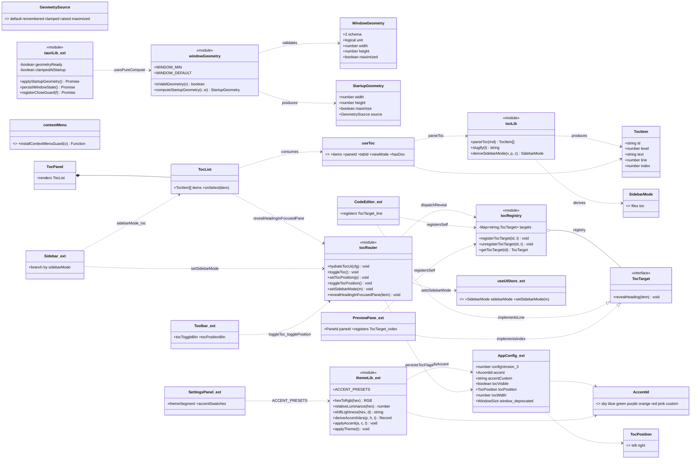
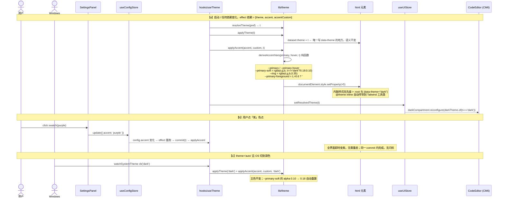
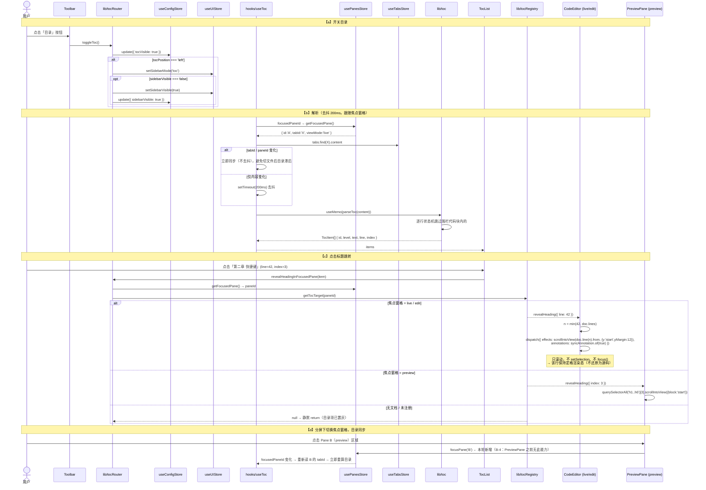
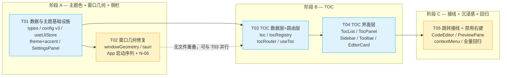

> ⚠️ **文档状态（2026-08-10）**：本文件是 PureMark **iter2-ext 的架构设计基线**（与 `prd-iter2-ext.md` 配套），规划基本落地。注意 §9 Q8 明确"分屏分隔条拖拽/PaneResizer 不做"（遗留债）、§2 提到的 `PreviewPane` 焦点修复（B-4）**已实现**。**当前唯一权威认知总览 = `docs/项目认知与现状总览.md`**，凡冲突以它为准。

# PureMark iter2-ext · 增量系统设计与任务分解

> 文档类型：**增量架构设计（delta of delta）**
> 作者：高见远（架构师）
> 输入：`docs/prd-iter2-ext.md`（本轮 PRD）、`docs/design-iter2.md` + `docs/class-diagram-iter2.mermaid` + `docs/sequence-diagram-iter2.mermaid`（iter2 设计）
> 基线：**当前仓库 `src/` 实际代码**（tsc 0 错 / 370 测试全绿）
> 技术栈不变：Tauri 2 + React 18 + Vite 5 + TypeScript + zustand + CodeMirror 6 + marked + highlight.js + Tailwind CSS 4
> 语言：中文

---

## 0. 摘要（三句话）

1. 本轮 7 项扩展需求全部可以**"只加不改"**地挂到 iter2 骨架上：主题色走**内联 CSS 变量覆盖**（不动 `applyTheme` 语义）、TOC 走**独立注册表 + 独立路由模块**（不动 `EditorHandle` / `paneRouter` 契约）、窗口几何走**单一原子函数 + 纯函数计算层**（可在 node 环境单测）。
2. **窗口越界与尺寸记不住是同一个 bug**，root cause 已由**代码级证据坐实**：`persistWindowState()` 存 `PhysicalSize`、`restoreWindowState()` 按 `LogicalSize` 还原，每次启动按 `scaleFactor` 放大一圈；`fitWindowToScreen()` 的钳制结果又被 `onResized` 去抖回写，污染真实尺寸。**无需实机复现即可定论**（§3.1）。
3. **实际代码与 PRD 的三处偏差必须先对齐**：① `SettingsPanel` **根本没有主题三段控件**（iter2 T05-5.5 欠账，Sun/Moon/MonitorCog 图标已注册但无人使用）；② 没有 `pane-grid` / `PaneResizer` / `LayoutToggle`，实际是 `.editor-pane > .editor-split`（flexBasis，无拖拽）；③ `PreviewPane` 没有 `paneId`，**点击预览窗格不会切焦点** —— 而 N-13「TOC 跟随焦点窗格」直接依赖它。三处本轮一并补齐，见 §2。

---

## 1. 实现方案（Implementation Approach）

### 1.1 技术难点与选型结论

| 难点 | 结论 | 理由 |
| --- | --- | --- |
| 主题色要同时覆盖 `:root` 与 `[data-theme="dark"]` | **内联 CSS 变量写在 `document.documentElement.style`** | 内联样式优先级高于任何选择器，一次写入同时压住明暗两态；`theme.css` 的 `@theme inline` 已把 `--color-primary: var(--primary)` 映射给 Tailwind 工具类，覆盖 `--primary` 会**自动传导到全部工具类**，无需改 CSS 结构 |
| `--primary-soft` 的 alpha 随明暗不同（0.10 / 0.18） | 在 `applyTheme(t)` **同一次 commit 内**紧随其后调 `applyAccent(accent, t)` | 拿到的 `t` 就是本次要应用的 `ResolvedTheme`，**零竞态**；若拆成两个 effect，首帧会读到上一轮的 `resolvedTheme`（zustand 订阅值滞后一帧） |
| 窗口几何要能单测，但 Tauri API 无法在 node 环境跑 | **纯函数层 `lib/windowGeometry.ts` + I/O 层 `lib/tauri.ts` 分离** | `vitest.config.ts` 是 `environment: "node"` 且 `include: ["src/**/*.test.ts"]`，只有纯 TS 模块可测。几何决策（丢弃脏数据 / clamp / 单位换算）全部下沉到纯函数 |
| TOC 跳转要覆盖 CM6 与 DOM 两种宿主 | **独立注册表 `lib/tocRegistry.ts`** | 与 `editorRegistry` 并列而非扩展它：`preview` 窗格**依旧不注册 `EditorHandle`**（iter2 §8.5 约定保持成立），但可以注册 `TocTarget`。两个注册表语义正交，互不污染 |
| TOC 滚动 API 是否要复用 `editorBridge` / `getFocusedEditor` | **不复用** | `editorBridge.ts` 是 MVP 的 textarea 遗留物（已被 `editorRegistry` 取代，本轮不动它）；`EditorHandle.scrollToOffset(offset)` 虽存在但**语义是字符偏移**，且 preview 窗格没有 handle。`TocTarget.revealHeading(item)` 直接以 `TocItem` 为输入，两种宿主各自实现，语义更内聚 |
| TOC 开关 / 位置 / 侧栏形态三者有联动边界规则 | **新增 `lib/tocRouter.ts` 作为唯一入口**（与 `paneRouter.ts` 对仗） | 「左侧模式下侧栏收起时开目录要自动展开」「位置从 left 改 right 要把 sidebarMode 回落 files」这类规则若散在组件里必然漂移。收敛到一个模块 → 组件只调 action、规则只有一处实现、可纯函数单测 |
| 右侧 TOC + 分屏 + 侧栏三者叠加窗格过窄 | **用 CSS `clamp()` 自适应，不提 `minWidth`、不加 JS 宽度守卫** | 见 §3.4 的拍板与算账 |
| 禁用右键要覆盖 CM6 且不泄漏监听 | **window 级 `capture` 监听 + `import.meta.env.DEV` 例外 + 显式 cleanup** | `capture: true` 先于任何元素处理器触发，`.cm-content` 自动覆盖，**CM6 侧零改动** |

### 1.2 无新增依赖

**依赖包列表：空。** 本轮不引入任何第三方包。

- 图标 `ListTree` / `PanelRight` / `PanelLeft` / `Check` / `Palette` / `ArrowLeftRight` 均由已装的 `lucide-react@^0.439.0` 提供，只需在 `src/components/ui/Icon.tsx` 的注册表里追加。
- 颜色计算（hex→rgb、相对亮度）自实现约 30 行纯函数，不引 `color` / `chroma-js`。
- TOC 解析自实现纯函数，**不复用 `marked`**（marked 的 lexer 会解析整篇文档并构造 token 树，对 200ms 去抖的高频调用过重；且我们需要**行号**，marked token 不直接提供）。

### 1.3 架构模式

沿用 iter2 的分层，本轮新增的模块严格落在既有层次里：

```
组件层   Toolbar / Sidebar / TocPanel / TocList / SettingsPanel / EditorCard
           │  只调 router，不直接写 store（沿用 iter2 paneRouter 规约）
路由层   paneRouter.ts（iter2，不改）   tocRouter.ts（🆕 本轮）
           │
状态层   useConfigStore / useUIStore / usePanesStore / useTabsStore
           │
纯逻辑   theme.ts(+accent) / toc.ts / windowGeometry.ts / contextMenu.ts   ← 全部可 node 环境单测
           │
注册表   editorRegistry.ts（iter2，不改）   tocRegistry.ts（🆕 本轮）
           │
I/O 层   tauri.ts（窗口 / store / 对话框）
```

---

## 2. 基线校正：实际代码 vs PRD 假设（**工程师必读**）

PRD §6 的依赖矩阵引用了若干 iter2 产出，但**实际代码中不存在**。设计以实际代码为准，以下差异本轮一并处理：

| # | PRD 假设 | 实际代码 | 本轮处置 |
| --- | --- | --- | --- |
| **B-1** | `SettingsPanel` 已有「主题」三段控件（浅色/深色/跟随系统），主题色板挂在其下方 | ❌ **不存在**。`SettingsPanel.tsx` 只有字体/字号/默认视图/侧边栏/自动保存 5 项；`Icon.tsx` 已注册 `Sun`/`Moon`/`MonitorCog` 但**全仓无人引用** | **本轮补齐**（T01）。成本极小（图标已就绪，`useTheme` / `config.theme` 链路已完整），但**不补就没有地方放主题色板**，且 iter2 验收项「主题记忆 / auto 跟随」实际无 UI 入口 |
| **B-2** | `pane-grid` 容器 + `PaneResizer` 可拖拽分隔条 + `.pane.focused` 边框 + 窗格头部关闭 ✕ | ❌ 实际是 `.editor-pane`（flex）> 两个 `.editor-split`（`flexBasis: splitRatio%`）。**无拖拽手柄、无窗格头部、无焦点边框**；`--pane-min-width: 240px` / `--pane-resizer: 6px` 是**死 token** | TOC 右侧面板改为**与两个 `.editor-split` 并列于 `.editor-pane` 内**。不引入 PaneResizer（超范围） |
| **B-3** | `LayoutToggle.tsx` 独立组件 + 可用宽度守卫 | ❌ 分屏按钮在 `ViewSwitcher.tsx` 里（`segment` + `Columns` 图标），**无任何宽度守卫** | 不新建 LayoutToggle，不加 JS 守卫；改用 CSS `clamp` 方案（§3.4） |
| **B-4** | `PreviewPane` 已接入焦点窗格模型 | ❌ `PreviewPane` 只有 `tabId` prop，**没有 `paneId`**，根 div 无 `onMouseDownCapture={focusPane}` → **点击预览窗格不会切换焦点** | **必须修**（T05）。否则 N-13「分屏下焦点切到预览窗格，目录同步切换」验收项无法通过，且 preview 窗格也无法注册 `TocTarget` |
| **B-5** | `styles/layout.css` 有 `.pane-resize-handle` 可复用给 TOC 宽度拖拽 | ❌ 只有 `.sidebar-resize-handle`（侧栏右缘） | P1 的 N-22 若要做，复用 `.sidebar-resize-handle`（PRD 原文也是这么写的），本轮 P0 不做 |
| **B-6** | `tauri.conf.json` 的 `minWidth` 已提到 960 | ✅ 属实（960 / 560）。但 `lib/tauri.ts` 里硬编码 `MIN_W=860 / MIN_H=560` 与之不一致 | 统一为单一来源常量 + 防漂移测试（T02） |

> ⚠️ **B-1 与 B-4 是本轮的隐性必做项**，PRD 未列为需求但缺了会导致验收项无法通过。已分别并入 T01 与 T05。

---

## 3. 关键决策（架构师拍板）

### 3.1 【N-03 / N-04 / N-05】窗口几何 —— root cause 定论与修复方案

#### Root cause：**RC-1 坐实（主因）+ RC-2 坐实（次因）+ RC-4 成立（隐患）**

代码级证据（无需实机复现）：

```
lib/tauri.ts:124   const size = await win.innerSize();          // Tauri 2 → PhysicalSize（物理像素）
lib/tauri.ts:127-129 state = { width: size.width, ... }         // 原样写入 window-state
lib/tauri.ts:79    await win.setSize(new LogicalSize(ws.width, ws.height));  // 按逻辑像素还原
```

**RC-1（放大循环，主因）**：150% 缩放下，用户把窗口调到逻辑 1000×700 → 物理 1500×1050 → 存 `{1500,1050}` → 下次启动 `setSize(LogicalSize(1500,1050))` → 物理 2250×1575 → **一次启动放大 1.5 倍**。这同时解释了用户报的 **#2 越界** 与 **#6 记不住**（并非"记不住"，是"一直在变大"）。

**RC-2（自我污染，次因）**：`App.tsx` L56-57 `restoreWindowState()` 后紧接 `fitWindowToScreen()`，后者 `setSize` + `center()`；这次程序化 resize 触发 `onResized` → 500ms 去抖 → `persistWindowState()` **把钳制后的"工作区−32"写回存储**。于是用户真实设置的尺寸被彻底覆盖，稳态表现为"每次启动都是接近满屏"。

**RC-4（不一致，隐患）**：`lib/tauri.ts` 的 `MIN_W=860 / MIN_H=560` vs `tauri.conf.json` 的 `960 / 560`。且 **1366×768 @150% 缩放 → 逻辑工作区仅 911×~470**，此时 conf 的 `minWidth: 960` **本身就不可满足** —— 这是小屏越界的独立成因。

**RC-3 / RC-5 / RC-6**：
- RC-3（无条件 `center()`）：本轮 P0 不记忆位置，`center()` 是期望行为，**保留**；但必须**在 `setSize` 之后**执行（现状已是）。P1 记位置（N-23）时再改为条件分支。
- RC-5（`transparent` + `acrylic` + `preventOverflow`）：`preventOverflow: true` 已开启，且 RC-1 足以完整解释现象，**不作为本轮修复项**；若 T02 实测后仍有 ≤ 阴影宽度的溢出，再做 A/B。
- RC-6（双真相源）：**成立**。全仓 grep 确认 `config.window` 除 `migrateConfig` 的 `readWindow()` 外无任何读写。

#### 修复方案（硬约束）

| 项 | 决定 |
| --- | --- |
| **真相源** | **`window-state`（plugin-store 键）为唯一真相源**。`AppConfig.window` 标 `@deprecated`，**字段保留**（避免旧配置反序列化告警）、`migrateConfig` **继续读但不再被任何代码消费**，并加注释「禁止新增读写」。P1 之后可整字段删除 |
| **单位** | 统一 **逻辑像素**。持久化：`const sf = await win.scaleFactor(); const s = (await win.innerSize()).toLogical(sf)`。新增 `WindowGeometry.unit: 'logical'` 标记 + `schema: 2` |
| **脏数据** | **读到缺少 `unit` 标记的旧记录 → 整条丢弃**，回落默认 1400×900。避免把历史放大过的脏值继续 clamp 后沿用 |
| **原子性** | 启动几何收敛为**唯一函数** `applyStartupGeometry()`，内部「读取 → 校验 → clamp → **一次** setSize → 定位 → maximize → 置 `geometryReady`」。**禁止二次 setSize**。删除 `restoreWindowState()` 与 `fitWindowToScreen()` 两段式调用 |
| **静默期** | 模块级 `let geometryReady = false`；`persistWindowState()` 首行 `if (!geometryReady) return;`。`applyStartupGeometry()` 末尾（含 `catch` 分支）置 `true`。**导出 `__setGeometryReadyForTest()` 供测试** |
| **clamp 不回写** | clamp 只影响本次会话的实际窗口大小，**不调用 `persistWindowState()`**。换回大屏后仍能恢复原尺寸（靠"用户没动窗口 → 无 `onResized` → 无写入"自然成立；`onCloseRequested` 里的 `persistWindowState()` 会写入当前实际尺寸，因此**需要额外保护**：见下条） |
| **关闭时的写入保护** | `registerCloseGuard` 里无条件 `persistWindowState()` 会把 clamp 后的尺寸写回。改为：`applyStartupGeometry()` 记录 `clampedAtStartup: boolean` 与 `startupSize`；关闭时若 **当前尺寸 === 启动时 clamp 后的尺寸**（±2px，说明用户全程没动过窗口）且 `clampedAtStartup === true` → **跳过写入**。否则正常写入 |
| **最小尺寸单一来源** | `lib/windowGeometry.ts` 导出 `export const WINDOW_MIN = { width: 960, height: 560 } as const;`，`lib/tauri.ts` 引用它，删除 `MIN_W/MIN_H` 局部常量。`windowGeometry.test.ts` 用 `readFileSync` 读 `src-tauri/tauri.conf.json` **断言两者一致**（防漂移） |
| **小屏兜底** | 当 `工作区 − MARGIN < WINDOW_MIN` 时（1366×768@150% 场景），**允许突破最小值**：`w = min(WINDOW_MIN.width, workAreaW - MARGIN)`。宁可比 conf 的 minWidth 小，也不能越界。同时**建议把 `tauri.conf.json` 的 `minHeight` 从 560 降到 480**（见 §9 开放问题 Q3） |
| **回归数据** | 修复后在 **100% / 125% / 150%** 三种缩放下各做 5 次「调整 → 关闭 → 启动」，出具 `window-state` 实测值表 |

#### `applyStartupGeometry()` 决策表（纯函数 `computeStartupGeometry` 的行为）

| 输入情况 | 输出 `source` | 尺寸 |
| --- | --- | --- |
| 无记录 / `unit` 缺失 / 非对象 | `'default'` | `clamp(1400×900)` |
| 有效记录且 `maximized === true` | `'maximized'` | 尺寸仍算出（供还原用），额外置 `maximize: true` |
| 有效记录，尺寸 > 工作区 × 1.5（历史脏数据） | `'default'` | `clamp(1400×900)`，并 `console.warn` |
| 有效记录，尺寸 > 工作区 − MARGIN | `'clamped'` | `clamp` 到 `工作区 − 32` |
| 有效记录，尺寸 < `WINDOW_MIN` | `'raised'` | 提升到 `WINDOW_MIN`（再受小屏兜底二次约束） |
| 有效记录且落在区间内 | `'remembered'` | 原值 |

---

### 3.2 【N-01 / N-02】主题色派生规则

#### 预设色板（7 色，明暗共用）

| id | 名称 | `--primary` | `--primary-hover` |
| --- | --- | --- | --- |
| `sky` | 青（默认，与现状完全一致） | `#0ea5e9` | `#0284c7` |
| `blue` | 蓝 | `#3b82f6` | `#2563eb` |
| `green` | 绿 | `#10b981` | `#059669` |
| `purple` | 紫 | `#8b5cf6` | `#7c3aed` |
| `orange` | 橙 | `#f97316` | `#ea580c` |
| `red` | 红 | `#ef4444` | `#dc2626` |
| `pink` | 粉 | `#ec4899` | `#db2777` |

#### 派生规则

```
输入：primary hex、hover hex（预设自带；自定义为 null）、resolvedTheme

--primary            = primary
--primary-hover      = hover ?? shiftLightness(primary, resolvedTheme === 'dark' ? +10% : -10%)
--primary-soft       = rgba(r, g, b, resolvedTheme === 'dark' ? 0.18 : 0.10)
--ring               = rgba(r, g, b, 0.35)
--primary-foreground = relativeLuminance(primary) > 0.6 ? '#1f2328' : '#ffffff'
```

#### 拍板：**P0 就实现亮度判定**（PRD 建议 P0 固定 `#fff`，我提升一档）

理由：`relativeLuminance()` 是 P1（N-20 自定义取色）无论如何都要写的纯函数（约 12 行），P0 写与不写成本差异 < 10 行；而**对 7 个预设色的实测结果全部 < 0.6**，行为与"固定 `#fff`"**完全一致，零视觉差异**：

| 预设 | 相对亮度 (WCAG) | 前景色 |
| --- | --- | --- |
| sky `#0ea5e9` | ≈ 0.32 | `#ffffff` |
| blue `#3b82f6` | ≈ 0.27 | `#ffffff` |
| green `#10b981` | ≈ 0.36 | `#ffffff` |
| purple `#8b5cf6` | ≈ 0.25 | `#ffffff` |
| orange `#f97316` | ≈ 0.32 | `#ffffff` |
| red `#ef4444` | ≈ 0.25 | `#ffffff` |
| pink `#ec4899` | ≈ 0.25 | `#ffffff` |

→ P0 落地即为 P1 自定义取色的对比度守护铺好路，**P1 只需加一个 `<input type="color">`，零逻辑改动**。

#### 写入方式与调用时机（**关键约定**）

```ts
// hooks/useTheme.ts —— 唯一改动点：在既有 commit() 内追加一行
const commit = (t: ResolvedTheme) => {
  applyTheme(t);                       // ← iter2 语义不变：唯一写 data-theme 的地方
  applyAccent(accentId, accentCustom, t);  // ← 本轮新增：只写内联 CSS 变量，不碰 data-theme
  useUIStore.getState().setResolvedTheme(t);
};
// effect 依赖：[preference, accentId, accentCustom]
```

| 约定 | 说明 |
| --- | --- |
| **为什么不新开一个 effect** | 新 effect 订阅 `resolvedTheme` 时，首帧会拿到**上一轮**的值（zustand 订阅值滞后一帧），导致 `--primary-soft` 的 alpha 首帧用错（0.10 ↔ 0.18 闪一下）。放进 `commit(t)` 里，`t` 就是本次要应用的值，**零竞态、零闪烁** |
| **iter2 §8.3 约定是否被破坏** | **否**。「`applyTheme()` 是修改 `data-theme` 的唯一函数」依然成立 —— `applyAccent` 只调 `documentElement.style.setProperty()`，从不触碰 `dataset.theme` |
| **auto 链路** | 完全不受影响。OS 切换深浅色 → `watchSystemTheme` 回调 → `commit(systemTheme)` → `applyAccent` 用新的 `t` 重算 `--primary-soft`，自动生效 |
| **Tailwind 传导** | `theme.css` 的 `@theme inline` 已把 `--color-primary: var(--primary)` 等映射给工具类；覆盖 `--primary` 会自动传导到 `bg-primary` / `text-primary` / `ring-ring` 等全部工具类，**`theme.css` 结构零改动** |
| **不受影响的 token** | 代码高亮 `--hl-*`（GitHub 取色）、中性色 `--surface*` / `--foreground*` / `--border*`、亚克力 `--acrylic*`。本轮**只改 accent** |
| **覆盖面自查清单** | `.segment.active`、`.btn-icon.active`、`.file-item.active`、`.tab-item.active`、`.sidebar-resize-handle:hover`、`.input:focus`（`--ring`）、CM6 选区、live/preview 的 `blockquote` 左边条、复选框、链接 |
| **失败兜底** | `applyAccent` 内部 try/catch；hex 非法 → 回落 `sky`，**绝不抛错阻断渲染** |

---

### 3.3 【N-07 ~ N-16】TOC 架构

#### 三个新模块的职责边界

```
lib/toc.ts          纯函数：parseToc(md) → TocItem[]；slug 去重；deriveSidebarMode()
                    ↑ 零依赖、零副作用、可 node 单测
lib/tocRegistry.ts  注册表：paneId → TocTarget{ revealHeading(item) }
                    ↑ 与 editorRegistry 并列，互不干扰
lib/tocRouter.ts    唯一动作入口：toggleToc / setTocPosition / toggleTocPosition
                    / setSidebarMode / hydrateTocUi / revealHeadingInFocusedPane
                    ↑ 与 paneRouter 同规约：组件禁止绕过它直接写 config.toc* 或 useUIStore.sidebarMode
```

#### `parseToc` 规格

| 项 | 规则 |
| --- | --- |
| 匹配 | ATX 标题 `/^ {0,3}(#{1,6})(?:\s+(.*?))?\s*$/`；`{0,3}` 前导空格上限天然排除「4 空格缩进代码块」 |
| **围栏代码块** | 逐行状态机：``` ` ``` 或 `~` 连续 ≥3 开启，需**同字符且长度 ≥ 开启长度**才闭合；围栏内所有行跳过。**这是 N-07 的核心验收点** |
| 闭合井号 | 去掉行尾 ` ###`（`/\s+#+\s*$/`） |
| 文本清洗 | 依次去 ``→`alt`、`[text](url)`→`text`、`` `code` ``→`code`、`**b**`/`__b__`、`*i*`/`_i_`、`~~s~~`、残留 HTML 标签 `<[^>]+>`；最后 `trim()` |
| `line` | **1-based**，指向标题在原文中的行号 |
| `index` | **0-based**，文档内第 n 个标题（用于 preview 模式定位） |
| `id` | `slug(text)`；空则 `heading-{index}`；重复则追加 `-1` / `-2`（仅作 React key，不用于锚点） |
| 空输入 | 返回 `[]` |
| **已知边界（本轮不处理）** | ① Setext 标题（P2 / N-28）；② YAML frontmatter 内的 `#` 会被误识（frontmatter 用 `---` 而非围栏字符）—— 记为已知限制；③ md 中内联的裸 `<h2>` HTML 标签会让 preview 的 `index` 与 TOC 错位（marked 原样输出，parseToc 不识别）—— 记为已知限制 |

> ✅ **index 定位成立的前提**：`parseToc` 跳过围栏代码块，而 `marked` 渲染围栏代码块时**同样不会产出 `<h*>`**（生成 `<pre><code>`）。二者对"哪些 `#` 算标题"的判定天然一致 → `querySelectorAll('h1,...,h6')[index]` 必然对齐。**T03 必须为此加一条对拍测试**（同一份含围栏代码块的 md，`parseToc(md).length === render(md) 中 h 标签数`）。

#### `useToc` 数据流

```
usePanesStore.focusedPaneId ──┐
usePanesStore.panes           ├─→ focusedPane.tabId ─→ useTabsStore 的 content
                              │                              │
                              │                        200ms 去抖
                              │                              ↓
                              └─→ focusedPane.viewMode   useMemo(parseToc)
                                                              ↓
                                          { items, paneId, tabId, viewMode, hasDoc }
```

- **去抖实现**：`useState<string>(debouncedContent)` + `useEffect` 里 `setTimeout(200)`，卸载/内容再变时 `clearTimeout`。`parseToc` 包在 `useMemo(..., [debouncedContent])` 里。
- **切换文档/窗格时不去抖**：`tabId` 或 `paneId` 变化时**立即同步**一次（否则切文件后目录会滞后 200ms 显示旧文档大纲，观感差）。实现：去抖 effect 内判断 `tabIdRef.current !== tabId` → 立即 `setDebounced(content)`。
- `useToc` 由 `TocList` 的两个宿主（`TocPanel` / `Sidebar`）各自调用；两处同时挂载的情况不存在（左右互斥），无重复解析成本。

#### 跳转实现（两种宿主）

| 宿主 | 实现 | 关键约束 |
| --- | --- | --- |
| `CodeEditor`（edit / live） | `const n = Math.min(item.line, view.state.doc.lines);`<br>`view.dispatch({ effects: EditorView.scrollIntoView(view.state.doc.line(n).from, { y: 'start', yMargin: 12 }), annotations: syncAnnotation.of(true) })` | **① 必须带 `syncAnnotation.of(true)`** —— iter2 §8.1 规约「所有程序化 dispatch 必须携带注解」，否则 `useDocSync` 的 updateListener 会把它当用户操作路径处理。<br>**② 不 `setSelection`、不 `focus()`** —— live 模式下移动光标会让目标标题行从渲染态还原为源码（"点过去反而变丑"）。<br>**③ 行号越界钳制** —— 去抖期间文档可能已被删短 |
| `PreviewPane`（preview） | `containerRef.current?.querySelectorAll('h1,h2,h3,h4,h5,h6')[item.index]?.scrollIntoView({ block: 'start', behavior: 'auto' })` | ① 滚动容器是 `.preview-content` 自身（`overflow: auto` 在 `.editor-split` 上）—— `scrollIntoView` 会自动找最近可滚动祖先，无需手算。<br>② `code-card` 包裹只影响 `<pre>`，不影响 `<h*>` 序列 |
| 无文档 / 未注册 | `getTocTarget(paneId)` 返回 `null` → `revealHeadingInFocusedPane` 静默 return；`TocList` 项渲染为 `disabled`（`hasDoc === false` 时） | — |

#### 注册生命周期

```ts
// CodeEditor.tsx —— 挂载 view 后
useEffect(() => {
  if (!view) return;
  registerTocTarget(paneId, { revealHeading: (item) => { /* 上表实现 */ } });
  return () => unregisterTocTarget(paneId);
}, [view, paneId]);

// PreviewPane.tsx —— 需要新增 paneId prop（见 §2 B-4）
useEffect(() => {
  registerTocTarget(paneId, { revealHeading: (item) => { /* 上表实现 */ } });
  return () => unregisterTocTarget(paneId);
}, [paneId]);
```

> ⚠️ **注册键与 `editorRegistry` 相同（`paneId`），但存于不同 Map**。窗格从 `live` 切到 `preview` 时，`CodeEditor` 卸载会 `unregisterTocTarget('A')`，`PreviewPane` 挂载会 `registerTocTarget('A')` —— React 的卸载/挂载顺序是**先挂载新的、后卸载旧的（同一 commit 内 effect cleanup 先于新 effect）**，实际顺序为「旧 cleanup → 新 register」，安全。但为稳妥，`unregisterTocTarget(paneId, target?)` **接受可选的 target 参数做身份校验**：只有当前注册的就是自己时才删除。

#### 侧栏双形态状态机（`deriveSidebarMode` 纯函数）

```
sidebarMode（会话态，useUIStore，不持久化）
启动初值：tocVisible && tocPosition === 'left' ? 'toc' : 'files'

边界规则（全部实现在 lib/tocRouter.ts，唯一入口）：
① toggleToc() 开启 且 tocPosition === 'left'：
     setSidebarMode('toc')
     若 sidebarVisible === false → setSidebarVisible(true) 且写 config.sidebarVisible = true
       （与 Toolbar 收起按钮行为一致：用户明确请求看目录）
② toggleToc() 关闭：setSidebarMode('files')
③ setTocPosition('right')：setSidebarMode('files')（切换按钮消失，⇤ 隐藏侧边栏按钮回归）
④ setTocPosition('left') 且 tocVisible：同 ①
⑤ Sidebar 头部 ⇄ 按钮：仅在 tocVisible && tocPosition === 'left' 时渲染，点击 files ⇄ toc
⑥ 收起/展开侧栏（Toolbar ⇤/⇥）不改 sidebarMode → 展开后自动恢复收起前的形态 ✅ 零成本
```

#### N-11「收起侧栏能力不丢失」—— **代码核验通过，零改动**

`Toolbar.tsx` L44-53 已存在等价按钮：`toggleSidebar()` + `useConfigStore.update({ sidebarVisible })`，且 tooltip / aria-label **已按 `sidebarVisible` 在「隐藏侧边栏」/「显示侧边栏」间切换**。**本项无需任何代码改动，仅需 QA 验证。**

---

### 3.4 【拍板 · PRD 待确认 #10】右侧 TOC + 分屏 + 侧栏叠加 → **不提 `minWidth`，改用 CSS `clamp()`**

#### 反对提到 1040 的理由

1. **960 在小屏上本身已不可满足**：1366×768 @150% 缩放 → 逻辑工作区约 **911×470**。`minWidth: 960` 已经超出，这正是 RC-4 越界的独立成因。再提到 1040 会让这类机器**根本无法把窗口放进屏幕**，把一个体验问题升级成可用性事故。
2. **提 `minWidth` 保护的是一个"iter2 从未实现"的约束**：`--pane-min-width: 240px` 是死 token，当前 `.editor-split` 只有 `min-width: 0`。为一个不存在的守卫牺牲小屏用户不划算。
3. **CSS 方案可以零状态、零 JS、零回归风险地解决**。

#### 采纳方案：TOC 面板宽度自适应

```css
.toc-panel {
  flex: 0 0 auto;
  width: clamp(180px, var(--layout-toc), 24%);   /* 24% 相对 .editor-pane */
  min-width: 0;
}
```

`--layout-toc: 220px` 定义在 `theme.css`，运行时由 `config.tocWidth` 以内联变量覆盖到 `<html>`（P1 拖拽时只需改这个值，无需改 CSS）。

**算账验证**（侧栏 248 默认宽，`.editor-card` 左右 margin 各 12）：

| 窗口逻辑宽 | `.editor-pane` 可用宽 | TOC 实际宽 | 剩余 ÷2 = 单窗格宽 | 结论 |
| --- | --- | --- | --- | --- |
| 960（conf minWidth） | 960−248−24 = 688 | `clamp(180, 220, 165)` → **180** | 254 | ✅ > 240 |
| 1040（PM 建议值） | 768 | `clamp(180, 220, 184)` → **184** | 292 | ✅ |
| 1400（默认） | 1128 | `clamp(180, 220, 271)` → **220** | 454 | ✅ 足额 220 |
| 1920 | 1648 | **220** | 714 | ✅ |

→ **无需改 `tauri.conf.json`，无需 JS 宽度守卫，任何窗口宽度下两窗格均 ≥ 240px**（默认侧栏宽下）。

**残余边界**：用户把侧栏拖到上限 480 且窗口 960 时，单窗格 ≈ 138px。iter2 现状同样允许这种情况（无守卫），本轮不引入。记为**遗留债**：`--pane-min-width` 守卫 → 下轮候选。

---

### 3.5 【N-06】文件关联启动收起侧栏 —— **顺带修一个现存竞态**

现状 `App.tsx` 有**两个互不保证顺序的 `useEffect`**：
- effect#1（L48-59）：`await loadConfig()` → `setSidebarVisible(cfg.sidebarVisible)`
- effect#3（L86-96）：`await invoke('take_launch_file')` → `openPath(...)`

两者都是异步的，若在 effect#3 里 `setSidebarVisible(false)`，**有可能被 effect#1 的 config 恢复覆盖**（取决于两个 Promise 的完成顺序）。

**修复**：把 `take_launch_file` 的处理**并入启动序列 effect，串行在 `loadConfig()` 与 `hydrate()` 之后**；`listen('open-file')` 的运行时监听**保留在独立 effect**（运行时打开**不收侧栏** —— PRD 待确认 #8 已定）。

```
启动序列 effect（单一、串行）：
  await loadConfig()
  → setSidebarVisible(cfg.sidebarVisible) / setSidebarWidth(...)
  → tocRouter.hydrateTocUi(cfg)                     ← 推导 sidebarMode 初值
  → usePanesStore.hydrate(cfg, activeId)
  → await applyStartupGeometry()                    ← 原子几何，置 geometryReady
  → const pending = await invoke('take_launch_file')
  → if (pending) { useUIStore.setSidebarVisible(false);  ← 仅本次会话，不写 config
                   await openPath(pending); }
```

---

### 3.6 【N-17 / N-18】禁用右键 + 本轮范围边界

| 项 | 决定 |
| --- | --- |
| 实现位置 | `lib/contextMenu.ts` 导出 `installContextMenuGuard(opts?: { enabled?: boolean }): () => void`（纯逻辑，可 node 单测），在 `App.tsx` 用一个 `useEffect` 挂载 + cleanup。**不放 `main.tsx`** —— 那里没有卸载时机，HMR 会堆积监听器 |
| 监听 | `window.addEventListener('contextmenu', handler, { capture: true })`，handler 内 `e.preventDefault()` |
| DEV 例外 | `enabled` 默认 `!import.meta.env.DEV`。App 侧传 `{ enabled: !import.meta.env.DEV }`；**`import.meta.env` 不进 `lib/contextMenu.ts`**，保持该模块在 node 环境可测 |
| CM6 | **零改动**。`capture: true` 的 window 监听先于任何元素处理器触发，`.cm-content` 自动覆盖。不加 `domEventHandlers` 双保险（避免动 `setup.ts` 这个 iter2 热点文件） |
| 不受影响 | Ctrl+C/V/X/A（keydown 路径，与 contextmenu 无关）、CM6 选区拖选（mousedown）、链接点击、代码块「复制」按钮 |
| 不做 | 自定义应用内右键菜单（P2 / N-33）、输入框白名单（PM 已定：全局禁用） |

#### **本轮范围边界澄清：Ctrl+F 应用内搜索 —— 不在本轮范围**

team-lead 提到的「Ctrl+F 拦截原生查找改用应用内 SearchPanel」**在 `docs/prd-iter2-ext.md` 的 N-01 ~ N-34 需求池中不存在**，属于本轮范围外。

现状核验：`SearchPanel.tsx` 组件已存在并由 `useUIStore.searchOpen` 控制，Toolbar 有「查找」按钮；但 `useHotkeys.ts` **只绑定了 Ctrl+S / Ctrl+W / Ctrl+N，没有 Ctrl+F** —— 因此 Ctrl+F 目前会落到 WebView2 的原生查找条上。

**架构师建议**：这是一个 **3 行代码、与 N-17「桌面沉浸感」目标同源**的缺口。建议以 **P1 顺带项**并入 T05（与 N-24 的 `Ctrl+B` / `Ctrl+Shift+O` 一起做，共约 15 行）：

```
在 useHotkeys 中追加：
  key === 'f' → e.preventDefault(); useUIStore.getState().setSearchOpen(true);
  key === 'b' → e.preventDefault(); toggleSidebar + 写 config          (N-24)
  Ctrl+Shift+O → e.preventDefault(); tocRouter.toggleToc()              (N-24)
```
需 team-lead / PM 确认是否纳入（列为 **Q1**，见 §9）。若不纳入，T05 只做 P0 部分。

---

## 4. 文件列表（相对路径 · 🆕 新增 / 🔧 修改 / ✅ 零改动仅验证）

```
prueMd/
├── docs/
│   ├── design-iter2-ext.md                  🆕 本文档
│   ├── class-diagram-iter2-ext.mermaid      🆕 增量类图
│   └── sequence-diagram-iter2-ext.mermaid   🆕 增量时序图
├── src-tauri/
│   └── tauri.conf.json                      ✅ minWidth 保持 960（拍板不提 1040）
│                                               ⛔ 严禁恢复 app.windows[0].theme 字段
│                                               🔧 可选：minHeight 560 → 480（见 Q3）
└── src/
    ├── App.tsx                              🔧 启动序列合并（几何 + 文件关联收侧栏 + hydrateTocUi）
    │                                           + contextmenu guard effect
    ├── types/index.ts                       🔧 +AccentId / TocPosition / TocItem / WindowGeometry
    │                                           AppConfig +5 字段；window 标 @deprecated
    ├── lib/
    │   ├── theme.ts                         🔧 +ACCENT_PRESETS / hexToRgb / relativeLuminance
    │   │                                        / deriveAccentVars(纯) / applyAccent(DOM)
    │   ├── windowGeometry.ts                🆕 纯函数：WINDOW_MIN / computeStartupGeometry
    │   │                                        / isValidGeometry / toLogicalGeometry
    │   ├── tauri.ts                         🔧 applyStartupGeometry() 取代 restore+fit 两段式
    │   │                                        单位统一 toLogical / geometryReady 静默期
    │   │                                        / closeGuard 写入保护；删 MIN_W/MIN_H
    │   ├── toc.ts                           🆕 parseToc / slugify / deriveSidebarMode（全纯函数）
    │   ├── tocRegistry.ts                   🆕 registerTocTarget / unregisterTocTarget
    │   │                                        / getTocTarget / clearTocTargets
    │   ├── tocRouter.ts                     🆕 唯一入口：toggleToc / setTocPosition
    │   │                                        / toggleTocPosition / setSidebarMode
    │   │                                        / hydrateTocUi / revealHeadingInFocusedPane
    │   └── contextMenu.ts                   🆕 installContextMenuGuard(opts) → cleanup
    ├── hooks/
    │   ├── useTheme.ts                      🔧 commit() 内追加 applyAccent；依赖 +accent
    │   ├── useToc.ts                        🆕 焦点窗格 → 200ms 去抖 → TocItem[]
    │   └── useHotkeys.ts                    🔧 P1（待 Q1 确认）：Ctrl+F / Ctrl+B / Ctrl+Shift+O
    ├── store/
    │   ├── useConfigStore.ts                🔧 CONFIG_VERSION 2→3；DEFAULT_CONFIG +5；
    │   │                                        migrateConfig 补齐 accent/toc* 缺省
    │   └── useUIStore.ts                    🔧 +sidebarMode: 'files' | 'toc' + setSidebarMode
    ├── components/
    │   ├── Toc/TocList.tsx                  🆕 目录列表（左右两种模式共用）
    │   ├── Toc/TocPanel.tsx                 🆕 右侧独立面板（头部「目录」+ ✕ + TocList）
    │   ├── Sidebar/Sidebar.tsx              🔧 双形态渲染；头部按钮按 tocPosition 分支
    │   ├── Sidebar/OpenFolderButton.tsx     ✅ 零改动（由 Sidebar 条件渲染控制显隐）
    │   ├── Workspace/Toolbar.tsx            🔧 +「目录」开关 +「位置」切换（仅 tocVisible 时显示）
    │   ├── Workspace/EditorCard.tsx         🔧 .editor-pane 内并列 TocPanel；PreviewPane 传 paneId
    │   ├── Workspace/CodeEditor.tsx         🔧 注册 TocTarget（行定位）
    │   ├── Workspace/PreviewPane.tsx        🔧 +paneId prop；+onMouseDownCapture=focusPane（B-4）
    │   │                                        +注册 TocTarget（索引定位）
    │   ├── dialogs/SettingsPanel.tsx        🔧 +「主题」三段控件（补 iter2 欠账 B-1）
    │   │                                        +「主题色」7 色板
    │   └── ui/Icon.tsx                      🔧 +ListTree / PanelRight / ArrowLeftRight / Check / Palette
    ├── styles/
    │   ├── theme.css                        🔧 +--layout-toc: 220px（主色仍靠内联变量覆盖，结构不动）
    │   └── layout.css                       🔧 +.toc-panel / .toc-head / .toc-list / .toc-item
    │                                            / .toc-item.disabled / .accent-swatch / .theme-segment
    └── __tests__/
        ├── accent.test.ts                   🆕 派生规则 / alpha 随明暗 / 亮度→前景色 / 非法 hex 回落
        ├── windowGeometry.test.ts           🆕 脏数据丢弃 / clamp / raised / 小屏兜底 / 与 conf 一致性
        ├── toc.test.ts                      🆕 围栏跳过 / 层级 / 行号 / index / 文本清洗 / 与 marked 对拍
        ├── tocRouter.test.ts                🆕 状态机 6 条边界规则
        ├── contextMenu.test.ts              🆕 capture 注册 / preventDefault / enabled=false / cleanup
        └── configMigrate.test.ts            🔧 +v3 迁移用例（老配置无 accent → 'sky'；非法值回落）
```

> **测试环境约束**：`vitest.config.ts` 为 `environment: "node"` + `include: ["src/**/*.test.ts"]`（**不含 `.tsx`**）。因此所有新增测试都只能覆盖**纯 TS 模块**。这正是把几何计算、颜色派生、TOC 解析、路由状态机全部下沉为纯函数的原因。组件层（TocPanel / Sidebar 双形态 / SettingsPanel 色板）**靠 QA 手工验收**，不写组件测试（不引入 jsdom / testing-library，避免扩大依赖面）。

---

## 5. 数据结构与接口

### 5.1 新增 / 变更类型（`src/types/index.ts`）

```ts
/** 主题色标识；'custom' 预留给 P1 自定义取色（N-20）。 */
export type AccentId =
  | 'sky' | 'blue' | 'green' | 'purple' | 'orange' | 'red' | 'pink' | 'custom';

/** 目录面板位置。 */
export type TocPosition = 'left' | 'right';

/** 侧栏形态（会话态，不持久化）。 */
export type SidebarMode = 'files' | 'toc';

/** 单个目录项。 */
export interface TocItem {
  /** React key / 未来锚点用；由 text slug 化 + 去重得到。 */
  id: string;
  /** 1..6。 */
  level: number;
  /** 已去除 Markdown 行内标记的纯文本。 */
  text: string;
  /** 1-based 行号，用于 CM6 定位。 */
  line: number;
  /** 0-based，文档内第 n 个标题，用于 preview DOM 定位。 */
  index: number;
}

/** 窗口几何持久化格式（window-state 键）。 */
export interface WindowGeometry {
  /** 结构版本；缺失视为旧脏数据并整条丢弃。 */
  schema: 2;
  /** 单位标记；必须为 'logical'，缺失视为旧脏数据。 */
  unit: 'logical';
  width: number;
  height: number;
  maximized: boolean;
}

/** @deprecated iter2-ext：window-state 才是唯一真相源，本类型仅为兼容旧配置保留。 */
export interface WindowSize { width: number; height: number; maximized: boolean }
```

`AppConfig` 变更：

```ts
export interface AppConfig {
  /** iter2 = 2；iter2-ext = 3。 */
  configVersion: number;
  // …… iter2 既有字段全部保持不变 ……

  /** 🆕 主题色标识，默认 'sky'（= 原青色，老用户无感）。 */
  accent: AccentId;
  /** 🆕 自定义主色 hex（P1 / N-20），P0 恒为 null。 */
  accentCustom: string | null;
  /** 🆕 目录开关，默认 false。 */
  tocVisible: boolean;
  /** 🆕 目录位置，默认 'right'。 */
  tocPosition: TocPosition;
  /** 🆕 右侧目录面板宽度，默认 220（P1 可拖拽）。 */
  tocWidth: number;

  /**
   * @deprecated iter2-ext（N-05）：窗口几何的唯一真相源是 plugin-store 的
   * `window-state` 键。此字段从未被任何业务代码读写，仅为兼容旧 settings.json
   * 保留。禁止新增读写；下一轮可整字段移除。
   */
  window: WindowSize;
}
```

### 5.2 模块接口签名

```ts
// ---- lib/theme.ts（追加，既有导出不变） ----------------------------------
export interface AccentPreset { id: Exclude<AccentId,'custom'>; label: string; primary: string; hover: string }
export const ACCENT_PRESETS: readonly AccentPreset[];
export function hexToRgb(hex: string): { r: number; g: number; b: number } | null;
export function relativeLuminance(hex: string): number;              // 0..1，WCAG
export function shiftLightness(hex: string, delta: number): string;  // delta ∈ [-1,1]
/** 纯函数：产出 5 个 CSS 变量键值对。非法 hex → 回落 sky。 */
export function deriveAccentVars(
  primary: string, hover: string | null, resolved: ResolvedTheme,
): Record<'--primary'|'--primary-hover'|'--primary-soft'|'--ring'|'--primary-foreground', string>;
/** 副作用：把派生结果写入 document.documentElement 的内联 style。绝不抛错。 */
export function applyAccent(accent: AccentId, custom: string | null, resolved: ResolvedTheme): void;

// ---- lib/windowGeometry.ts（新增，纯函数） -------------------------------
export const WINDOW_MIN: { readonly width: 960; readonly height: 560 };
export const WINDOW_DEFAULT: { readonly width: 1400; readonly height: 900 };
export const WINDOW_MARGIN = 32;
export interface WorkArea { width: number; height: number }   // 逻辑像素
export type GeometrySource = 'default'|'remembered'|'clamped'|'raised'|'maximized';
export interface StartupGeometry { width: number; height: number; maximize: boolean; source: GeometrySource }
export function isValidGeometry(v: unknown): v is WindowGeometry;
export function computeStartupGeometry(remembered: unknown, work: WorkArea): StartupGeometry;

// ---- lib/tauri.ts（变更） -------------------------------------------------
export async function applyStartupGeometry(): Promise<void>;   // 取代 restoreWindowState + fitWindowToScreen
export async function persistWindowState(): Promise<void>;     // 首行 geometryReady 守卫；存 logical
export function __setGeometryReadyForTest(v: boolean): void;   // 测试钩子
// restoreWindowState / fitWindowToScreen —— 删除

// ---- lib/toc.ts（新增，纯函数） ------------------------------------------
export function parseToc(md: string): TocItem[];
export function slugify(text: string): string;
export function deriveSidebarMode(tocVisible: boolean, pos: TocPosition, current?: SidebarMode): SidebarMode;

// ---- lib/tocRegistry.ts（新增） ------------------------------------------
export interface TocTarget { revealHeading(item: TocItem): void }
export function registerTocTarget(paneId: string, t: TocTarget): void;
export function unregisterTocTarget(paneId: string, t?: TocTarget): void;  // 传 t 则做身份校验
export function getTocTarget(paneId: string): TocTarget | null;
export function clearTocTargets(): void;                                   // 测试用

// ---- lib/tocRouter.ts（新增；组件唯一入口） -------------------------------
export function hydrateTocUi(cfg: AppConfig): void;          // 启动时推导 sidebarMode 初值
export function toggleToc(): void;
export function setTocPosition(pos: TocPosition): void;
export function toggleTocPosition(): void;
export function setSidebarMode(mode: SidebarMode): void;
export function revealHeadingInFocusedPane(item: TocItem): void;

// ---- lib/contextMenu.ts（新增） ------------------------------------------
export function installContextMenuGuard(opts?: { enabled?: boolean }): () => void;

// ---- hooks/useToc.ts（新增） ---------------------------------------------
export interface TocState { items: TocItem[]; paneId: PaneId; tabId: string|null; viewMode: ViewMode; hasDoc: boolean }
export function useToc(): TocState;
```

### 5.3 类图

见 `docs/class-diagram-iter2-ext.mermaid`（本轮**增量**部分；iter2 既有类见 `class-diagram-iter2.mermaid`）。



---

## 6. 程序调用流程（时序图）

完整版见 `docs/sequence-diagram-iter2-ext.mermaid`。以下为三条主链路。

### 6.1 启动序列（几何 restore + 文件关联收侧栏 + TOC UI 推导）

```mermaid
sequenceDiagram
    participant APP as App.tsx
    participant CS as useConfigStore
    participant UIS as useUIStore
    participant TR as lib/tocRouter
    participant PS as usePanesStore
    participant TA as lib/tauri
    participant WG as lib/windowGeometry
    participant MON as Monitor / workArea
    participant WIN as Tauri Window
    participant RS as take_launch_file

    APP->>CS: await loadConfig() → migrateConfig(v2→v3)
    Note over CS: accent 缺失 → 'sky'；tocVisible → false<br/>tocPosition → 'right'；configVersion = 3
    APP->>UIS: setSidebarVisible(cfg.sidebarVisible) / setSidebarWidth(...)
    APP->>TR: hydrateTocUi(cfg)
    TR->>UIS: setSidebarMode(deriveSidebarMode(tocVisible, tocPosition))
    APP->>PS: hydrate(cfg, activeId)

    rect rgb(240,246,255)
    Note over APP,WIN: 【窗口几何：单次原子应用，禁止二次 setSize】
    APP->>TA: await applyStartupGeometry()
    TA->>TA: storeGet('window-state')
    TA->>MON: currentMonitor() ?? primaryMonitor()
    MON-->>TA: workArea(physical) + scaleFactor
    TA->>TA: work = { w: area.w/sf, h: area.h/sf }   逻辑像素
    TA->>WG: computeStartupGeometry(remembered, work)
    WG->>WG: isValidGeometry? (schema===2 && unit==='logical')
    alt 无效 / 脏数据 / > workArea*1.5
        WG-->>TA: { 1400x900 clamp, source:'default' }
    else 有效
        WG->>WG: clamp(min→WINDOW_MIN, max→work−32)  含小屏兜底
        WG-->>TA: { w, h, maximize, source }
    end
    TA->>WIN: setSize(new LogicalSize(w, h))    ← 仅此一次
    TA->>WIN: center()                          ← P0 不记位置
    opt source === 'maximized'
        TA->>WIN: maximize()
    end
    TA->>TA: clampedAtStartup = (source==='clamped'); startupSize = {w,h}
    TA->>TA: geometryReady = true               ← 解除静默期
    end

    APP->>TA: listenWindowResize(debounce 500ms → persistWindowState)
    Note over TA: persistWindowState() 首行：if (!geometryReady) return;<br/>启动阶段的自动调整不写回存储（修复 RC-2）

    APP->>RS: await invoke('take_launch_file')
    alt 返回非空（双击 .md / Open with）
        APP->>UIS: setSidebarVisible(false)     ← 仅本次会话，不写 config（N-06）
        APP->>APP: await openPath(pending) → openInFocusedPane(...)
    end
    APP->>APP: installContextMenuGuard({ enabled: !import.meta.env.DEV })
```

### 6.2 主题 + 主题色应用



### 6.3 TOC 解析、切换与跳转



---

## 7. 共享知识（跨文件约定 · 工程师必须遵守）

| # | 约定 | 说明 |
| --- | --- | --- |
| **S-1** | **CSS 变量覆盖顺序**：`:root`（theme.css）< `[data-theme="dark"]`（theme.css）< **`<html>` 内联 style**（`applyAccent` / `--layout-toc`） | 内联层只写 accent 5 个变量 + `--layout-toc`，**禁止写任何中性色 / 布局 token**，否则暗色主题会被永久钳死（重蹈 iter2 A-1 的覆辙） |
| **S-2** | **`applyTheme()` 仍是唯一写 `data-theme` 的函数**；`applyAccent()` 只写内联 CSS 变量 | iter2 §8.3 约定不被破坏 |
| **S-3** | **TOC 相关状态只能通过 `lib/tocRouter.ts` 修改** | 组件禁止直接 `useConfigStore.update({ tocVisible / tocPosition })` 或 `useUIStore.setSidebarMode()`。与 iter2 的 `paneRouter` 规约同源同理 |
| **S-4** | **窗格的打开/聚焦/分屏/关闭仍只能走 `lib/paneRouter.ts`** | iter2 约定不变。本轮新增的 `PreviewPane.onMouseDownCapture` 调的是 `paneRouter.focusPane(paneId)`，合规 |
| **S-5** | **所有程序化 CM6 dispatch 必须携带 `syncAnnotation`** | TOC 跳转的 `scrollIntoView` dispatch **必须** `annotations: syncAnnotation.of(true)`（无文本变更，但规约要求全覆盖），否则 `useDocSync` 的 updateListener 会走用户编辑路径 |
| **S-6** | **窗口几何：单位一律逻辑像素，持久化必带 `unit`/`schema` 标记** | 读到缺标记的旧记录整条丢弃。`persistWindowState()` 首行 `geometryReady` 守卫。**禁止在 `applyStartupGeometry()` 之外调用 `setSize`** |
| **S-7** | **`WINDOW_MIN` 是最小尺寸的唯一来源** | `lib/windowGeometry.ts` 导出；`lib/tauri.ts` 引用；`windowGeometry.test.ts` 读 `tauri.conf.json` 断言一致（防漂移）。⛔ **严禁在 `tauri.conf.json` 恢复 `app.windows[0].theme` 字段**（会再次钳死 auto 主题，iter2 A-1） |
| **S-8** | **`config.window` 是死字段** | 全仓禁止新增读写。`migrateConfig` 里保留 `readWindow()` 仅为不丢旧数据。IDE 会因 `@deprecated` 划删除线 —— 这是预期效果 |
| **S-9** | **`TocTarget` 与 `EditorHandle` 是两套正交注册表** | 键都是 `paneId`，但存在不同 Map。`preview` 窗格**注册 `TocTarget` 但依然不注册 `EditorHandle`** —— iter2 §8.5「`getFocusedEditor()` 可能返回 null」的约定保持成立 |
| **S-10** | **`parseToc` 与 `marked` 对"哪些 `#` 算标题"的判定必须一致** | preview 的 `index` 定位依赖于此。二者都跳过围栏代码块 → 天然一致。**必须有对拍测试锁定**。已知不一致场景（内联裸 `<h2>` HTML）记为已知限制 |
| **S-11** | **新增测试只能是纯 TS**（`src/**/*.test.ts`，node 环境） | 不引入 jsdom / @testing-library。需要 DOM 的地方按 `theme.test.ts` 的既有做法**手工安装 fake `window`/`document`** |
| **S-12** | **TOC 面板宽度走 `--layout-toc` CSS 变量 + `clamp()`** | 禁止硬编码 220px。`width: clamp(180px, var(--layout-toc), 24%)`。`config.tocWidth` 在启动时以内联变量写入 `<html>` |
| **S-13** | **`contextmenu` 拦截用 `capture: true` 且必须 cleanup** | 组件卸载/HMR 时 `removeEventListener`，防止监听器堆积。DEV 判定（`import.meta.env.DEV`）留在 `App.tsx`，**不进 `lib/contextMenu.ts`**（保持该模块可 node 测） |
| **S-14** | **`configVersion` 升到 3，迁移绝不阻断启动** | 老配置无 `accent` → `'sky'`（**保持原青色，老用户无感**）；非法值一律回落默认；整个 `migrateConfig` 包在 try/catch 里（iter2 已建立此机制，沿用） |

---

## 8. 任务列表（有序 · 含依赖）

> **总量控制**：5 个任务。每个任务 ≥ 3 个相关文件，按**功能层次**分组，不按单文件拆分。
> **分阶段建议**：阶段 A = T01 + T02（主题色 + 窗口几何 + 侧栏）；阶段 B = T03 + T04（TOC）；阶段 C = T05（跳转接线 + 禁用右键 + 回归）。**每个阶段结束跑一次 `tsc -b` + 全量测试，阶段间可交 QA 抽验。**

### T01 · 数据与主题基础设施 【P0】

| 项 | 内容 |
| --- | --- |
| **依赖** | 无（起点） |
| **源文件** | `src/types/index.ts` 🔧、`src/store/useConfigStore.ts` 🔧、`src/store/useUIStore.ts` 🔧、`src/lib/theme.ts` 🔧、`src/hooks/useTheme.ts` 🔧、`src/components/dialogs/SettingsPanel.tsx` 🔧、`src/components/ui/Icon.tsx` 🔧、`src/styles/theme.css` 🔧、`src/styles/layout.css` 🔧、`src/__tests__/accent.test.ts` 🆕、`src/__tests__/configMigrate.test.ts` 🔧 |
| **交付** | ① 类型：`AccentId` / `TocPosition` / `SidebarMode` / `TocItem` / `WindowGeometry`；`AppConfig` +5 字段；`window` 标 `@deprecated`（N-05 的类型部分、N-19）。<br>② `useConfigStore`：`CONFIG_VERSION` 2→3，`DEFAULT_CONFIG` 补 5 个默认值，`migrateConfig` 补齐 + 非法值回落（N-19）。<br>③ `useUIStore`：`sidebarMode` + `setSidebarMode`（供 T04 用）。<br>④ `lib/theme.ts`：`ACCENT_PRESETS` / `hexToRgb` / `relativeLuminance` / `shiftLightness` / `deriveAccentVars`（纯）/ `applyAccent`（DOM）（N-01、N-02）。<br>⑤ `useTheme`：`commit()` 内追加 `applyAccent`，依赖数组 +accent（§3.2）。<br>⑥ **`SettingsPanel` 补「主题」三段控件**（浅色/深色/跟随系统 + 「当前跟随系统：X」灰字提示，B-1 欠账）+ 其下方「主题色」7 色板（选中态 ring + 对勾）。<br>⑦ `Icon.tsx` 追加 `Check` / `Palette`。<br>⑧ `theme.css` 加 `--layout-toc: 220px`；`layout.css` 加 `.theme-segment` / `.accent-swatch` 样式。<br>⑨ 测试：`accent.test.ts`（alpha 随明暗、亮度→前景色、非法 hex 回落、7 预设快照）；`configMigrate.test.ts` 补 v3 用例 |
| **验收** | PRD §8.1 全部 7 条 |
| **风险** | 低。`applyAccent` 全程 try/catch，最坏退化为「颜色不变」，不影响任何既有功能 |

### T02 · 窗口几何修复 + 启动序列收敛 【P0】

| 项 | 内容 |
| --- | --- |
| **依赖** | T01（用到 `WindowGeometry` 类型 + `hydrateTocUi` 的占位；若并行可先用局部类型，但建议串行） |
| **源文件** | `src/lib/windowGeometry.ts` 🆕、`src/lib/tauri.ts` 🔧、`src/App.tsx` 🔧、`src-tauri/tauri.conf.json` ✅/🔧、`src/__tests__/windowGeometry.test.ts` 🆕 |
| **交付** | ① `lib/windowGeometry.ts`：`WINDOW_MIN` / `WINDOW_DEFAULT` / `WINDOW_MARGIN` / `isValidGeometry` / `computeStartupGeometry`（全纯函数，§3.1 决策表）。<br>② `lib/tauri.ts`：新增 `applyStartupGeometry()`，**删除** `restoreWindowState()` + `fitWindowToScreen()`；`persistWindowState()` 改用 `toLogical(scaleFactor)` 并写 `schema/unit` 标记 + `geometryReady` 首行守卫；`registerCloseGuard` 加"启动即 clamp 且用户未动过窗口 → 跳过写入"保护；删 `MIN_W/MIN_H` 改引 `WINDOW_MIN`；导出 `__setGeometryReadyForTest`（N-03、N-04、N-05）。<br>③ `App.tsx`：**合并启动序列 effect**（loadConfig → UI → hydrateTocUi → panes.hydrate → applyStartupGeometry → take_launch_file），`take_launch_file` 非空时 `setSidebarVisible(false)`（**不写 config**）；`listen('open-file')` 保留独立 effect 且**不收侧栏**（N-06）。<br>④ `tauri.conf.json`：确认无 `theme` 字段、`minWidth` 保持 960；按 Q3 结论决定是否降 `minHeight`。<br>⑤ 测试：脏数据丢弃 / clamp / raised / 小屏兜底 / maximized / **读 `tauri.conf.json` 断言 `WINDOW_MIN` 一致** |
| **验收** | PRD §8.2（9 条）+ §8.3（4 条）。**必须出具 100%/125%/150% × 5 次开关的实测 `window-state` 数据表** |
| **风险** | **中**。涉及 Tauri 运行时行为，单测只能覆盖纯函数层，其余靠实机回归。建议工程师**先在 150% 缩放下复现一次放大现象**（改窗口→关→看 `settings.json`→重开），坐实 RC-1 后再改，作为修复前后的对照基线 |

### T03 · TOC 数据层 + 路由层 【P0】

| 项 | 内容 |
| --- | --- |
| **依赖** | T01（`TocItem` / `TocPosition` / `SidebarMode` / config 字段） |
| **源文件** | `src/lib/toc.ts` 🆕、`src/lib/tocRegistry.ts` 🆕、`src/lib/tocRouter.ts` 🆕、`src/hooks/useToc.ts` 🆕、`src/__tests__/toc.test.ts` 🆕、`src/__tests__/tocRouter.test.ts` 🆕 |
| **交付** | ① `lib/toc.ts`：`parseToc`（§3.3 规格，**重点是围栏代码块状态机**）/ `slugify` / `deriveSidebarMode`（N-07）。<br>② `lib/tocRegistry.ts`：4 个 API + 带身份校验的 `unregisterTocTarget`（N-16）。<br>③ `lib/tocRouter.ts`：6 个 action，实现 §3.3 的 6 条边界规则（N-08、N-09、N-10）。<br>④ `hooks/useToc.ts`：焦点窗格 → 200ms 去抖（切文档/切窗格立即同步）→ `useMemo(parseToc)`（N-13）。<br>⑤ 测试：`toc.test.ts`（围栏内 `#` 不入目录、`~~~` 围栏、不等长围栏不闭合、4 空格缩进、层级、1-based 行号、0-based index、行内标记清洗、空文档、**与 `marked` 渲染的 h 标签数对拍**）；`tocRouter.test.ts`（6 条状态机规则） |
| **验收** | PRD §8.4 中的数据层项 |
| **风险** | 低。全部纯函数 + store 操作，可测性极好。**T03 可与 T02 并行**（无文件重叠） |

### T04 · TOC 界面层（左右两种形态） 【P0】

| 项 | 内容 |
| --- | --- |
| **依赖** | T03 |
| **源文件** | `src/components/Toc/TocList.tsx` 🆕、`src/components/Toc/TocPanel.tsx` 🆕、`src/components/Sidebar/Sidebar.tsx` 🔧、`src/components/Workspace/Toolbar.tsx` 🔧、`src/components/Workspace/EditorCard.tsx` 🔧、`src/components/ui/Icon.tsx` 🔧、`src/styles/layout.css` 🔧 |
| **交付** | ① `TocList`：缩进 `(level-1)*12px`、13px、h1 字重 600、悬停 `--surface-2`、单行截断 + `title` 全文、`hasDoc===false` 置灰不可点、空态文案（「本文档暂无标题」/「未打开文档」）（N-12 渲染规格）。<br>② `TocPanel`：28px 头部（「目录」+ ✕ 关闭）+ `TocList`（N-12）。<br>③ `Sidebar`：按 `sidebarMode` 分支 —— 标题 `EXPLORER`/`OUTLINE`、`OpenFolderButton` 仅 `files` 显示、头部右侧按钮在 `tocVisible && tocPosition==='left'` 时替换为 `⇄`（`ArrowLeftRight`）否则维持 `PanelLeftClose`（N-10、N-11）。<br>④ `Toolbar`：「目录」`ListTree` 开关（`.btn-icon.active` 高亮）+ 「位置」`PanelLeft`/`PanelRight` 按钮（仅 `tocVisible` 时显示），**全部调 `tocRouter`**（N-08、N-09）。<br>⑤ `EditorCard`：`.editor-pane` 内，在两个 `.editor-split` 之后并列 `{tocVisible && tocPosition==='right' && <TocPanel/>}`；**同时给 `PreviewPane` 传 `paneId`**（为 T05 铺路）。<br>⑥ `Icon`：+`ListTree` / `PanelRight` / `ArrowLeftRight`。<br>⑦ `layout.css`：`.toc-panel`（`clamp(180px, var(--layout-toc), 24%)`，§3.4）/ `.toc-head` / `.toc-list` / `.toc-item` / `.toc-item.disabled`；启动时把 `config.tocWidth` 写入 `--layout-toc` 内联变量 |
| **验收** | PRD §8.4 中的 UI 项（除跳转外全部） |
| **风险** | 中低。`Sidebar` 与 `Toolbar` 是 iter2 热点文件，但本轮改动都是**追加分支**，不动既有逻辑 |

### T05 · 跳转接线 + 禁用右键 + 全量回归 【P0】

| 项 | 内容 |
| --- | --- |
| **依赖** | T04 |
| **源文件** | `src/components/Workspace/CodeEditor.tsx` 🔧、`src/components/Workspace/PreviewPane.tsx` 🔧、`src/lib/contextMenu.ts` 🆕、`src/App.tsx` 🔧、`src/hooks/useHotkeys.ts` 🔧（P1，待 Q1）、`src/__tests__/contextMenu.test.ts` 🆕 |
| **交付** | ① `CodeEditor`：注册 `TocTarget`（行定位 + 越界钳制 + **`syncAnnotation.of(true)`** + 不移光标不抢焦点）（N-14）。<br>② `PreviewPane`：**新增 `paneId` prop**、根 div 加 `onMouseDownCapture={() => focusPane(paneId)}`（**B-4 修复，N-13 的前提**）、注册 `TocTarget`（索引定位）（N-15）。<br>③ `lib/contextMenu.ts` + `App.tsx` effect：全局 `contextmenu` capture 拦截、DEV 例外、卸载 cleanup（N-17、N-18）。<br>④ `contextMenu.test.ts`：capture 注册 / `preventDefault` 被调用 / `enabled:false` 不注册 / cleanup 后不再拦截。<br>⑤ **P1（待 Q1 确认）**：`useHotkeys` 追加 `Ctrl+F`（打开应用内 SearchPanel）/ `Ctrl+B`（收起展开侧栏）/ `Ctrl+Shift+O`（开关目录）（N-24 + §3.6 边界项）。<br>⑥ **全量回归**：`tsc -b` + `npm test` 全绿；PRD §8.6 的 iter2 13 项验收清单重跑；深色 + 新主题色走查 |
| **验收** | PRD §8.4 跳转项 + §8.5（5 条）+ §8.6（3 条） |
| **风险** | 中。`CodeEditor` 是 iter2 最敏感文件；但改动仅为**新增一个 effect**，不触碰 view 生命周期、compartment、docSync 任何一处 |

### 8.1 任务依赖图



### 8.2 需求 → 任务 覆盖矩阵

| 需求 | 任务 | 需求 | 任务 |
| --- | --- | --- | --- |
| N-01 主题色预设 | T01 | N-11 收起能力不丢失 | T04（✅ 零改动，仅验证） |
| N-02 主色 token 派生 | T01 | N-12 右侧目录面板 | T04 |
| N-03 启动越界 | T02 | N-13 内容源=焦点窗格 | T03 + **T05（B-4 前提）** |
| N-04 尺寸记忆 | T02 | N-14 live/edit 跳转 | T05 |
| N-05 真相源统一 | T01（类型）+ T02（实现） | N-15 preview 跳转 | T05 |
| N-06 文件关联收侧栏 | T02 | N-16 跳转注册表 | T03 |
| N-07 TOC 数据层 | T03 | N-17 全局禁用右键 | T05 |
| N-08 TOC 开关 | T03 + T04 | N-18 副作用回归 | T05 |
| N-09 左/右位置 | T03 + T04 | N-19 配置扩展与迁移 | T01 |
| N-10 侧栏双形态 | T03 + T04 | **B-1 主题三段控件**（隐性必做） | T01 |
| | | **B-4 PreviewPane 焦点**（隐性必做） | T05 |

**P1 池归属建议**（本轮不做，除非 Q1 通过）：N-20 自定义取色（T01 已铺好亮度判定，加 15 行即可）、N-21 scroll-spy、N-22 TOC 宽度拖拽（`--layout-toc` 已就位）、N-23 记忆位置（`computeStartupGeometry` 已预留 source 分支）、N-24 快捷键、N-25 设置面板目录位置下拉、N-26 层级折叠、N-27 色点悬停预览。

---

## 9. 待明确事项（需 team-lead / PM / 用户拍板）

| # | 问题 | 架构师建议 | 影响 |
| --- | --- | --- | --- |
| **Q1** | **Ctrl+F 拦截原生查找改用应用内 SearchPanel，是否纳入本轮？** `docs/prd-iter2-ext.md` 需求池里**没有**这项；但现状 `useHotkeys` 确实没绑 Ctrl+F，WebView2 原生查找条会弹出 —— 与 N-17「桌面沉浸感」目标同源 | 🟠 **建议纳入 T05 的 P1 部分**，与 N-24 的 `Ctrl+B` / `Ctrl+Shift+O` 打包做，三项合计约 15 行。若 PM 坚持严格按需求池执行，则本轮不做，作为 iter2-ext 的遗留项 | 小（T05 +0.5h） |
| **Q2** | **`SettingsPanel` 的「主题」三段控件（B-1）算 iter2 欠账补做，还是算本轮新增范围？** 无论如何都必须做（否则主题色板没有落脚点、iter2 的 auto 主题也没有 UI 入口） | 🟠 **建议按「iter2 欠账补做」记账**，并入 T01 交付，但在 QA 报告中单独列出，避免与 iter2 的 T05 验收结论冲突 | 记账口径 |
| **Q3** | **`tauri.conf.json` 的 `minHeight` 是否从 560 降到 480？** 1366×768 @150% 缩放的逻辑工作区约 911×470，`minHeight: 560` **本身不可满足** → 窗口必然纵向越界 | 🟠 **建议降到 480**。`minWidth` 保持 960（配合 §3.4 的小屏兜底逻辑：工作区不足时允许突破最小值）。这是 RC-4 的完整闭环修复 | 需 PM 确认能否接受 480 高度下的 UI 观感（Header 40 + Toolbar 46 + StatusBar 34 = 120，剩 360 编辑区，可接受） |
| **Q4** | **右侧 TOC 的 `minWidth` 拍板（PRD 待确认 #10）**：我拍板**不提到 1040**，改用 CSS `clamp(180px, 220px, 24%)`（§3.4 已给完整算账，任何窗口宽下两窗格 ≥ 240px） | 🟢 **架构师已拍板，无需回问用户**。仅需 team-lead 知悉该决策与 PM 建议不同（PM 建议提到 1040） | 无 |
| **Q5** | **窗口位置记忆（PRD 待确认 #11）**：我拍板 **P0 只记尺寸 + 最大化态，位置入 P1（N-23）** | 🟢 **架构师已拍板**。`computeStartupGeometry` 的 `source` 已预留位置分支，P1 接入成本低 | 无 |
| **Q6** | **`AppConfig.window` 双真相源（PRD 待确认 #12）**：我拍板**保留 `window-state` 为唯一真相源，`AppConfig.window` 标 `@deprecated` 但字段保留**（不删，避免旧 settings.json 反序列化告警） | 🟢 **架构师已拍板** | 无 |
| **Q7** | **YAML frontmatter 内的 `#` 会被 `parseToc` 误识为标题**（frontmatter 用 `---` 分隔，不是围栏字符） | 🟠 **建议本轮记为已知限制**（PureMark 当前不支持 frontmatter 渲染，marked 也会把 `---` 渲染成 `<hr>`，即 preview 侧同样"不认识" frontmatter → 二者行为一致，index 不会错位）。若 PM 认为常见，可加 10 行 frontmatter 跳过逻辑 | 小 |
| **Q8** | **本轮是否要顺带补 iter2 未落地的 `PaneResizer`（可拖拽分隔条）与 240px 窗格守卫？** `--pane-min-width` / `--pane-resizer` 是死 token，`splitRatio` 只能靠 config 改、UI 无法拖动 | 🔴 **建议不做，明确记为遗留债**。这是 iter2 的 R-13 验收项（"分隔条拖拽 / 双击复位 50/50"）—— **如果 iter2 QA 报告声称该项通过，需要 team-lead 与 QA 复核**。本轮范围内不扩张 | **需 team-lead 决策**：是回补 iter2 缺口，还是记为下轮需求 |

---

## 10. 风险与缓解

| 风险 | 等级 | 缓解 |
| --- | --- | --- |
| 窗口几何修复只能靠实机验证，单测覆盖不到 Tauri 运行时 | 🔴 高 | ① 决策逻辑 100% 下沉纯函数并单测；② 要求工程师**先复现再修**，出具修复前后对照数据；③ `applyStartupGeometry` 全程 try/catch，最坏退化为"用默认 1400×900 居中"，绝不白屏 |
| `parseToc` 与 `marked` 对标题判定不一致导致 preview 跳错行 | 🟡 中 | 强制对拍测试（S-10）；已知不一致场景（内联 HTML 标题）文档化 |
| `applyAccent` 内联变量污染暗色主题 | 🟡 中 | S-1 明确"内联层只写 accent 5 变量 + `--layout-toc`"；`accent.test.ts` 断言返回的 key 集合恰好是这 5 个 |
| `Sidebar` / `Toolbar` / `CodeEditor` 是 iter2 热点，改动引发回归 | 🟡 中 | 改动全部为"追加分支 / 追加 effect"，零删除零重写；T05 强制重跑 iter2 13 项验收清单 |
| `configVersion` 3 迁移把老用户配置搞坏 | 🟢 低 | iter2 已建立 `migrateConfig` try/catch 机制；本轮只加字段不改语义；`configMigrate.test.ts` 补 v2→v3 用例 |
| 5 个任务串行，阶段 C 才做全量回归，问题发现晚 | 🟡 中 | 阶段 A / B 结束各跑一次 `tsc -b` + `npm test`，阶段 A 结束可交 QA 抽验主题色与窗口几何（这两项与 TOC 完全正交） |
