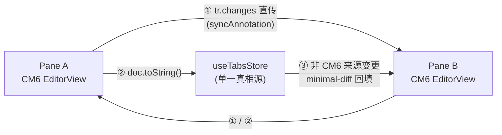
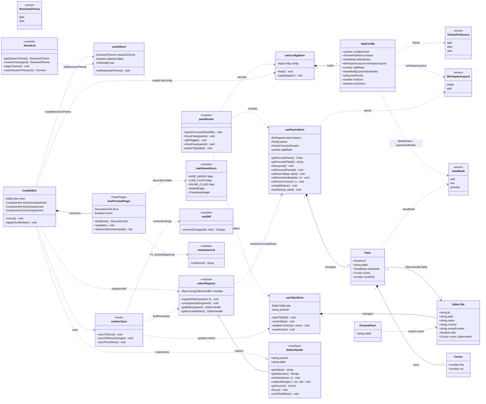
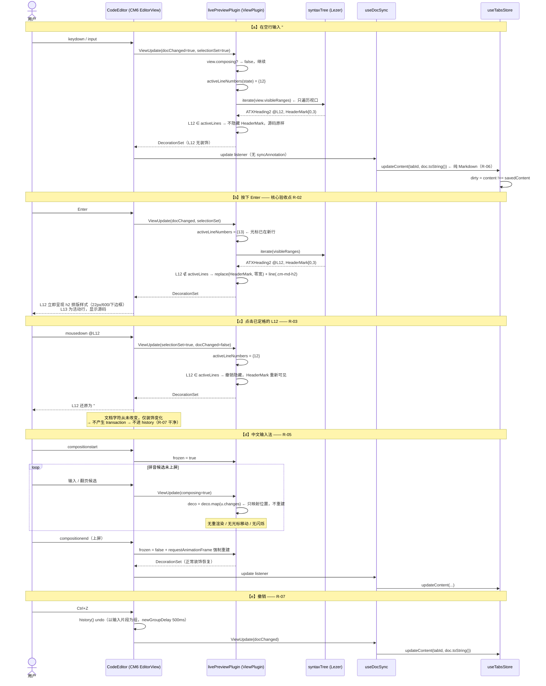
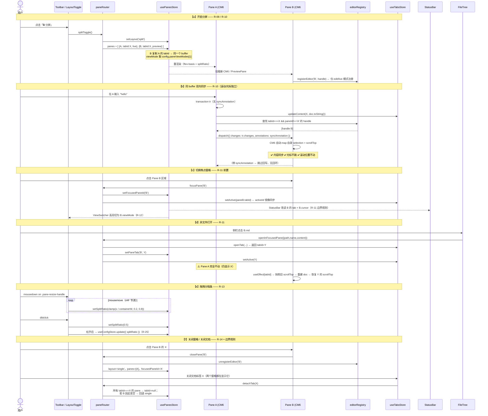
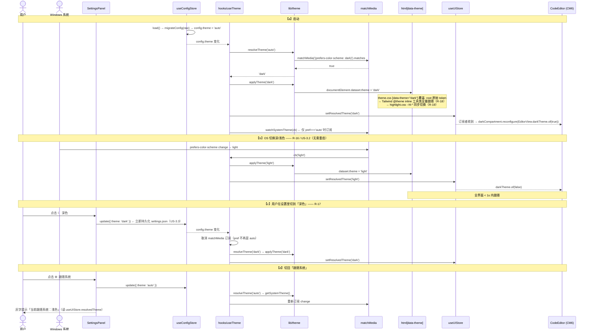
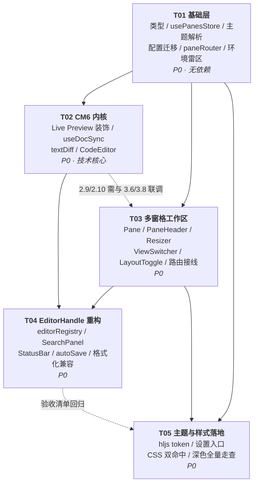

> ⚠️ **文档状态（2026-08-10）**：本文件是 PureMark **iter2 的架构设计基线**（与 `prd-iter2.md` 配套），规划**已全部落地**。其中涉及"分屏拖拽分隔条/PaneResizer"的条目**实际未做**（遗留债）。**当前唯一权威认知总览 = `docs/项目认知与现状总览.md`**，凡冲突以它为准。

# PureMark 第二轮迭代 · 增量架构设计 + 任务分解（iter2）

> 文档类型：**增量架构设计（delta）** ｜ 作者：高见远（架构师）
> 权威需求源：`docs/prd-iter2.md`（许清楚 / PM）
> 基线：`docs/system_design.md` v1 + 当前 `src/` 实际代码
> 语言：中文 ｜ 本文档只描述**本轮新增 / 变更**，未提及的 MVP 结构一律保持不变
> **本文件是 iter2 的唯一实现依据。**

---

## 0. 三句话摘要

1. **技术定调**：Live Preview 采用 **CodeMirror 6 + Lezer 语法树 + 视口内增量 Decoration**——「非活动行用 `Decoration.replace` 隐藏语法标记 + `Decoration.line/mark` 套 `preview.css` 排版类」，文档 buffer 恒为纯 Markdown，光标 / IME / 撤销全部走 CM6 原生能力；视觉一致性靠**共享 CSS 选择器**（而非二次调用 marked）达成，`lib/markdown.ts` 只在 P1 块级 widget（代码块 / 表格）里被调用。
2. **最大风险**：`tauri.conf.json` 里写死了 `"theme": "Light"`，会**钳制 WebView 的 `prefers-color-scheme`，导致 R-16 的 `auto` 主题永远解析为 light**——这是本轮必须先拆的一颗雷；其次是 CM6 双实例的 `@codemirror/state` 单例约束（多副本会直接抛 `Unrecognized extension value`）。
3. **任务数**：**5 个主任务（T01–T05，共 27 个可逐条执行的子步骤）**，依赖链为 T01 → {T02, T03} → T04 → T05。

---

# Part A：系统架构设计

## 1. 实现方案与框架选型

### 1.1 Live Preview 内核 → **CodeMirror 6**（已与用户确认，不再论证选型）

#### 1.1.1 为什么 CM6 能同时满足 R-02 / R-05 / R-06 / R-07

| 需求 | CM6 的原生答案 | 说明 |
| --- | --- | --- |
| **R-06 文档恒为纯 Markdown** | `EditorState.doc` 是**纯文本 Text 结构**；`Decoration` 属于 **view 层**，不进入 doc | `view.state.doc.toString()` 永远是纯源码，物理上不可能写入 HTML。这是相对自研 contenteditable 的**根本性优势** |
| **R-07 撤销重做** | `@codemirror/commands` 的 `history()` + `historyKeymap` | 以输入片段（transaction 聚合，`newGroupDelay` 默认 500ms）为撤销单元，天然满足「不得整行整段回滚」 |
| **R-05 IME 保护** | `EditorView.composing` / `view.inputState.composing` | 组合期间**冻结装饰重建**，只对已有 `DecorationSet` 做 `.map(update.changes)` 位置映射 |
| **R-02 回车定格** | `update.selectionSet` 触发装饰重建 | 光标离开旧行 → 旧行不再属于 `activeLines` → 隐藏装饰生效。**定格是选区变化的自然结果，无需特殊逻辑** |
| **性能 R-G1 / RK-4** | 视口虚拟化 + `view.visibleRanges` 限定遍历 | 只对**可视区域**遍历语法树构建装饰，1 万行文档与 100 行文档的单次重建成本同阶 |

#### 1.1.2 核心机制：**行级活动单元 + 内联渲染装饰**（不是 HTML 替换）

> ⚠️ **本轮最重要的架构约束**：**禁止**用 `Decoration.replace({ widget: 渲染后的 HTML })` 整行替换来做 P0 的行内语法。
> 原因：整行 widget 会让该行文本从可编辑流中消失，破坏光标映射、选区拖选、查找跳转与 IME 落点，等于把 contenteditable 的坑重新挖一遍。
> **P0 一律使用「原地装饰」**：文本仍在原位、仍可编辑，只是**部分字符被隐藏、部分字符被套上 CSS 类**。

装饰分三类，全部由一个 `ViewPlugin` 统一产出：

| 装饰类型 | API | 用途 | 例子 |
| --- | --- | --- | --- |
| **① 隐藏语法标记** | `Decoration.replace({})`（无 widget，零宽替换） | 非活动行的 `#`、`**`、`~~`、`` ` ``、`[`、`](url)`、`>` | `## 标题` → 隐藏 `## ` 三个字符 |
| **② 行级排版类** | `Decoration.line({ class })` | 给整行加 class，套用标题 / 引用 / 分割线样式 | `.cm-md-h2` → 22px/600/下边框 |
| **③ 内联排版类** | `Decoration.mark({ class })` | 给标记内的内容套 class | `.cm-md-strong` / `.cm-md-em` / `.cm-md-code` / `.cm-md-link` |
| **④ 符号替换**（唯一允许的 widget） | `Decoration.replace({ widget })` | 列表 bullet / 任务复选框 / 有序号 | `- ` → `•`；`- [x] ` → `☑`。**widget 极窄、无内部文本**，不影响光标映射 |

#### 1.1.3 语法树来源：`@codemirror/lang-markdown`（Lezer）

`syntaxTree(state).iterate({ from, to })` 提供的节点名（GFM 已默认开启），装饰映射表：

| Lezer 节点 | 标记子节点（隐藏目标） | 应用装饰 |
| --- | --- | --- |
| `ATXHeading1` … `ATXHeading6` | `HeaderMark`（`#…` + 空格） | `line: .cm-md-h1..h6` |
| `StrongEmphasis` | `EmphasisMark`（`**`） | `mark: .cm-md-strong` |
| `Emphasis` | `EmphasisMark`（`*` / `_`） | `mark: .cm-md-em` |
| `Strikethrough` | `StrikethroughMark`（`~~`） | `mark: .cm-md-del` |
| `InlineCode` | `CodeMark`（`` ` ``） | `mark: .cm-md-code` |
| `Link` | `LinkMark`（`[` `]` `(` `)`）+ `URL` 整体隐藏 | `mark: .cm-md-link`（仅链接文本可见） |
| `Image` | `LinkMark` + `URL` | P0 仅隐藏标记，P2 再做缩略图（R-29） |
| `BulletList > ListItem` | `ListMark`（`-` / `*` / `+`） | `replace(widget: BulletWidget "•")` + `line: .cm-md-li` |
| `OrderedList > ListItem` | `ListMark`（`1.`） | 保留数字，`line: .cm-md-li-ol` |
| `Task`（GFM） | `TaskMarker`（`[ ]` / `[x]`） | `replace(widget: CheckboxWidget)` ；P1 可点（R-27） |
| `Blockquote` | `QuoteMark`（`>`） | `line: .cm-md-quote` |
| `HorizontalRule` | 整行 | `line: .cm-md-hr`（CSS 画线，文本保留但字色透明） |
| `FencedCode`（**P1 / R-21**） | `CodeMark` / `CodeInfo` | 块级 widget，调用 `lib/markdown.ts` 渲染 |
| `Table`（**P1 / R-21**） | `TableDelimiter` | 块级 widget |

> **可行性护栏**：Lezer 节点名随版本存在漂移风险。要求工程师在 `src/lib/cm/livePreview.ts` 内置一个 `DEBUG_DUMP_TREE` 开关（`import.meta.env.DEV` 下按 `Ctrl+Alt+T` 打印当前 `syntaxTree` 节点名），**先 dump 再写映射表**，禁止照抄本表硬编码后不验证。

#### 1.1.4 活动行判定与「冻结」

```ts
// 伪代码（src/lib/cm/livePreview.ts）
function activeLineNumbers(state: EditorState): Set<number> {
  const s = new Set<number>();
  for (const r of state.selection.ranges) {
    const a = state.doc.lineAt(r.from).number;
    const b = state.doc.lineAt(r.to).number;
    for (let n = a; n <= b; n++) s.add(n);
  }
  return s;
}

// ViewPlugin.update 的门控（R-05 IME 保护 + 性能）
update(u: ViewUpdate) {
  if (u.view.composing || this.frozen) {          // ← 组合输入期间只做位置映射
    this.deco = this.deco.map(u.changes);
    return;
  }
  if (u.docChanged || u.selectionSet || u.viewportChanged || u.focusChanged) {
    this.deco = this.build(u.view);               // 只遍历 view.visibleRanges
  }
}
```

- `frozen` 由 `EditorView.domEventHandlers({ compositionstart, compositionend })` 翻转；`compositionend` 后用 `requestAnimationFrame` 触发一次强制重建（避免上屏后残留源码态）。
- 失焦（`u.focusChanged && !view.hasFocus`）时把 `activeLines` 视为空集 → **全文定格**，符合 PRD「失焦 = 定格触发」。

#### 1.1.5 视觉一致性：**共享 CSS，而非共享渲染器**

用户的诉求是「live 与 preview 视觉一致」。达成方式**不是**在 live 模式里跑一遍 marked，而是：

```css
/* src/styles/preview.css —— 把选择器扩为双命中，值只定义一次 */
.preview-content h1,
.cm-live .cm-md-h1        { font-size: 28px; font-weight: 700; line-height: 1.3; margin: 0 0 16px; }

.preview-content h2,
.cm-live .cm-md-h2        { font-size: 22px; font-weight: 600; padding-bottom: 8px;
                            border-bottom: 1px solid var(--border-subtle); }

.preview-content blockquote,
.cm-live .cm-md-quote     { border-left: 3px solid var(--primary); background: var(--primary-soft); }
/* …以此类推 */
```

| 层次 | 复用手段 | 覆盖范围 |
| --- | --- | --- |
| **P0 行内 / 行级** | `preview.css` 选择器双命中（单一数值来源） | 标题、粗斜删、行内代码、链接、列表、引用、分割线 |
| **P1 块级（R-21）** | `Decoration.replace({ widget })` 内部调用 `lib/markdown.ts` 的 `render()`，widget DOM 外层挂 `.preview-content` 类 | 围栏代码块（含 hljs + 复制按钮）、表格 |

> **已识别的视觉冲突（需工程师处理）**：`preview.css` 现有 `.preview-content p { color: var(--foreground-muted) }`——预览态正文是灰的。但 **live 模式是编辑态，正文必须是 `--foreground`**，否则打字看着发灰。
> **决策**：`live.css` 中对 `.cm-live .cm-line { color: var(--foreground); }` 做覆盖，只让**标题 / 引用 / 链接 / 代码**继承 preview 的语义色；`p` 的 muted 色**不参与双命中**。

#### 1.1.6 性能预算（R-G1 < 80ms P95）

| 手段 | 效果 |
| --- | --- |
| 只遍历 `view.visibleRanges`（而非全文 `syntaxTree`） | 单次构建 O(视口行数) ≈ 40–60 行，与文档总长解耦 |
| `RangeSetBuilder` 严格按 `from` 递增追加 | 避免 RangeSet 排序开销 |
| `u.composing` 时只 `deco.map(changes)` | 组合期零重建 |
| `Decoration.replace({})` 零宽替换，不创建 DOM 节点 | 隐藏标记几乎零成本 |
| CM6 自身 DOM 复用（只 patch 变化的 `.cm-line`） | 「只重渲染变化的行」由 CM6 保证，无需自研 |
| 分屏两实例（RK-4） | 各自独立视口，成本线性叠加而非平方；实测门槛 = 两个 60 行视口 |

**验收方法**：DEV 模式下在 ViewPlugin 里用 `performance.now()` 包裹 `build()`，输出 P95；工程师需在 1 万行样例文档上出具实测数字。

### 1.2 概念分层（复核 PRD 5.1，**采纳并给出状态归属结论**）

| 层 | 概念 | 取值 | **归属（架构结论）** |
| --- | --- | --- | --- |
| 工作区层 | `WorkspaceLayout` 🆕 | `single` \| `split` | **新建 `src/store/usePanesStore.ts`** |
| 窗格层 | `Pane` 🆕 | `{ id, tabId, viewMode, cursor, scrollTop }` | **`usePanesStore`** |
| 窗格层 | `ViewMode` 🔧 | `edit` \| `live` \| `preview`（**删除 `split`**） | 每个 `Pane` 独立持有 |
| 文档层 | `EditorTab` ♻️ | 不变（单一 buffer） | `useTabsStore`（**不动**） |

#### 为什么新建 `usePanesStore` 而不是塞进 `useUIStore`

| 理由 | 说明 |
| --- | --- |
| **订阅粒度** | `useUIStore` 被 Sidebar / AppShell / Toolbar 广泛订阅；pane 的 `cursor`/`scrollTop` 是高频写入字段，混入会引发大面积无谓重渲染 |
| **生命周期独立** | panes 有自己的持久化（R-25）、迁移、以及「关闭 tab 时联动释放窗格」的领域逻辑 |
| **避免双真相源** | `useUIStore.viewMode` **必须删除**——保留它就会与 `Pane.viewMode` 形成两份真相 |

#### 旧「左源码右预览」的等价映射（零功能损失）

```
MVP:  useUIStore.viewMode === 'split'
iter2: usePanesStore = {
         layout: 'split',
         splitRatio: 0.5,
         panes: [
           { id: 'A', tabId: X, viewMode: 'edit'    },
           { id: 'B', tabId: X, viewMode: 'preview' }   ← 同一个 tabId
         ]
       }
```
能力**严格超集**：还可以左 `live` 右 `preview`、左 A.md 右 B.md。R-26（P1）只是把上面这段配置封成一个按钮。

#### `activeId` 与 `focusedPaneId` 的一致性（关键约定）

`useTabsStore.activeId` **保留**（TabBar 高亮、`saveActive()`、`useAutoSave` 都依赖它），语义收敛为「**焦点窗格所显示的 tabId 的镜像**」。
所有会改变这两者的入口，**统一收敛到 `src/lib/paneRouter.ts`**，禁止组件直接调 `useTabsStore.setActive` / `openTab`：

```ts
// src/lib/paneRouter.ts —— 唯一的「打开 / 聚焦」出入口
openInFocusedPane(file): void   // openTab → 写焦点 pane.tabId → setActive
focusPane(paneId): void         // setFocusedPaneId → setActive(pane.tabId)
splitToggle(): void             // single ⇄ split（分屏时 B 复制 A 的 tabId，viewMode 取 config.paneViewModes[1]）
closePane(paneId): void         // 移除窗格 → layout='single' → 焦点归剩余窗格
detachTab(tabId): void          // 关闭文档时把所有引用它的 pane 释放；若因此只剩一个有效窗格 → 回 single
```

### 1.3 `EditorHandle` 抽象（替换 `editorBridge` 的「全局唯一 textarea」假设）

现状 `lib/editorBridge.ts` 只有 `setActiveTextarea/getActiveTextarea`，被 `EditorPane.tsx`（写）与 `SearchPanel.tsx`（读）使用。分屏后存在**两个编辑器实例**，且 live/edit 模式下已不是 `<textarea>` 而是 CM6 `EditorView`。

**结论：删除 `editorBridge.ts`，新建 `src/lib/editorRegistry.ts`。**

```ts
export interface EditorHandle {
  readonly paneId: string;
  readonly tabId: string | null;
  getValue(): string;
  getSelection(): { start: number; end: number };          // 字符偏移，0-based
  setSelection(start: number, end: number): void;
  replaceRange(from: number, to: number, insert: string,
               select?: { start: number; end: number }): void;
  getCursor(): Cursor;                                     // 1-based line/col
  focus(): void;
  scrollToOffset(offset: number): void;                    // 查找跳转用
}

registerEditor(paneId: string, h: EditorHandle): void;
unregisterEditor(paneId: string): void;
getEditor(paneId: string): EditorHandle | null;
getFocusedEditor(): EditorHandle | null;   // 读 usePanesStore.getState().focusedPaneId
```

| 调用方 | 迁移动作 |
| --- | --- |
| `SearchPanel.tsx` | `getActiveTextarea()` → `getFocusedEditor()`；`ta.setSelectionRange` → `h.setSelection` + `h.scrollToOffset` |
| `StatusBar.tsx` | 改读 `usePanesStore` 焦点窗格的 `tabId` + `cursor` |
| 格式化链路（`format.ts` 调用方） | `applyFormat(cmd, h.getValue(), h.getSelection())` → `h.replaceRange(0, len, text, {selStart, selEnd})`。**`format.ts` 本身是纯函数，一行不改**（R-10 决策：本轮不恢复工具栏按钮，仅保证兼容） |
| `preview` 模式的窗格 | **不注册** handle（无编辑能力）；`getFocusedEditor()` 返回 `null` 时，查找/格式化优雅降级（提示或转投另一窗格） |

### 1.4 同文件分屏的双向同步（R-10）

`useTabsStore` 单一 buffer 让「数据同步」天然成立，但**两个 CM6 实例之间需要精确的变更转发**，否则全量替换会打乱对侧的光标与滚动。

**双通道同步策略**：



| 通道 | 触发场景 | 实现 |
| --- | --- | --- |
| **① Peer 直传**（主路径） | 用户在 A 输入 | `useDocSync` 的 update listener：遍历 registry 中**同 tabId 且 paneId≠自身**的 view，`peer.dispatch({ changes: tr.changes, annotations: syncAnnotation.of(true) })`。CM6 会自动 map 对侧的 selection / scroll → **光标与滚动天然独立且不跳** |
| **② 回写 store** | 同上 | `updateContent(tabId, view.state.doc.toString())`，脏标记 / 自动保存链路完全不变（R-06） |
| **③ minimal-diff 回填** | 非 CM6 来源（草稿恢复、格式化命令、未来的外部改动） | `useEffect` 比较 `tab.content !== view.state.doc.toString()` → `src/lib/textDiff.ts` 求公共前后缀得最小 `{from,to,insert}` → dispatch（带 `syncAnnotation`） |

**防回环**：任何带 `syncAnnotation` 的 transaction，在 update listener 中**跳过 ①②**。

```ts
// src/lib/textDiff.ts
export function minimalChange(oldStr: string, newStr: string):
  { from: number; to: number; insert: string } | null;
```

### 1.5 主题解析层（R-15 / R-16 / R-17）

```ts
// src/lib/theme.ts
export type ThemePreference = 'light' | 'dark' | 'auto';
export type ResolvedTheme   = 'light' | 'dark';

getSystemTheme(): ResolvedTheme                                   // matchMedia('(prefers-color-scheme: dark)')
resolveTheme(pref: ThemePreference): ResolvedTheme
applyTheme(t: ResolvedTheme): void                                // documentElement.dataset.theme = t
watchSystemTheme(cb: (t: ResolvedTheme) => void): () => void      // addEventListener('change') → 返回取消函数
```

```ts
// src/hooks/useTheme.ts —— 在 App.tsx 中调用一次
// 1. config.theme 变化 → resolve → applyTheme → useUIStore.setResolvedTheme
// 2. 若 pref === 'auto'，订阅 watchSystemTheme；否则取消订阅
// 3. 返回 resolvedTheme（供 SettingsPanel 显示「当前跟随系统：深色」）
```

- `resolvedTheme` 存入 **`useUIStore`**（不新建 store），供 CM6 组件订阅以切换 `EditorView.darkTheme` compartment。
- `App.tsx` 里现有的 `document.documentElement.dataset.theme = config.theme` **删除**，改为 `useTheme()`。

> 🚨 **本轮最大的隐藏雷（RK-新增）**：`src-tauri/tauri.conf.json` 中 `app.windows[0].theme` 目前硬编码为 `"Light"`。
> 该字段会**强制 WebView 的配色偏好**，导致 `matchMedia('(prefers-color-scheme: dark)').matches` **恒为 false**，R-16 / US-3.2 直接失效。
> **必须改为移除该字段（或设为 `null`）**，让窗口跟随系统。这是 T01 的第一优先动作，且必须实机验证（改 Windows 深色模式，观察 App 是否 1s 内跟随）。

### 1.6 深色代码高亮（R-19，采纳自写 token 方案）

新建 `src/styles/highlight.css`，**不引入任何 `highlight.js/styles/*.css`**：

```css
:root {                     /* GitHub Light 取色 */
  --hl-comment: #6e7781;  --hl-keyword: #cf222e;  --hl-string:  #0a3069;
  --hl-number:  #0550ae;  --hl-title:   #8250df;  --hl-type:    #953800;
  --hl-variable:#953800;  --hl-literal: #0550ae;  --hl-meta:    #6e7781;
  --hl-symbol:  #0550ae;  --hl-addition:#116329;  --hl-deletion:#82071e;
}
[data-theme="dark"] {       /* GitHub Dark 取色 */
  --hl-comment: #8b949e;  --hl-keyword: #ff7b72;  --hl-string:  #a5d6ff;
  --hl-number:  #79c0ff;  --hl-title:   #d2a8ff;  --hl-type:    #ffa657;
  --hl-variable:#ffa657;  --hl-literal: #79c0ff;  --hl-meta:    #8b949e;
  --hl-symbol:  #79c0ff;  --hl-addition:#7ee787;  --hl-deletion:#ffa198;
}
```

需覆盖的 12 组 hljs 类（其余类归入这 12 组的分组选择器）：

| 变量 | 覆盖的 `.hljs-*` 类 |
| --- | --- |
| `--hl-comment` | `comment` `quote` |
| `--hl-keyword` | `keyword` `selector-tag` `doctag` |
| `--hl-string` | `string` `regexp` `template-tag` |
| `--hl-number` | `number` `literal`(数字场景) |
| `--hl-title` | `title` `section` `name` `title.function` `title.class` |
| `--hl-type` | `type` `built_in` `class` `builtin-name` |
| `--hl-variable` | `variable` `template-variable` `attr` `attribute` `params` |
| `--hl-literal` | `literal` `symbol` `bullet` |
| `--hl-meta` | `meta` `meta-keyword` `meta-string` `punctuation` |
| `--hl-symbol` | `link` `selector-id` `selector-class` |
| `--hl-addition` | `addition` |
| `--hl-deletion` | `deletion` |
| （无色，仅字形） | `emphasis`→`font-style:italic`；`strong`→`font-weight:600` |

### 1.7 CM6 自身的主题与字体

**不引入 `@codemirror/theme-one-dark`**。做法：

| 事项 | 方案 |
| --- | --- |
| 配色 | `src/styles/live.css` 中直接用现有 token：`.cm-editor { color: var(--foreground); background: transparent; }`、`.cm-cursor { border-left-color: var(--foreground) }`、`.cm-selectionBackground { background: var(--primary-soft) }` 等 → **随 `data-theme` 自动切换，零切换成本** |
| CM6 内部 dark 标志 | `Compartment` 包 `EditorView.darkTheme.of(resolvedTheme === 'dark')`（影响 CM6 默认选区 / 滚动条推断），订阅 `useUIStore.resolvedTheme` 重配置 |
| 字体 / 字号 | `Compartment` 包 `EditorView.theme({ '&': { fontSize: fontSize+'px' }, '.cm-content': { fontFamily } })`，订阅 `useConfigStore.config` 重配置 |
| Tailwind preflight 冲突 | `live.css` 需在 `@import "tailwindcss"` **之后**加载；CM6 的 `.cm-*` 类特异性通常足够，若被 preflight 压制则局部提权（不使用 `!important` 泛滥） |

---

## 2. 文件列表（本轮新增 / 修改 / 删除）

```
prueMd/
├── package.json                                  🔧 新增 6 个 @codemirror/* 依赖
├── vite.config.ts                                🔧 resolve.dedupe 保证 CM6 单例
├── src-tauri/tauri.conf.json                     🔧 移除 app.windows[0].theme:"Light"（阻断 auto 主题）
└── src/
    ├── App.tsx                                   🔧 data-theme 挂载改走 useTheme()；defaultView → 初始化 panes
    ├── types/index.ts                            🔧 ViewMode 重定义 / WorkspaceLayout / Pane / ThemePreference / AppConfig 扩展
    ├── store/
    │   ├── usePanesStore.ts                      🆕 布局 + 窗格数组 + 焦点 + 分栏比例
    │   ├── useUIStore.ts                         🔧 删除 viewMode / setViewMode；新增 resolvedTheme
    │   ├── useConfigStore.ts                     🔧 DEFAULT_CONFIG 更新 + migrateConfig()（R-20）
    │   └── useTabsStore.ts                       ♻️ 不改（EditorTab.cursor 标 @deprecated）
    ├── lib/
    │   ├── theme.ts                              🆕 主题解析 / 应用 / matchMedia 监听
    │   ├── editorRegistry.ts                     🆕 EditorHandle 注册表（替代 editorBridge）
    │   ├── editorBridge.ts                       ❌ 删除
    │   ├── textDiff.ts                           🆕 minimalChange（公共前后缀最小差异）
    │   ├── paneRouter.ts                         🆕 打开/聚焦/分屏/关闭窗格 的唯一入口
    │   ├── cm/
    │   │   ├── setup.ts                          🆕 基础扩展组合 + Compartment 定义 + syncAnnotation
    │   │   ├── livePreview.ts                    🆕 ViewPlugin：活动行判定 + 视口内装饰构建 + IME 冻结
    │   │   ├── markdownDecor.ts                  🆕 Lezer 节点 → Decoration 映射表 + BulletWidget/CheckboxWidget
    │   │   └── cmTheme.ts                        🆕 EditorView.theme（字体/字号）+ darkTheme compartment
    │   ├── markdown.ts                           ♻️ 不改（P1 块级 widget 调用它）
    │   ├── highlight.ts                          ♻️ 不改
    │   ├── format.ts                             ♻️ 不改（纯函数）
    │   └── closeGuard.ts                         🔧 closeTab 后调用 paneRouter.detachTab
    ├── hooks/
    │   ├── useTheme.ts                           🆕 主题解析 + 系统监听 + 写入 resolvedTheme
    │   ├── useDocSync.ts                         🆕 CM6 ⇄ store ⇄ peer 三通道同步 + registry 注册
    │   ├── useAutoSave.ts                        🔧 activeTab 改由焦点窗格解析（语义不变）
    │   ├── useHotkeys.ts                         🔧 P1：Ctrl+\ 分屏、Ctrl+1/2 切焦点（R-23）
    │   └── useEditorStats.ts                     ♻️ 不改（纯函数）
    ├── components/
    │   ├── AppShell.tsx                          ♻️ 不改
    │   ├── Workspace/
    │   │   ├── Workspace.tsx                     🔧 TabBar + EditorCard（EditorCard 内部改多窗格）
    │   │   ├── EditorCard.tsx                    🔧 Toolbar + PaneGrid（single/split 分支）
    │   │   ├── Pane.tsx                          🆕 单窗格：PaneHeader + (CodeEditor | PreviewPane)
    │   │   ├── PaneHeader.tsx                    🆕 28px：文件名+脏点 / mini ViewSwitcher / 关闭
    │   │   ├── PaneResizer.tsx                   🆕 拖拽分隔条（照搬 .sidebar-resize-handle 交互）
    │   │   ├── CodeEditor.tsx                    🆕 CM6 封装（承载 edit 与 live 两种 viewMode）
    │   │   ├── EditorPane.tsx                    ❌ 删除（被 CodeEditor 取代）
    │   │   ├── PreviewPane.tsx                   🔧 props 改为 { tabId }，保留内部滚动（分屏两实例）
    │   │   ├── ViewSwitcher.tsx                  🔧 源码|实时|预览，作用于目标窗格（受控 props 化）
    │   │   ├── LayoutToggle.tsx                  🆕 工具栏「⧉ 分屏」布局开关按钮
    │   │   ├── Toolbar.tsx                       🔧 挂 ViewSwitcher(焦点窗格) + LayoutToggle
    │   │   └── TabBar.tsx                        🔧 点击走 paneRouter.openInFocusedPane / setActive
    │   ├── Sidebar/FileTree.tsx                  🔧 openTab → paneRouter.openInFocusedPane
    │   ├── StatusBar/StatusBar.tsx               🔧 读焦点窗格的 tab + cursor
    │   ├── dialogs/SearchPanel.tsx               🔧 editorBridge → getFocusedEditor()
    │   ├── dialogs/SettingsPanel.tsx             🔧 新增「主题」三段控件；默认视图选项改 源码/实时/预览
    │   └── ui/Icon.tsx                           🔧 新增 Columns2 / Code2 / Pilcrow / Sun / Moon / MonitorCog / X
    ├── styles/
    │   ├── theme.css                             🔧 补 --hl-* 变量（亮/暗两套）
    │   ├── layout.css                            🔧 .editor-split → .pane-grid/.pane/.pane-header/.pane-resize-handle
    │   ├── preview.css                           🔧 选择器双命中（.preview-content X, .cm-live .cm-md-X）
    │   ├── live.css                              🆕 CM6 编辑器外观 + live 装饰专属样式
    │   └── highlight.css                         🆕 基于 CSS 变量的 .hljs-* 配色
    └── __tests__/
        ├── textDiff.test.ts                      🆕
        ├── theme.test.ts                         🆕
        ├── configMigrate.test.ts                 🆕
        └── panes.test.ts                         🆕
```

**统计**：新增 21 个文件，修改 22 个文件，删除 2 个文件。

---

## 3. 数据结构与接口

### 3.1 类型定义（`src/types/index.ts`）

```ts
/* ---------- 变更：ViewMode 下沉为「窗格级渲染模式」，移除 'split' ---------- */
export type ViewMode = 'edit' | 'live' | 'preview';        // 🔧 R-08 破坏性

/* ---------- 新增：工作区布局 ---------- */
export type WorkspaceLayout = 'single' | 'split';          // 🆕 R-09

/* ---------- 新增：窗格模型 ---------- */
export type PaneId = 'A' | 'B';                            // 固定两槽，避免 uuid 带来的一致性成本
export interface Pane {
  id: PaneId;
  tabId: string | null;      // 指向 EditorTab.id；两个 pane 可指向同一个（R-10 同文件分屏）
  viewMode: ViewMode;        // R-12 每窗格独立
  cursor: Cursor;            // R-10 光标独立（1-based）
  scrollTop: number;         // 切走时快照，切回时恢复（非逐帧同步）
}

/* ---------- 新增：主题 ---------- */
export type ThemePreference = 'light' | 'dark' | 'auto';   // 🔧 R-15
export type ResolvedTheme   = 'light' | 'dark';            // 🆕 R-16（<html data-theme> 只写这两个值）

/* ---------- 变更：AppConfig ---------- */
export interface AppConfig {
  configVersion: number;              // 🆕 迁移用；iter2 = 2
  theme: ThemePreference;             // 🔧 新装默认 'auto'
  fontFamily: string;
  fontSize: number;
  defaultView: ViewMode;              // 🔧 默认 'live'；旧 'split' → 'live'（R-20）
  workspaceLayout: WorkspaceLayout;   // 🆕 R-25，默认 'single'
  splitRatio: number;                 // 🆕 R-25，0.2~0.8，默认 0.5
  paneViewModes: [ViewMode, ViewMode];// 🆕 R-25，默认 ['live', 'preview']
  sidebarVisible: boolean;
  sidebarWidth: number;
  lastFolder: string | null;
  recentFiles: string[];
  window: WindowSize;
  autoSave: boolean;
  autoSaveDelay: number;
}

/* ---------- EditorTab：不动，仅降级注释 ---------- */
export interface EditorTab {
  id: string; path: string; name: string;
  content: string; savedContent: string; dirty: boolean;
  /** @deprecated iter2 起光标归属 Pane（同文件分屏需两个独立光标）。保留字段以兼容既有调用。 */
  cursor: Cursor;
}
```

### 3.2 Store 接口

```ts
/* ---------- 🆕 src/store/usePanesStore.ts ---------- */
interface PanesState {
  layout: WorkspaceLayout;
  panes: Pane[];                 // 长度 1（single）或 2（split），数组顺序 = 左右顺序
  focusedPaneId: PaneId;
  splitRatio: number;            // 左窗格占比

  getFocusedPane(): Pane;
  getPane(id: PaneId): Pane | undefined;
  getFocusedTabId(): string | null;

  setLayout(l: WorkspaceLayout): void;
  setFocusedPane(id: PaneId): void;
  setPaneTab(id: PaneId, tabId: string | null): void;
  setPaneViewMode(id: PaneId, m: ViewMode): void;
  setPaneCursor(id: PaneId, c: Cursor): void;
  setPaneScroll(id: PaneId, top: number): void;
  setSplitRatio(r: number): void;               // 内部 clamp 到 [0.2, 0.8]
  hydrate(cfg: AppConfig, initialTabId: string | null): void;   // 启动时按配置初始化
}

/* ---------- 🔧 src/store/useUIStore.ts ---------- */
interface UIState {
  // ❌ viewMode / setViewMode —— 删除，迁至 Pane
  resolvedTheme: ResolvedTheme;                 // 🆕
  setResolvedTheme(t: ResolvedTheme): void;     // 🆕
  sidebarVisible: boolean; sidebarWidth: number;
  currentFolder: string | null; tree: FileNode[];
  searchOpen: boolean; configOpen: boolean;
  /* 其余保持不变 */
}

/* ---------- 🔧 src/store/useConfigStore.ts ---------- */
export const DEFAULT_CONFIG: AppConfig = {
  configVersion: 2,
  theme: 'auto',                      // 🔧 新装默认跟随系统（PM 待确认 #7 已采纳）
  defaultView: 'live',                // 🔧 PM 待确认 #3 已采纳
  workspaceLayout: 'single',
  splitRatio: 0.5,
  paneViewModes: ['live', 'preview'],
  /* …其余沿用 MVP 值 */
};

/** R-20 配置迁移：旧文件 → iter2 结构，任何异常值都回落默认，禁止抛错。 */
export function migrateConfig(raw: unknown): AppConfig;
```

`migrateConfig` 规则表：

| 输入情形 | 输出 |
| --- | --- |
| `raw == null`（全新安装） | `DEFAULT_CONFIG`（theme = `auto`） |
| `raw.theme` ∈ {light, dark, auto} | 原样保留（**旧用户不被覆盖为 auto**） |
| `raw.theme` 非法 / 缺失 | `'auto'` |
| `raw.defaultView === 'split'` | `'live'`（PM 决策：老用户选 split 是想看渲染效果） |
| `raw.defaultView` ∈ {edit, live, preview} | 原样保留 |
| `raw.defaultView` 非法 / 缺失 | `'live'` |
| `raw.workspaceLayout / splitRatio / paneViewModes` 缺失 | 填默认值 |
| `raw.splitRatio` 越界 | clamp 到 `[0.2, 0.8]` |
| 任意字段解析抛异常 | 整体回落 `DEFAULT_CONFIG` 并 `console.warn`，**不得阻断启动** |

### 3.3 类图



---

## 4. 程序调用流程（时序图）

### 4.1 ① Live 模式：输入 → 回车定格 → 点回还原（R-01/02/03/05/06/07）



### 4.2 ② 分屏：开启 → 同 buffer 双向同步 → 聚焦切换 → 异文件打开（R-09/10/11/12/13/14）



### 4.3 ③ 主题 auto 解析（R-15/16/17/18）



> ⚠️ **前置条件**：上述 ③ 全链路的成立，依赖 `tauri.conf.json` 中 **`app.windows[0].theme` 字段被移除**。否则 `matchMedia(...).matches` 恒为 `false`，【b】永不触发。

---

## 5. 待明确事项 / 风险与建议

| # | 事项 | 风险等级 | 架构师建议 |
| --- | --- | --- | --- |
| **A-1** | **`tauri.conf.json` 的 `"theme": "Light"` 钳制 WebView 配色偏好** | 🔴 高（直接阻断 R-16） | **移除该字段**（Tauri 默认 = 跟随系统）。T01 第一步执行并实机验证。若产品希望「浅色主题下窗口边框也是浅色」，改用 `getCurrentWindow().setTheme()` 在运行时按 `resolvedTheme` 动态设置，而非配置写死 |
| **A-2** | **CM6 模块单例约束** | 🔴 高（分屏必踩） | `@codemirror/state` / `@codemirror/view` 若在 node_modules 出现多副本，会抛 `Unrecognized extension value in extension set`。**必须**在 `vite.config.ts` 加 `resolve.dedupe: ['@codemirror/state','@codemirror/view']`，并在 `package.json` 中显式声明这两个包（不依赖传递） |
| **A-3** | **Lezer markdown 节点名漂移** | 🟡 中 | 装饰映射表禁止盲抄。要求 DEV 下内置 `syntaxTree` dump 开关，**先 dump 再写表**。已在 §1.1.3 给出预期节点名作为参照基线 |
| **A-4** | **标题行定格瞬间的高度跳动** | 🟡 中 | `## 标题` 定格后字号 14px→22px，CM6 需 `requestMeasure` 重算行高，可能有一帧抖动。缓解：`.cm-md-h1..h6` 设定固定 `line-height`（与 `preview.css` 一致），并给 `.cm-line` 加 `transition: none`（禁止过渡动画放大抖动感）。若实测明显，退化方案是**只放大字重不放大字号**（需回 PM 确认，会削弱 G1 体感） |
| **A-5** | **窗口最小宽度实测（RK-5）** | 🟡 中 | 算账：`860 - 248(侧栏) - 24(card margin) - 6(handle) = 582`，÷2 = **291px > 240px ✅ 勉强够**。但侧栏可拖宽（`sidebarWidth` 无上限约束），拖到 400px 就不够。**建议**：① `tauri.conf.json` `minWidth` 提到 **960**；② `PaneResizer` 在可用宽度 `< 2×240+6` 时**禁用分屏按钮并给 tooltip**；③ 不做「分屏时自动折叠侧栏」（会让用户困惑） |
| **A-6** | **live 模式正文色与 preview 的 muted 冲突** | 🟢 低 | 已决策（§1.1.5）：`live.css` 覆盖 `.cm-line { color: var(--foreground) }`，`p` 的 muted 不参与双命中。**需 PM/设计走查确认观感** |
| **A-7** | **hljs token 配色范围** | 🟢 低 | 已定 **12 组变量**（§1.6），取色对齐 GitHub Light / Dark。若后续觉得区分度不足，只需加变量、不改结构 |
| **A-8** | **preview 模式窗格不注册 EditorHandle** | 🟢 低 | 焦点窗格若是 `preview`，`getFocusedEditor()` 返回 `null` → 查找面板应**降级到「另一个可编辑窗格」**，若都不可编辑则禁用跳转按钮并提示「当前窗格为预览模式」。建议按此实现（R-28） |
| **A-9** | **CM6 体积实测** | 🟢 低 | 预估 `state+view+commands+language+lang-markdown+lezer-markdown` ≈ **min 550–650KB / gzip 150–190KB**（用户已接受 ~200KB gzip）。**不装伞包 `codemirror`**（会连带 autocomplete/lint/search/搜索面板），可省 ~30%。要求工程师在 T02 完成后跑 `vite build` 出具实测 gzip 增量 |
| **A-10** | **`EditorTab.cursor` 的去留** | 🟢 低 | 本轮标 `@deprecated` 保留（避免动 `useTabsStore` 签名与既有测试）。**下一轮清理**。工程师不得再往它写值 |
| **A-11** | **`preventOverflow: true` 与分屏** | 🟢 低 | Tauri 该选项防止窗口超出屏幕；小屏（1366×768）下分屏可用宽度更紧张，与 A-5 一并实测 |
| **A-12** | **P1 项的取舍** | 🟢 低 | R-21（块级代码块/表格）、R-22（对照已保存版本）、R-23（快捷键）、R-26（一键源码/预览）、R-27（可点复选框）、R-28（查找适配）。**其中 R-28 建议提到 P0**——它不是新功能而是「不做就坏掉」的适配项，已并入 T04 |

---

# Part B：任务分解

## 6. 依赖包列表

### 6.1 新增 `dependencies`（进生产包）

```text
- @codemirror/state@^6.4.1          # EditorState / Text / Transaction / Compartment / Annotation ★单例关键
- @codemirror/view@^6.26.0          # EditorView / Decoration / ViewPlugin / WidgetType ★单例关键
- @codemirror/commands@^6.3.3       # history() + defaultKeymap + historyKeymap（R-07 撤销重做）
- @codemirror/language@^6.10.1      # syntaxTree() / LanguageSupport / HighlightStyle
- @codemirror/lang-markdown@^6.2.5  # Lezer Markdown 解析（GFM 默认开启）—— 装饰映射的语法树来源
- @lezer/markdown@^1.2.0            # 显式声明：直接引用 GFM 扩展与节点名，避免依赖传递版本漂移
```

### 6.2 **明确不引入**（及理由）

| 包 | 不引入理由 |
| --- | --- |
| `codemirror`（伞包） | 会连带 `@codemirror/autocomplete`、`@codemirror/lint`、`@codemirror/search`，这三个我们都不用，白增 ~30% 体积 |
| `@codemirror/theme-one-dark` | 自写基于 CSS 变量的 `live.css`，随 `data-theme` 自动切换，零切换成本、零额外体积（用户决策 #9） |
| `@codemirror/language-data` | 懒加载嵌套语言（代码块内高亮）。P0 不需要；P1 的 R-21 代码块走 **marked + hljs widget** 路线，也不需要 |
| `@codemirror/search` | 已有自研 `SearchPanel.tsx`，不重复造 |

### 6.3 `devDependencies`

无新增。

### 6.4 配置变更

```ts
// vite.config.ts  ★ A-2 必做
export default defineConfig({
  /* … */
  resolve: {
    dedupe: ['@codemirror/state', '@codemirror/view'],
  },
});
```

```jsonc
// src-tauri/tauri.conf.json  ★ A-1 必做
"windows": [{
  /* … */
  // "theme": "Light"    ← 删除此行，让 WebView 跟随系统 prefers-color-scheme
  "minWidth": 960        // ← 由 860 提升（A-5）
}]
```

---

## 7. 任务列表（按实现顺序，含依赖与验收点）

> **说明**：团队规范限制主任务 ≤ 5 个。为满足「工程师可逐条执行」的要求，每个主任务内部拆出**编号子步骤**（共 27 步）。
> 主理人建议的 7 步顺序 → 5 任务映射：
> | 建议顺序 | 归属 |
> |---|---|
> | ① 类型与 store 改造 | T01 |
> | ② 主题解析层 + 设置入口 + hljs token | T01（解析层/迁移）+ T05（设置入口/token/走查） |
> | ③ CodeMirror Live Preview 编辑器组件 | **T02** |
> | ④ 多窗格 Workspace/Pane + 拖拽 + 工具栏 + 分段控件 | **T03** |
> | ⑤ editorBridge→EditorHandle 重构 | **T04** |
> | ⑥ 配置迁移与兼容性 | T01（migrateConfig）+ T05（回归验证） |
> | ⑦ 样式走查 | **T05** |

### T01 · 基础层：类型 / 窗格状态 / 主题解析 / 配置迁移 / 环境雷区

| 项 | 内容 |
| --- | --- |
| **优先级** | P0 |
| **依赖** | — |
| **影响文件** | `src-tauri/tauri.conf.json`、`vite.config.ts`、`src/types/index.ts`、`src/store/usePanesStore.ts`🆕、`src/store/useUIStore.ts`、`src/store/useConfigStore.ts`、`src/lib/theme.ts`🆕、`src/lib/paneRouter.ts`🆕、`src/hooks/useTheme.ts`🆕、`src/App.tsx`、`src/__tests__/theme.test.ts`🆕、`src/__tests__/configMigrate.test.ts`🆕、`src/__tests__/panes.test.ts`🆕 |

**子步骤**

| # | 动作 | 验收点 |
| --- | --- | --- |
| 1.1 | 移除 `tauri.conf.json` 的 `"theme": "Light"`；`minWidth` 860 → 960 | 启动后 `matchMedia('(prefers-color-scheme: dark)').matches` 能随 OS 变化（控制台验证）**A-1 / R-16** |
| 1.2 | `vite.config.ts` 加 `resolve.dedupe: ['@codemirror/state','@codemirror/view']` | `pnpm ls @codemirror/state` 只有一个版本 **A-2** |
| 1.3 | `types/index.ts`：`ViewMode` 改 `edit\|live\|preview`；新增 `WorkspaceLayout`/`PaneId`/`Pane`/`ThemePreference`/`ResolvedTheme`；`AppConfig` 加 5 个字段；`EditorTab.cursor` 标 `@deprecated` | `tsc -b` 报出所有受影响引用点（这是预期的，作为改造清单） **R-08 / R-09 / R-15** |
| 1.4 | 新建 `store/usePanesStore.ts`（§3.2 接口全量实现，`setSplitRatio` 内 clamp `[0.2,0.8]`） | `panes.test.ts`：single↔split 切换、setPaneTab、焦点切换、ratio clamp **R-09/R-12** |
| 1.5 | `useUIStore`：**删除** `viewMode`/`setViewMode`；新增 `resolvedTheme`/`setResolvedTheme` | 无残留引用 **R-08** |
| 1.6 | `useConfigStore`：更新 `DEFAULT_CONFIG`（theme `auto`、defaultView `live`、3 个新字段、configVersion 2）；实现并导出 `migrateConfig(raw)`；`load()` 改走它 | `configMigrate.test.ts` 覆盖 §3.2 迁移规则表**全部 9 行**；旧配置 `{theme:'light',defaultView:'split'}` → `{theme:'light',defaultView:'live'}` 且不崩溃 **R-20** |
| 1.7 | 新建 `lib/theme.ts`（4 个函数）+ `hooks/useTheme.ts` | `theme.test.ts`：resolveTheme 三分支；watchSystemTheme 返回可用的取消函数 **R-16** |
| 1.8 | 新建 `lib/paneRouter.ts`（5 个函数，§1.2） | 所有打开/聚焦动作单点收敛；`activeId` 与 `focusedPane.tabId` 始终一致 **R-11** |
| 1.9 | `App.tsx`：删除 `dataset.theme = config.theme` 与 `setViewMode(config.defaultView)`；改为 `useTheme()` + `usePanesStore.hydrate(config, activeId)` | 启动即按 config 恢复布局与主题 **R-25 基础** |

---

### T02 · CodeMirror 6 编辑器内核 + Live Preview 装饰（本轮技术核心）

| 项 | 内容 |
| --- | --- |
| **优先级** | P0 |
| **依赖** | T01 |
| **影响文件** | `package.json`、`src/lib/cm/setup.ts`🆕、`src/lib/cm/markdownDecor.ts`🆕、`src/lib/cm/livePreview.ts`🆕、`src/lib/cm/cmTheme.ts`🆕、`src/lib/textDiff.ts`🆕、`src/hooks/useDocSync.ts`🆕、`src/components/Workspace/CodeEditor.tsx`🆕、`src/components/Workspace/EditorPane.tsx`❌删除、`src/styles/live.css`🆕、`src/__tests__/textDiff.test.ts`🆕 |

**子步骤**

| # | 动作 | 验收点 |
| --- | --- | --- |
| 2.1 | 安装 §6.1 六个依赖（**不装伞包**）；`main.tsx` 引入 `live.css` | `vite build` 通过；记录 gzip 增量 **A-9** |
| 2.2 | `lib/cm/setup.ts`：导出 `baseExtensions`（`history()`、`keymap.of([...defaultKeymap,...historyKeymap])`、`EditorView.lineWrapping`、`markdown()`、`drawSelection`）+ 3 个 `Compartment`（font / darkTheme / live）+ `syncAnnotation` | 裸 CM6 可编辑、可撤销、可换行 **R-07** |
| 2.3 | `lib/cm/cmTheme.ts`：`EditorView.theme` 只做 fontSize/fontFamily/padding（对齐 `--editor-pad-*`）；配色全部交给 `live.css` 的 CSS 变量 | 切换字号/字体即时生效；`data-theme` 切换时编辑区随之变色 |
| 2.4 | `lib/cm/markdownDecor.ts`：**先用 DEV dump 开关打印真实节点名**，再写 `HIDE_MARKS` / `LINE_CLASS` / `INLINE_CLASS` 映射表 + `BulletWidget` / `CheckboxWidget` | dump 输出与 §1.1.3 表比对，差异记录在代码注释 **A-3** |
| 2.5 | `lib/cm/livePreview.ts`：`ViewPlugin` 实现 `activeLineNumbers()` + `build(view)`（`RangeSetBuilder` + `syntaxTree().iterate(visibleRanges)`）+ `update()` 门控（composing / frozen / docChanged\|selectionSet\|viewportChanged\|focusChanged） | R-04 全部 P0 语法在非活动行隐藏标记并套样式；活动行完整显示源码 **R-01/03/04** |
| 2.6 | 在 2.5 中接入 `compositionstart/end` 冻结 + `rAF` 解冻重建 | 中文连打 500 字：无丢字、无光标跳动、无闪烁 **R-05**（硬门槛） |
| 2.7 | DEV 下用 `performance.now()` 包裹 `build()`，输出 P95 | 1 万行文档输入时 P95 < 80ms、无掉帧 **R-G1 / RK-4** |
| 2.8 | `lib/textDiff.ts`：`minimalChange(old,new)`（公共前缀 + 公共后缀） | `textDiff.test.ts`：首/中/尾插入、删除、替换、无变化(返回 null)、全量替换 |
| 2.9 | `hooks/useDocSync.ts`：三通道（回写 store / peer 直传 / minimal-diff 回填）+ `syncAnnotation` 防回环 + `registerEditor`/`unregisterEditor` 生命周期 | 见 T03 的分屏联调验收 **R-10** |
| 2.10 | `components/Workspace/CodeEditor.tsx`：CM6 挂载/卸载；`viewMode==='live'` 时 `liveCompartment.reconfigure(livePreviewPlugin)`，`'edit'` 时 `reconfigure([])`；实现并注册 `EditorHandle`；`tabId` 变化时快照/恢复 `scrollTop` | 源码↔实时切换即时、无内容丢失；`view.state.doc.toString()` 恒为纯 Markdown **R-06** |
| 2.11 | 删除 `EditorPane.tsx`，`EditorCard.tsx` 暂时改指 `CodeEditor`（single 模式先跑通） | 单窗格 live 模式端到端可用（回车定格 / 点回还原）**R-02/R-03** |

---

### T03 · 多窗格工作区（布局 / 窗格 / 分隔条 / 视图模式控件）

| 项 | 内容 |
| --- | --- |
| **优先级** | P0 |
| **依赖** | T01（T02 完成后联调 2.9/2.10） |
| **影响文件** | `src/components/Workspace/Workspace.tsx`、`EditorCard.tsx`、`Pane.tsx`🆕、`PaneHeader.tsx`🆕、`PaneResizer.tsx`🆕、`LayoutToggle.tsx`🆕、`ViewSwitcher.tsx`、`Toolbar.tsx`、`PreviewPane.tsx`、`TabBar.tsx`、`src/components/Sidebar/FileTree.tsx`、`src/components/ui/Icon.tsx`、`src/styles/layout.css`、`src/lib/closeGuard.ts` |

**子步骤**

| # | 动作 | 验收点 |
| --- | --- | --- |
| 3.1 | `Icon.tsx` 新增 `Columns2`/`Code2`/`Pilcrow`/`Sun`/`Moon`/`MonitorCog` | 统一走 lucide，无散装 import |
| 3.2 | `ViewSwitcher.tsx` **受控化**：props `{ value: ViewMode; onChange(m) }`；文案图标改 `源码(Code2) \| 实时(Pilcrow) \| 预览(Eye)` | 不再直读 `useUIStore.viewMode` **R-08 / 4.1 Toolbar 变更** |
| 3.3 | `LayoutToggle.tsx`🆕：`Columns2` 图标按钮，`layout==='split'` 时 `.btn-icon.active`；点击调 `paneRouter.splitToggle()`；可用宽度不足时 `disabled` + tooltip | 按下高亮 = 已分屏；再点取消分屏 **R-09 / A-5** |
| 3.4 | `Toolbar.tsx`：挂 `<ViewSwitcher value={focusedPane.viewMode} onChange={m => setPaneViewMode(focusedPaneId, m)} />` + `<LayoutToggle/>` | 分段控件作用于**焦点窗格** **R-12** |
| 3.5 | `PaneHeader.tsx`🆕（28px）：左=文件名+脏点；右=mini ViewSwitcher + 关闭 ✕。**仅 `layout==='split'` 时渲染**（single 不占写作空间） | 满足 US-2.4 且不挤压单窗格 **R-14 / PRD 4.3 弹性条款** |
| 3.6 | `Pane.tsx`🆕：`PaneHeader` + 按 `viewMode` 渲染 `CodeEditor`(edit/live) 或 `PreviewPane`(preview)；`onMouseDown`/`onFocusCapture` → `paneRouter.focusPane(id)`；焦点窗格加 `.pane.focused`（蓝色细边框） | 点击任一窗格即获焦；状态栏/工具栏随之切换 **R-11/R-12** |
| 3.7 | `PaneResizer.tsx`🆕：照搬 `.sidebar-resize-handle` 交互；`mousemove` 用 `requestAnimationFrame` 节流写 `setSplitRatio`；`dblclick` → 0.5；`mouseup` → `useConfigStore.update({splitRatio})` | 拖拽流畅、双击复位、单侧最小 240px **R-13 / R-25** |
| 3.8 | `EditorCard.tsx`：`Toolbar` + `.pane-grid`；single → 一个 `Pane`；split → `Pane A` + `PaneResizer` + `Pane B`，`flex-basis` 由 `splitRatio` 驱动 | 布局正确、无溢出 **R-09** |
| 3.9 | `layout.css`：删除 `.editor-split`；新增 `.pane-grid` / `.pane` / `.pane.focused` / `.pane-header` / `.pane-resize-handle`（复用 `--primary-soft` hover）；新增 `--layout-pane-header: 28px`、`--pane-min-width: 240px` | 无硬编码数字（走 CSS 变量）**R-13** |
| 3.10 | `PreviewPane.tsx`：确认双实例互不干扰（当前实现已按 `tabId` 订阅，仅需确认 `useEffect` 依赖与滚动保持） | 分屏下两个 preview 各自滚动独立 |
| 3.11 | `FileTree.tsx` / `TabBar.tsx` / `Toolbar` 的新建&打开：全部改走 `paneRouter.openInFocusedPane` / `focusPane` | 异文件分屏成立：聚焦右窗格 → 侧栏点开 B.md → 只有右窗格变 **R-11** |
| 3.12 | `closeGuard.requestCloseTab`：`closeTab(id)` 之后调用 `paneRouter.detachTab(id)` | 关闭被两个窗格共用的文档 → 两窗格同时释放并退回 single **PRD 4.3 边界规则** |

---

### T04 · EditorHandle 重构与周边适配（查找 / 状态栏 / 自动保存 / 格式化）

| 项 | 内容 |
| --- | --- |
| **优先级** | P0（R-28 由 P1 提升为 P0：不做则现有功能损坏） |
| **依赖** | T02、T03 |
| **影响文件** | `src/lib/editorRegistry.ts`🆕、`src/lib/editorBridge.ts`❌删除、`src/components/dialogs/SearchPanel.tsx`、`src/components/StatusBar/StatusBar.tsx`、`src/hooks/useAutoSave.ts`、`src/hooks/useHotkeys.ts`、`src/lib/format.ts`（只读校验，不改） |

**子步骤**

| # | 动作 | 验收点 |
| --- | --- | --- |
| 4.1 | 新建 `lib/editorRegistry.ts`（§1.3 接口）；删除 `lib/editorBridge.ts` | 全仓无 `editorBridge` 引用；`tsc -b` 干净 |
| 4.2 | `SearchPanel.tsx`：`getActiveTextarea()` → `getFocusedEditor()`；跳转用 `h.setSelection(...)` + `h.scrollToOffset(...)`；焦点窗格为 `preview` 时降级到另一可编辑窗格，皆不可编辑则禁用跳转并提示 | 分屏 + live 下查找跳转命中正确窗格，选区可见 **R-28 / A-8** |
| 4.3 | `StatusBar.tsx`：改读 `usePanesStore.getFocusedPane()` → tabId → tab，并用 `pane.cursor` | 分屏下 Ln/Col 与统计始终反映**焦点窗格** **PRD 待确认 #11** |
| 4.4 | `CodeEditor` 的 selection 变化 → `setPaneCursor(paneId, {line,col})`（复用 `lib/caret.ts` 或 CM6 `doc.lineAt`）；**不再写 `useTabsStore.setCursor`** | 同文件分屏两窗格光标读数互不干扰 **R-10 / A-10** |
| 4.5 | `useAutoSave.ts`：`activeTab` 改由 `getFocusedTabId()` 解析（其余逻辑与去抖不变） | 草稿行为与 MVP 完全一致 **R-06** |
| 4.6 | 格式化链路兼容性验证：写一段调用样例（不接 UI），确认 `applyFormat` + `EditorHandle.replaceRange` 可用；`format.ts` **零改动** | `format.test.ts` 仍全绿；`Ctrl+Z` 可一步撤销一次格式化 **PRD 待确认 #10** |
| 4.7 | **（P1 / R-23）** `useHotkeys.ts`：`Ctrl+\` splitToggle、`Ctrl+1/2` focusPane('A'/'B')；`Ctrl+S` 确认作用于焦点窗格文档 | 快捷键生效且不与 CM6 keymap 冲突（CM6 未占用这三组） |

---

### T05 · 主题落地 / 设置入口 / 代码高亮配色 / 深色全量走查

| 项 | 内容 |
| --- | --- |
| **优先级** | P0 |
| **依赖** | T01、T03 |
| **影响文件** | `src/components/dialogs/SettingsPanel.tsx`、`src/styles/highlight.css`🆕、`src/styles/theme.css`、`src/styles/preview.css`、`src/styles/live.css`、`src/styles/layout.css`、`src/main.tsx` |

**子步骤**

| # | 动作 | 验收点 |
| --- | --- | --- |
| 5.1 | `theme.css`：在 `:root` 与 `[data-theme="dark"]` 各补 §1.6 的 12 个 `--hl-*` 变量 | 变量在两套主题下均有定义 |
| 5.2 | 新建 `styles/highlight.css`：按 §1.6 映射表写 `.hljs-*` 规则；`main.tsx` 引入 | 深色下代码块无「黑底深灰字」，关键字/字符串/注释可区分 **R-19 / US-3.4** |
| 5.3 | `preview.css`：把标题/引用/列表/链接/行内代码/分割线的选择器扩为**双命中**（`.preview-content X, .cm-live .cm-md-X`），**数值只保留一处** | live 与 preview 同一份文档视觉一致（并排肉眼比对）**R-04 / PRD 5.3** |
| 5.4 | `live.css`：CM6 外观（`.cm-editor`/`.cm-content`/`.cm-cursor`/`.cm-selectionBackground`/`.cm-activeLine` 全用 token）+ `.cm-line { color: var(--foreground) }` 覆盖 muted | 编辑态正文不发灰；光标/选区在深色下清晰 **A-6** |
| 5.5 | `SettingsPanel.tsx`：**最上方**新增「主题」三段控件（☀浅色 / ☾深色 / ⚙跟随系统，复用 `.segment`）；选 auto 时下方灰字「当前跟随系统：深色/浅色」（读 `useUIStore.resolvedTheme`） | 切换即时生效并持久化；重启后记忆正确 **R-17 / US-3.1/3.3** |
| 5.6 | `SettingsPanel.tsx`：「默认视图」选项改为 `源码 / 实时 / 预览`；移除 `setViewMode` 调用，改为 `setPaneViewMode(focusedPaneId, v)` | 无 `split` 残留选项 **R-08** |
| 5.7 | **深色全量走查**：Header / Sidebar / TabBar / Toolbar / PaneHeader / 编辑区 / 预览区 / SearchPanel / SettingsPanel / UnsavedDialog / StatusBar / 滚动条 / `.pane-resize-handle` / `.overlay-scrim` | 无硬编码亮色残留（`.overlay-scrim` 的 `rgba(15,23,42,.18)` 需 token 化）**R-18** |
| 5.8 | **验收清单回归**：逐条跑 PRD「附：本轮验收清单」13 项 | 13/13 通过；旧配置文件加载不崩溃 **R-20** |

---

## 8. 共享知识（跨文件约定，工程师必读）

### 8.1 CM6 相关

| 约定 | 内容 |
| --- | --- |
| **单例** | `@codemirror/state` / `@codemirror/view` 必须全局唯一。`vite.config.ts` 的 `resolve.dedupe` 是硬要求；报 `Unrecognized extension value` 必是此问题 |
| **扩展注册方式** | 所有基础扩展从 `lib/cm/setup.ts` 的 `baseExtensions` 导出；**动态可变的扩展一律走 `Compartment`**：`fontCompartment`（字体字号）、`darkCompartment`（`EditorView.darkTheme`）、`liveCompartment`（live 装饰插件的启停）。禁止销毁重建 `EditorView` 来切换配置 |
| **文档纯净性（R-06 铁律）** | `EditorState.doc` 只允许包含用户输入的 Markdown。装饰、widget、样式一律 view 层。任何往 doc 写 HTML 的 PR 直接拒绝 |
| **同步注解** | `export const syncAnnotation = Annotation.define<boolean>()`（定义在 `lib/cm/setup.ts`）。**所有程序化 dispatch 必须带它**；update listener 中 `tr.annotation(syncAnnotation)` 为真则跳过回写与转发 |
| **装饰构建** | 只用 `RangeSetBuilder`，只遍历 `view.visibleRanges`，`add()` 调用必须按 `from` 严格递增（同位置先 `line` 后 `mark`/`replace`） |
| **IME 门控** | `update()` 首行必须是 `if (u.view.composing \|\| this.frozen) { this.deco = this.deco.map(u.changes); return; }` |

### 8.2 窗格状态读写约定

| 约定 | 内容 |
| --- | --- |
| **单点入口** | 组件**禁止**直接调 `useTabsStore.setActive` / `openTab` / `usePanesStore.setLayout`。一律经 `lib/paneRouter.ts` |
| **activeId 语义** | `useTabsStore.activeId` ≡ `usePanesStore.getFocusedPane().tabId`。由 `paneRouter` 保证；任何时刻不一致即为 bug |
| **PaneId** | 固定字面量 `'A'` / `'B'`，数组顺序 = 视觉左右顺序。不使用 uuid |
| **光标归属** | 编辑器只写 `usePanesStore.setPaneCursor`；**禁止**再写 `useTabsStore.setCursor`（`EditorTab.cursor` 已 `@deprecated`） |
| **滚动位置** | `Pane.scrollTop` 只在**切换 tabId 前快照、切回后恢复**，不逐帧同步（性能） |
| **持久化时机** | `splitRatio` 在 `mouseup` 时写 config（非拖拽中）；`layout` / `paneViewModes` 在变更时立即写 |

### 8.3 主题约定

| 约定 | 内容 |
| --- | --- |
| **两层概念** | `ThemePreference`（用户选择，存 config，三值）≠ `ResolvedTheme`（实际生效，两值）。`<html data-theme>` **只允许**写 `light` / `dark`，**绝不允许**写 `auto` |
| **唯一应用点** | `applyTheme()` 是修改 `documentElement.dataset.theme` 的唯一函数；其他任何地方禁止直接赋值 |
| **订阅生命周期** | `matchMedia` 的 `change` 监听**只在 `pref === 'auto'` 时存在**，切走时必须取消（`useTheme` 的 `useEffect` cleanup） |
| **token 命名** | 界面色沿用 MVP 的 `--background/--surface-N/--foreground-*/--border*/--primary*`；**代码高亮新增 `--hl-*` 前缀**，共 12 个，亮/暗各一套 |
| **CM6 跟随** | CM6 配色不写死颜色值，全部经 `live.css` 引用上述 token；`EditorView.darkTheme` 仅作为 CM6 内部推断标志 |

### 8.4 live 与 preview 的 CSS 共用约定

| 约定 | 内容 |
| --- | --- |
| **类名映射** | preview 侧是**标签选择器**（`.preview-content h2`），live 侧是**类选择器**（`.cm-live .cm-md-h2`）。命名规则：`.cm-md-` + preview 的标签/语义名（`h1..h6` / `strong` / `em` / `del` / `code` / `link` / `li` / `li-ol` / `quote` / `hr` / `task`） |
| **单一数值源** | 排版数值（字号/字重/行高/间距/边框）**只在 `preview.css` 写一次**，用逗号分组选择器同时命中两侧。禁止在 `live.css` 重复定义数值 |
| **live.css 的职责边界** | 只放「CM6 结构性外观」（编辑器容器、光标、选区、活动行、padding）与「live 特有覆盖」（正文色 `--foreground`）。不放排版数值 |
| **容器类** | live 模式的 CM6 根节点必须带 `.cm-live` 类（由 `CodeEditor` 按 `viewMode` 加/删），`edit` 模式不带——保证源码模式是纯等宽无装饰 |

### 8.5 EditorHandle 接口签名（跨模块契约）

```ts
export interface EditorHandle {
  readonly paneId: string;
  readonly tabId: string | null;
  getValue(): string;
  getSelection(): { start: number; end: number };   // 字符偏移，0-based，start<=end
  setSelection(start: number, end: number): void;   // 同时 focus + scrollIntoView
  replaceRange(from: number, to: number, insert: string,
               select?: { start: number; end: number }): void;
  getCursor(): Cursor;                              // 1-based { line, col }
  focus(): void;
  scrollToOffset(offset: number): void;
}
```
- **只有 `edit` / `live` 模式的窗格注册**；`preview` 窗格不注册。
- 注册/注销必须在 `CodeEditor` 的 `useEffect` 中成对完成，`paneId` 变化时先注销旧的。
- `getFocusedEditor()` 可能返回 `null`——**所有调用方必须处理 null 分支**。

### 8.6 保持不变的既有约定（MVP 遗产）

- `dirty = content !== savedContent`；脏点 UI、未保存拦截、草稿 key（`settings.json` 的 `config`/`drafts`/`window-state`）**一律不变**。
- 路径全为 Tauri 绝对路径；文件 UTF-8 读写。
- 布局尺寸走 `--layout-*` CSS 变量，**禁止硬编码 px**（本轮新增 `--layout-pane-header`、`--pane-min-width`）。
- 图标统一经 `components/ui/Icon.tsx`，禁止散装 `lucide-react` import。

---

## 9. 任务依赖图



**并行建议**：T01 完成后，T02（CM6，重）与 T03（布局，中）可并行；但 T02 的子步骤 2.9 / 2.10（`useDocSync` 的 peer 转发、`scrollTop` 快照）需要 T03 的 3.6 / 3.8 落地后才能真正联调分屏同步——建议**同一人先做 T02 到 2.8，再做 T03 到 3.8，回头补 2.9/2.10**，或两人结对时约好这个交汇点。

---

## 附录 A：与 PRD 需求池的覆盖对照

| 需求 | 覆盖位置 | 状态 |
| --- | --- | --- |
| R-01 live 模式 | §1.1 / T02-2.5 | ✅ P0 |
| R-02 回车定格 | §1.1.1 / §4.1【b】/ T02-2.5 | ✅ P0 |
| R-03 光标回落还原 | §4.1【c】/ T02-2.5 | ✅ P0 |
| R-04 P0 语法覆盖 | §1.1.3 映射表 / T02-2.4 / T05-5.3 | ✅ P0 |
| R-05 IME 保护 | §1.1.4 / §4.1【d】/ T02-2.6 | ✅ P0 |
| R-06 纯 Markdown | §1.1.1 / §8.1 铁律 | ✅ P0 |
| R-07 撤销重做 | §1.1.1 / T02-2.2 | ✅ P0 |
| R-08 ViewMode 重定义 | §1.2 / §3.1 / T01-1.3 / T03-3.2 | ✅ P0 |
| R-09 WorkspaceLayout | §1.2 / §3.2 / T03-3.3/3.8 | ✅ P0 |
| R-10 同文件分屏 | §1.4 / §4.2【b】/ T02-2.9 | ✅ P0 |
| R-11 异文件分屏 | §1.2 paneRouter / §4.2【d】/ T03-3.11 | ✅ P0 |
| R-12 每窗格独立 viewMode | §3.1 Pane / T03-3.4/3.5 | ✅ P0 |
| R-13 可拖拽分隔条 | T03-3.7 / T03-3.9 | ✅ P0 |
| R-14 关闭窗格 | §1.2 closePane / T03-3.5 | ✅ P0 |
| R-15 theme 三值 | §3.1 / T01-1.3 | ✅ P0 |
| R-16 主题解析层 | §1.5 / §4.3 / T01-1.7（**前置 A-1**） | ✅ P0 |
| R-17 设置面板主题项 | T05-5.5 | ✅ P0 |
| R-18 深色全量走查 | T05-5.7 | ✅ P0 |
| R-19 hljs token 配色 | §1.6 / T05-5.1/5.2 | ✅ P0 |
| R-20 配置迁移 | §3.2 迁移规则表 / T01-1.6 | ✅ P0 |
| R-21 块级元素 | §1.1.5（widget 路线已预留） | ⏭ P1 |
| R-22 对照已保存版本 | 数据源 `savedContent` 已在；只需一个只读 pane 变体 | ⏭ P1 |
| R-23 分屏快捷键 | T04-4.7 | ⏭ P1（已排入） |
| R-24 工具栏主题快切 | — | ⏭ P1 |
| R-25 布局与主题记忆 | §3.1 AppConfig 3 字段（**P0 就加字段，避免二次迁移**）/ T03-3.7 | ✅ 字段 P0 / 完整 P1 |
| R-26 一键源码-预览对照 | §1.2 等价映射已成立，仅缺按钮 | ⏭ P1 |
| R-27 可点复选框 | §1.1.3 CheckboxWidget 已预留 | ⏭ P1 |
| R-28 查找/状态栏适配 | §1.3 / T04-4.2/4.3 | ✅ **提升为 P0** |
| R-29 ~ R-34 | — | ⏭ P2 |
