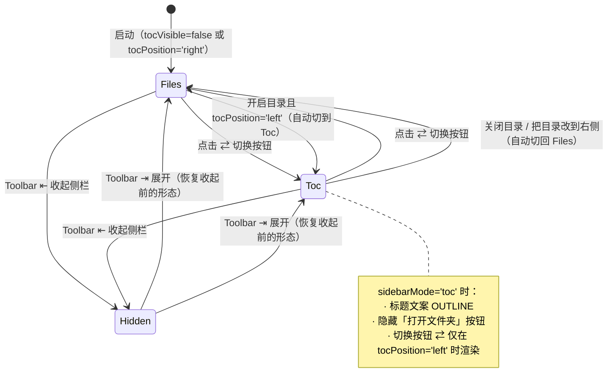
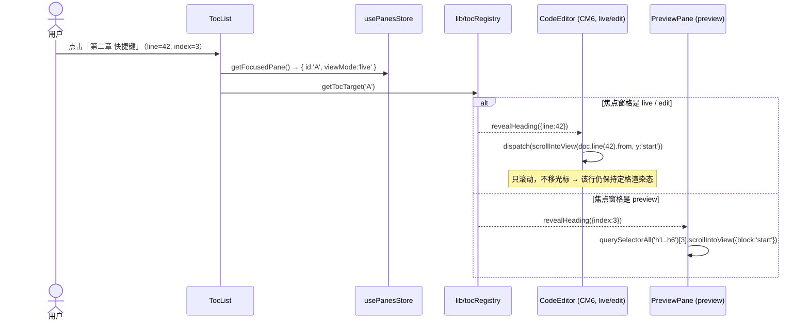
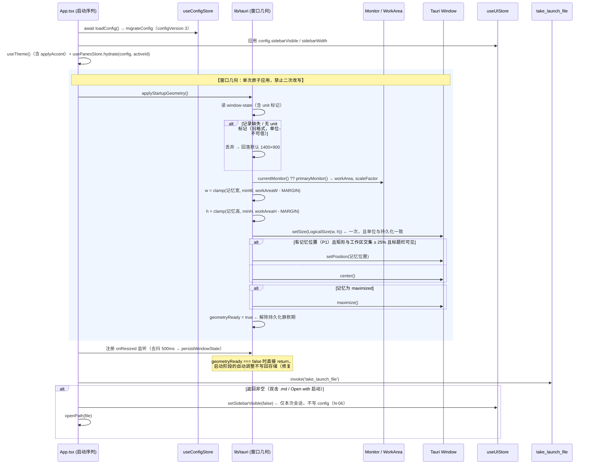
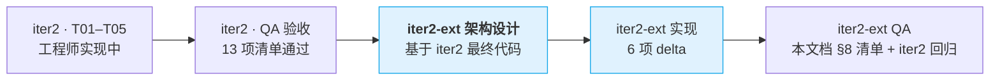

> ⚠️ **文档状态（2026-08-10）**：本文件是 PureMark **iter2-ext 的需求基线**（主题色 / TOC / 窗口几何 / 禁右键 / Ctrl+F）。规划**基本落地**，但 `Ctrl+B`/`Ctrl+Shift+O` 快捷键、分屏分隔条拖拽、侧栏内 `files⇄toc` 切换按钮**未做/被注释**（遗留债见总览 §7）。**当前唯一权威认知总览 = `docs/项目认知与现状总览.md`**，凡冲突以它为准。

# PureMark 第二轮迭代 · 扩展增量 PRD（iter2-ext）

> 文档类型：**简单 PRD（增量 / delta of delta）**
> 作者：许清楚（产品经理）
> 基线版本：**iter2 最终态**（`docs/prd-iter2.md` + `docs/design-iter2.md` 的 T01–T05 全部完成、QA 通过之后）
> 语言：中文 ｜ 技术栈不变：Tauri 2 + React 18 + Vite 5 + TypeScript + zustand + CodeMirror 6 + marked + highlight.js + Tailwind CSS 4
> 本文档只描述**本轮扩展新增 / 变更**的部分；iter2 与 MVP 已定义的行为一律保持不变。

---

## 0. 三句话摘要

1. **总目标**：在 iter2「单屏 Live Preview + 文件级分屏 + 明暗跟随系统」之上，补齐**个性化（主题色）、导航（目录 TOC）、启动可靠性（窗口几何 / 侧栏形态）与桌面沉浸感（禁用右键）**四类体验缺口，让 PureMark 从「能写」升级为「顺手」。
2. **最大依赖点**：本轮 6 项**全部落在 iter2 刚改过的三处热点**——`lib/theme.ts` + `useTheme`（T05 主题层）、`App.tsx` 启动序列 + `lib/tauri.ts`（T01-1.9 / 1.1）、`usePanesStore` 焦点窗格模型 + `Sidebar`/`Toolbar`/`CodeEditor`/`PreviewPane`（T01/T03/T02）。**必须等 iter2 全量落地后再开工**，否则会与工程师当前修改直接冲突。
3. **建议默认项**（若无异议不再回问用户）：主题色 = **7 个预设色 P0 + 自定义取色 P1**、**亮暗共用同一主色**；TOC 默认 **右侧、默认关闭**；侧栏「收起」按钮被切换按钮替换后，**沿用 Toolbar 最左侧已存在的同功能按钮**（零新增成本）；右键 **全局禁用、DEV 模式保留**；窗口记忆 **P0 记尺寸+最大化态，P1 记位置**。

---

## 1. 项目信息与本轮范围

| 项 | 内容 |
| --- | --- |
| Project Name | `puremark` |
| 迭代代号 | `iter2-ext` |
| 本轮主题 | **顺手化**：个性化配色 + 文档内导航 + 启动可靠性 + 桌面沉浸感 |
| 交付形态 | 桌面应用增量版本（Windows `.exe`），无新增后端能力（Rust 侧仅 P2 兜底项可能触及） |
| 前置条件 | **iter2 的 T01–T05 全部完成并通过 QA**。本轮所有设计以 iter2 最终代码状态为基线 |
| 不在本轮范围 | 导出 HTML/PDF、演讲模式、云同步、插件系统、自定义右键菜单、多主题方案包 |

### 原始需求复述（用户原话精神，逐条）

1. **主题色选项**：在现有亮色 / 暗色主题下，增加「主题色（accent）」可选项，可以调整原本的青色（`#0ea5e9`）。
2. **修复程序启动时的界面超出屏幕问题**。
3. **文件关联打开时默认收起 sidebar**：双击 `.md` / 「Open with」启动时，本次启动不显示文件树。
4. **Markdown 目录（TOC）**：toolbar 提供开关；可选显示在左侧或右侧；左侧时 sidebar 在「文件树」与「目录」间切换，**切换按钮替换原来的"收起侧栏"按钮**；点击标题跳转。
5. **禁止右键菜单**：全局禁用上下文菜单，含 CodeMirror 6 编辑区。
6. **记忆窗口大小，下次打开沿用**。

---

## 2. 产品目标

| # | 目标 | 说明 | 成功衡量 |
| --- | --- | --- | --- |
| **X1** | **看得顺眼**：配色可由用户做主 | 在明 / 暗 / 跟随系统之外，主色调可从预设中挑选，全应用（按钮、链接、激活态、焦点环、引用条、选区）一致跟随 | 切换主题色后 3 秒内全界面无残留青色；重启记忆正确；明暗两态下均可读 |
| **X2** | **找得到路**：长文档可导航 | 任意时刻一键唤出当前文档的标题大纲，可放左可放右，点击直达 | 一篇 200 行 / 30 个标题的文档，从「想跳到第 7 章」到「看到第 7 章」≤ 2 次点击；live / preview 两种模式下均能正确定位 |
| **X3** | **开得可靠**：启动即可用 | 启动窗口不越界、位置可见、尺寸沿用上次；由文件关联打开时直接进入专注写作形态 | 125% / 150% 缩放下连续 5 次开关，窗口尺寸零漂移；1366×768 小屏启动后标题栏完全可见可拖拽 |
| **X4** | **像个桌面应用**：不出现浏览器痕迹 | 全局无浏览器右键菜单 | 应用任意区域（含 CM6 编辑区、预览区、输入框、面板）右键均无系统菜单弹出；复制 / 粘贴 / 剪切快捷键全部可用 |

四个目标正交：X1 改「颜色」，X2 加「导航」，X3 修「窗口生命周期」，X4 改「输入事件」。

---

## 3. 用户故事

### 3.1 主题色（N-01）

| ID | 用户故事 |
| --- | --- |
| UX-1.1 | 作为使用者，我希望**在设置面板里从一排色点中选一个我喜欢的主题色**（例如把默认青色换成紫色），确认后按钮、链接、激活态、焦点环、引用条立即全部变成紫色，不用重启。 |
| UX-1.2 | 作为深色模式用户，我希望**同一个主题色在浅色与深色下都好看且可读**——不需要我为明暗各选一次颜色。 |
| UX-1.3 | 作为使用者，我希望**主题色被记住**，下次启动仍是我选的那个色；老用户升级后颜色不被改变，仍是原来的青色。 |

### 3.2 启动窗口越界（N-02，Bug）

| ID | 用户故事 |
| --- | --- |
| UX-2.1 | 作为使用者，我希望**每次启动 PureMark 时窗口完整落在屏幕内**，标题栏可见可拖动，而不是有一半跑到屏幕外 / 比屏幕还大。 |
| UX-2.2 | 作为高分屏（125% / 150% 缩放）用户，我希望**窗口尺寸不会每次启动都变大一圈**。 |

### 3.3 文件关联启动收起侧栏（N-03）

| ID | 用户故事 |
| --- | --- |
| UX-3.1 | 作为使用者，当我在资源管理器**双击一个 `.md` 文件**打开 PureMark 时，我希望直接看到文档内容占满编辑区，左侧文件树默认收起——因为我此刻只想看这一个文件。 |
| UX-3.2 | 作为使用者，我希望**这次收起不影响我平时的偏好**：下次我从开始菜单正常启动时，侧栏仍按我原来的设置显示。 |

### 3.4 Markdown 目录 TOC（N-04）

| ID | 用户故事 |
| --- | --- |
| UX-4.1 | 作为长文作者，我希望**在工具栏点一下「目录」按钮就能看到当前文档的标题大纲**（按 h1–h6 层级缩进），再点一下关掉。 |
| UX-4.2 | 作为使用者，我希望**能选择目录显示在左边还是右边**：左边＝复用侧栏空间，右边＝独立面板不挤占文件树。 |
| UX-4.3 | 作为使用者，当目录在左侧时，我希望**侧栏顶部的按钮变成「文件树 ⇄ 目录」的切换开关**，一键在两者之间来回。 |
| UX-4.4 | 作为使用者，我希望**点击目录里的某个标题，编辑区立刻滚动到那一段**——不管我当前是「实时」模式还是「预览」模式。 |
| UX-4.5 | 作为分屏用户，我希望**目录展示的是我正在写的那个窗格的文档**，我把焦点切到右窗格，目录就换成右窗格文档的大纲。 |

### 3.5 禁止右键菜单（N-05）

| ID | 用户故事 |
| --- | --- |
| UX-5.1 | 作为使用者，我希望**在 PureMark 任何地方右键都不弹出浏览器菜单**（「重新加载」「检查」这类选项会破坏桌面应用的观感）。 |
| UX-5.2 | 作为使用者，我希望**禁用右键后复制 / 粘贴 / 剪切照常可用**（Ctrl+C / V / X）。 |

### 3.6 记忆窗口大小（N-06，Bug）

| ID | 用户故事 |
| --- | --- |
| UX-6.1 | 作为使用者，我希望**把窗口调成我习惯的大小后，下次打开就是这个大小**，不用每次重新拖。 |
| UX-6.2 | 作为使用者，我希望**最大化状态也被记住**：上次是最大化关的，下次打开还是最大化；还原后是最大化之前的那个尺寸。 |

---

## 4. 需求池（P0 / P1 / P2）

> **类型标注**：① = 功能（Feature）｜ ② = Bug（Fix）
> **6 项用户需求全部进 P0**；每项内部的「锦上添花」子能力下沉到 P1 / P2，不影响主诉求交付。

### P0 — 必须交付

| ID | 类型 | 需求 | 涉及 iter2 最终态 |
| --- | --- | --- | --- |
| **N-01** | ① | **主题色预设**：设置面板提供 **7 个预设主色**（青(默认) / 蓝 / 绿 / 紫 / 橙 / 红 / 粉），选择后**即时生效并持久化**；作用于全部 `--primary` 派生 token | `lib/theme.ts`、`hooks/useTheme.ts`、`SettingsPanel.tsx`、`styles/theme.css` |
| **N-02** | ① | **主色 token 派生规则**：由选中主色派生 `--primary` / `--primary-hover` / `--primary-soft`（rgba，**亮 0.10 / 暗 0.18**）/ `--ring`（rgba 0.35）/ `--primary-foreground`（按亮度取白或深色），以**内联 CSS 变量写在 `<html>`** 的方式覆盖 `:root` 与 `[data-theme="dark"]` | `styles/theme.css`（现状 dark 仅覆盖 `--primary-soft`） |
| **N-03** | ② | **修复启动窗口越界**：root cause 必须查明（见 §6.2 的三条高概率假设），修复后**任何缩放比例 / 任何分辨率下启动，窗口矩形完整位于当前显示器工作区内** | `lib/tauri.ts`、`App.tsx`、`src-tauri/tauri.conf.json` |
| **N-04** | ② | **修复窗口尺寸记忆**：关闭时的尺寸 + 最大化状态被正确持久化，下次启动**精确沿用**（±2 逻辑像素）；启动阶段的自动调整**不得污染**已记忆的值 | 同上 |
| **N-05** | ② | **窗口几何真相源统一**：现存 `AppConfig.window` 与 store 的 `window-state` 两处并存且 `AppConfig.window` **从未被读写** → 保留 `window-state` 为唯一真相源，`AppConfig.window` 标 `@deprecated` | `types/index.ts`、`useConfigStore.ts` |
| **N-06** | ① | **文件关联启动收起侧栏**：`take_launch_file` 返回非空（= 本次启动由双击 / Open with 触发）时，**本次会话**将侧栏置为收起；**不写入 config**，不影响下次正常启动 | `App.tsx`（iter2 T01-1.9 重写处）、`useUIStore` |
| **N-07** | ① | **TOC 数据层**：`lib/toc.ts` 纯函数 `parseToc(md): TocItem[]`，解析 ATX 标题 h1–h6，**必须跳过围栏代码块内的 `#`**；产出 `{ id, level, text, line(1-based), index(文档内第 n 个标题) }` | 新增文件 |
| **N-08** | ① | **TOC 开关**：Toolbar 新增「目录」图标按钮，开 / 关切换，状态持久化（`config.tocVisible`，默认 `false`） | `Toolbar.tsx`（iter2 已挂 ViewSwitcher + LayoutToggle） |
| **N-09** | ① | **TOC 左 / 右位置**：`config.tocPosition: 'left' \| 'right'`，默认 **`'right'`**；Toolbar 在 TOC 开启时显示一个「位置」小按钮，一键左右互换 | `Toolbar.tsx`、`EditorCard.tsx`、`Sidebar.tsx` |
| **N-10** | ① | **左侧模式：侧栏双形态**。`useUIStore.sidebarMode: 'files' \| 'toc'`（会话态）。侧栏顶部原「隐藏侧边栏」按钮**替换为「文件树 ⇄ 目录」切换按钮**；`OpenFolderButton` 仅在 `files` 形态显示；标题文案随形态在 `EXPLORER` / `OUTLINE` 间切换 | `Sidebar.tsx`、`OpenFolderButton.tsx` |
| **N-11** | ① | **「收起侧栏」能力不丢失**：切换按钮占位后，收起动作**沿用 `Toolbar.tsx` 最左侧已存在的 `PanelLeftClose` 按钮**（现有代码 L44–L52，功能完全等价，含 config 持久化）。不新增入口 | 零改动（仅需验证 + 文案校对） |
| **N-12** | ① | **右侧模式：独立目录面板**。`TocPanel` 与 `pane-grid` 并列于 `EditorCard` 内容区右侧，默认宽 220px，自带头部（「目录」+ 关闭 ✕） | `EditorCard.tsx`、`layout.css` |
| **N-13** | ① | **TOC 内容源 = 焦点窗格文档**：读 `usePanesStore.getFocusedPane().tabId` → `useTabsStore` 内容；焦点窗格切换 / 文档切换时目录同步刷新；解析结果做 **200ms 去抖 + useMemo** | `usePanesStore`（iter2 T01-1.4） |
| **N-14** | ① | **点击跳转（live / edit 窗格）**：按 `TocItem.line` 定位，CM6 `EditorView.scrollIntoView(doc.line(n).from, { y:'start' })`；**默认只滚动、不移动光标、不抢焦点**（避免 live 模式下该标题行因获得光标而还原为源码） | `CodeEditor.tsx`（iter2 T02-2.10） |
| **N-15** | ① | **点击跳转（preview 窗格）**：按 `TocItem.index` 定位到容器内第 n 个 `h1..h6` 元素并 `scrollIntoView({ block:'start' })`；**无需改动 marked 渲染器** | `PreviewPane.tsx` |
| **N-16** | ① | **跳转能力注册表**：新建 `lib/tocRegistry.ts`，`registerTocTarget(paneId, { revealHeading(item) })`。CodeEditor 注册行定位实现、PreviewPane 注册索引定位实现。**不修改 iter2 §8.5 的 `EditorHandle` 契约**（preview 窗格依旧不注册 EditorHandle） | 新增文件，扩展点而非破坏点 |
| **N-17** | ① | **全局禁用右键**：在应用根部以 **capture 阶段**监听 `contextmenu` 并 `preventDefault()`，覆盖全部区域（含 CM6 `.cm-content`、预览区、输入框、弹层）；**`import.meta.env.DEV` 下不拦截**（保留 DevTools 检查能力） | `main.tsx` 或 `App.tsx` |
| **N-18** | ① | **禁用右键的副作用回归**：Ctrl+C / Ctrl+V / Ctrl+X / Ctrl+A、CM6 选区拖拽、链接点击行为均不受影响 | 验收项 |
| **N-19** | ① | **配置扩展与迁移**：`AppConfig` 新增 `accent` / `accentCustom` / `tocVisible` / `tocPosition` / `tocWidth`；`configVersion` 2 → **3**；`migrateConfig` 补齐缺省值，**老用户 `accent` 缺失 → `'sky'`（保持原青色不变）**，任何异常值回落默认且**不得阻断启动** | `useConfigStore.migrateConfig`（iter2 T01-1.6 已建立机制） |

### P1 — 应做

| ID | 类型 | 需求 | 说明 |
| --- | --- | --- | --- |
| **N-20** | ① | **自定义取色**：预设色点末位提供「自定义」，用 `<input type="color">` 取色 + hex 输入框；带**对比度守护**（主色相对亮度 > 0.6 时 `--primary-foreground` 自动切换为 `#1f2328`） | 成本低但需要额外的可读性校验，故与预设分档 |
| **N-21** | ① | **TOC 当前章节高亮（scroll-spy）**：跟随焦点窗格滚动位置高亮目录中当前所处的标题 | live/preview 两套实现，成本中等 |
| **N-22** | ① | **TOC 面板宽度可拖拽 + 记忆**（右侧模式），复用 `.sidebar-resize-handle` 交互，持久化到 `config.tocWidth` | — |
| **N-23** | ② | **记忆窗口位置**：持久化 `x/y`，恢复前做**可见性校验**（与任一显示器工作区的交集 < 25% 或标题栏不可见 → 丢弃位置改为居中） | 多显示器 / 拔屏场景 |
| **N-24** | ① | **快捷键**：`Ctrl+B` 收起 / 展开侧栏；`Ctrl+Shift+O` 开关目录 | 扩展 iter2 的 `useHotkeys.ts`；需确认不与 CM6 keymap 冲突 |
| **N-25** | ① | **设置面板同步「目录位置」下拉**（与 Toolbar 位置按钮双向同步） | 一致性 |
| **N-26** | ① | **TOC 层级折叠**：h1 节点可折叠其下子标题 | 长文档友好 |
| **N-27** | ① | **主题色实时预览**：设置面板中鼠标悬停色点时临时应用，移开还原 | 提升选色体验 |

### P2 — 可选 / 备选

| ID | 类型 | 需求 |
| --- | --- | --- |
| **N-28** | ① | 支持 Setext 标题（`===` / `---` 下划线式）进入目录 |
| **N-29** | ① | 亮 / 暗两态分别配置不同主题色 |
| **N-30** | ① | Rust / WebView2 层彻底关闭默认上下文菜单（`AreDefaultContextMenusEnabled = false`），作为前端拦截的兜底 |
| **N-31** | ① | 设置项 `collapseSidebarOnFileOpen`（默认 true），允许用户关掉 N-06 行为 |
| **N-32** | ① | 目录项拖拽重排 = 文档章节重排（大纲编辑） |
| **N-33** | ① | 自定义应用内右键菜单（复制 / 粘贴 / 格式化），替代被禁用的系统菜单 |
| **N-34** | ① | 更多内置配色方案包（主色 + 中性色整套切换） |

---

## 5. UI 设计稿 / 交互说明

### 5.1 整体形态（iter2 骨架 + 本轮两处新增）

```
┌─ Header 40px ─────────────────────────────────────────────────────────────────┐
├─ Sidebar（双形态）─┬─ Workspace ───────────────────────────────────────────────┤
│ OUTLINE      [⇄]  │  TabBar: 欢迎.md ×  长文.md ●×                            │
│ ─────────────────  │ ┌─ EditorCard ──────────────────────────────────────────┐ │
│ ▾ PureMark 指南   │ │ Toolbar: ☰ │ 新建 打开 保存 │ 源码 实时 预览 ⧉ ☰目录 ⇤⇥│ │
│   ▸ 第一章 安装   │ │ ─────────────────────────────────────────────────────  │ │
│   ▸ 第二章 快捷键 │ │ ┌── pane-grid ────────────┐ ┌─ TocPanel 220px ─────┐  │ │
│     · 2.1 编辑    │ │ │  Pane A     ║  Pane B   │ │ 目录             ✕  │  │ │
│     · 2.2 视图    │ │ │             ║           │ │ ─────────────────── │  │ │
│   ▸ 第三章 主题   │ │ │             ║           │ │ ▾ PureMark 指南     │  │ │
│                   │ │ │             ║           │ │   第一章 安装       │  │ │
│                   │ │ └─────────────────────────┘ └─────────────────────┘  │ │
│                   │ └───────────────────────────────────────────────────────┘ │
├───────────────────┴───────────────────────────────────────────────────────────┤
└─ StatusBar 34px ──────────────────────────────────────────────────────────────┘
      ↑ 左侧模式（sidebarMode='toc'）              ↑ 右侧模式（二者互斥，图中并存仅为示意）
```

> ⚠️ 左侧模式与右侧模式**互斥**（由 `tocPosition` 单一决定），上图并列只为对比示意。

**Toolbar 变更（在 iter2 的 `☰ │ 文件组 │ 源码|实时|预览 │ ⧉分屏` 之后追加）**：

| 控件 | 图标 | 行为 | 可见条件 |
| --- | --- | --- | --- |
| 目录开关 | `ListTree` | 点击切换 `config.tocVisible`；开启时 `.btn-icon.active` 高亮 | 恒显示 |
| 目录位置 | `PanelLeft` / `PanelRight` | 点击在 `left` ⇄ `right` 间切换，图标反映**当前**位置 | 仅 `tocVisible === true` 时显示 |

### 5.2 主题色选择器（设置面板）

置于 iter2 已新增的「主题」三段控件**正下方**，同属「外观」区块：

```
┌──────────────── 设置 ─────────────────── ✕ ┐
│                                            │
│  主题                                       │  ← iter2 T05-5.5 已实现
│  ┌────────┬────────┬────────────┐          │
│  │ ☀ 浅色 │ ☾ 深色 │ ⚙ 跟随系统 │          │
│  └────────┴────────┴────────────┘          │
│  当前跟随系统：深色                          │
│                                            │
│  主题色                                     │  ← 本轮新增（N-01）
│   ●   ●   ●   ●   ●   ●   ●    [ + ]      │
│  青  蓝  绿  紫  橙  红  粉   自定义(P1)     │
│   ↑ 选中项：外圈 2px ring + 中心对勾         │
│                                            │
│  字体          [ 系统默认 (Inter)  ▾ ]      │
│  字号（14px）  [————●—————]                 │
│  默认视图      [ 实时  ▾ ]                  │
│  目录位置      [ 右侧  ▾ ]   ← P1 / N-25   │
│  显示侧边栏    [✓]                          │
│  自动保存草稿  [✓]                          │
└────────────────────────────────────────────┘
```

**预设色板（P0，7 色，明暗共用）**：

| id | 名称 | `--primary` | `--primary-hover` | 备注 |
| --- | --- | --- | --- | --- |
| `sky` | 青（默认） | `#0ea5e9` | `#0284c7` | **与现状完全一致**，老用户无感 |
| `blue` | 蓝 | `#3b82f6` | `#2563eb` | — |
| `green` | 绿 | `#10b981` | `#059669` | — |
| `purple` | 紫 | `#8b5cf6` | `#7c3aed` | — |
| `orange` | 橙 | `#f97316` | `#ea580c` | — |
| `red` | 红 | `#ef4444` | `#dc2626` | 与错误色语义有轻微重叠，可接受 |
| `pink` | 粉 | `#ec4899` | `#db2777` | — |

**派生规则（N-02，本轮的核心技术约定）**：

```
选中主色 hex → rgb(r,g,b)
  --primary            = hex
  --primary-hover      = 预设自带的 hover 值；自定义时按亮度 ±10% 推导（亮色主题变暗、深色主题变亮）
  --primary-soft       = rgba(r,g,b, resolvedTheme === 'dark' ? 0.18 : 0.10)   ← 必须随明暗重算
  --ring               = rgba(r,g,b, 0.35)
  --primary-foreground = relativeLuminance(hex) > 0.6 ? '#1f2328' : '#ffffff'  ← P0 用常量 #fff，P1 开启判定
```

| 约束 | 说明 |
| --- | --- |
| **写入方式** | 由 `applyAccent(accent, resolvedTheme)` **以内联 style 写在 `document.documentElement`** 上（`el.style.setProperty('--primary', ...)`）。内联样式优先级高于 `:root` 与 `[data-theme="dark"]` 两个选择器，**一次写入同时覆盖明暗两态**，无需改动 `theme.css` 的既有结构 |
| **调用时机** | `hooks/useTheme.ts` 中，**`applyTheme(resolved)` 之后**立即调用；依赖项为 `[config.accent, config.accentCustom, resolvedTheme]`。系统深浅色切换（auto）会触发 `resolvedTheme` 变化 → `--primary-soft` 自动重算 |
| **明暗共用** | **是**。理由：现状 `[data-theme="dark"]` 未覆盖 `--primary` / `--primary-hover` / `--primary-foreground` / `--ring`，说明主色本就是跨主题共享的设计；分离配置入 P2（N-29） |
| **覆盖面** | 所有引用 `--primary*` / `--ring` 的位置：`.segment.active`、`.btn-primary`、链接、`.file-item.active`、`.pane.focused` 边框、`.pane-resize-handle:hover`、CM6 `.cm-selectionBackground`、live/preview 的 `blockquote` 左边条、复选框、滚动条 hover。**代码高亮 `--hl-*`（iter2 §1.6）不受主题色影响**，保持 GitHub 取色 |

### 5.3 TOC：左侧模式（sidebar 双形态）

```
tocPosition = 'left'  且  tocVisible = true

┌─ Sidebar ─────────────────┐        ┌─ Sidebar ─────────────────┐
│ OUTLINE          [⇄]      │  点[⇄] │ EXPLORER      [📁] [⇄]    │
│ ─────────────────────────  │ ←───→ │ ─────────────────────────  │
│ ▾ PureMark 使用指南   h1  │        │ ▸ 欢迎.md                 │
│   第一章 安装         h2  │        │ ▸ 语法.md   ←active       │
│     1.1 环境准备      h3  │        │ ▾ 子目录/                 │
│   第二章 快捷键       h2  │        │     长文.md               │
│   第三章 主题         h2  │        │                           │
└───────────────────────────┘        └───────────────────────────┘
      sidebarMode = 'toc'                   sidebarMode = 'files'
      （标题右侧无「打开文件夹」按钮）        （保留「打开文件夹」按钮）
```

**侧栏头部按钮的变化（N-10 / N-11，用户明确点名处）**：

| 状态 | 侧栏头部右侧按钮 | 「收起侧栏」如何触发 |
| --- | --- | --- |
| **iter2 现状** | `📁 打开文件夹` + `⇤ 隐藏侧边栏` | 侧栏头部按钮 **或** Toolbar 最左侧按钮（**两处等价，均已实现**） |
| **本轮 · tocPosition='right'** | 维持不变（`📁` + `⇤`） | 不变 |
| **本轮 · tocPosition='left'** | `📁`（仅 files 形态显示）+ **`⇄ 文件树/目录 切换`**（替换掉 `⇤`） | **由 `Toolbar.tsx` L44–L52 已存在的 `PanelLeftClose` 按钮承担**，功能完全等价（`toggleSidebar()` + 写 `config.sidebarVisible`）。P1 再补 `Ctrl+B` |

> 💡 **这是本轮成本最低的一个决策**：用户担心的「收起功能没地方放」实际上不存在——Toolbar 里早就有一个同功能按钮，且位置更符合直觉（紧邻侧栏边缘）。**不新增任何入口**，只需在验收时确认该按钮的 tooltip 文案在两种形态下都正确（「隐藏侧边栏」/「显示侧边栏」）。

**形态状态机**：



**边界规则**：
- `tocPosition='left'` 且侧栏当前被收起 → 点「目录」开关时**自动展开侧栏**并置 `sidebarMode='toc'`（否则用户点了开关看不到任何反馈）。
- `tocPosition` 从 `left` 改为 `right` → `sidebarMode` 立即回落 `'files'`，切换按钮消失、`⇤ 隐藏侧边栏` 按钮回归。
- `sidebarMode` 是**会话态**（`useUIStore`），不持久化；启动时按 `tocVisible && tocPosition==='left'` 推导初值。

### 5.4 TOC：右侧模式（独立面板）

```
┌─ EditorCard 内容区（layout='split' + tocPosition='right'）───────────────────┐
│ ┌── Pane A ─────────┐║┌── Pane B ────────┐ │ 目录              ✕ │          │
│ │ 长文.md   [实时]  │║│ 长文.md  [预览]  │ │ ─────────────────── │          │
│ │ ───────────────── │║│ ──────────────── │ │ ▾ PureMark 指南     │          │
│ │ ## 第 2 章        │║│ 第 7 章          │ │   第一章 安装       │  ← 220px │
│ │ 正文……▮          │║│ 正文……          │ │   第二章 快捷键 ←当前│          │
│ │                   │║│                  │ │     2.1 编辑        │          │
│ └───────────────────┘║└──────────────────┘ │   第三章 主题       │          │
│         可拖拽分隔条（iter2 PaneResizer）    └─────────────────────┘          │
└──────────────────────────────────────────────────────────────────────────────┘
                                                ↑ TocPanel：与 pane-grid 并列，
                                                  自身独立滚动，不参与 splitRatio 计算
```

| 规格 | 值 |
| --- | --- |
| 默认宽度 | 220px（`--layout-toc: 220px`，走 CSS 变量，禁止硬编码） |
| 可拖拽 | P1（N-22），复用 `.sidebar-resize-handle` 交互 |
| 头部 | 28px：左「目录」标签，右关闭 ✕（等价于关闭 `tocVisible`） |
| 与分屏共存 | **需重新核算最小宽度**：`minWidth(960) − 侧栏 248 − TOC 220 − card margin 24 − handle 6 = 462`，÷2 = **231px < iter2 规定的 240px 最小窗格宽**。→ 见 §7 待确认 #10：建议 `minWidth` 提到 **1040**，并把 TOC 宽度纳入 iter2 T03-3.3 `LayoutToggle` 的可用宽度守卫计算 |
| 空态 | 无标题 → 「本文档暂无标题」；无打开文档 → 「未打开文档」 |

### 5.5 TOC 项与跳转交互

```
目录项渲染规格（左右两种模式共用同一个 <TocList> 组件）：
  缩进      = (level - 1) * 12px
  字号      = 13px；h1 字重 600，h2–h6 字重 400
  文本      = 标题的纯文本（去掉 #、去掉行内 **/`/[]() 等标记）
  悬停      = background: var(--surface-2)
  当前章节  = 左侧 2px var(--primary) 竖条 + 文字 var(--primary)   ← P1 / N-21
  单击      = 跳转（见下表）
  溢出      = 单行截断 + title 属性显示全文
```

| 焦点窗格 viewMode | 跳转实现 | 焦点与光标 |
| --- | --- | --- |
| `live` / `edit`（CM6） | `revealHeading` → `view.dispatch({ effects: EditorView.scrollIntoView(view.state.doc.line(item.line).from, { y: 'start', yMargin: 12 }) })` | **只滚动**：不 `setSelection`、不 `focus()`。避免 live 模式下标题行因获得光标而还原成 `## xxx` 源码，产生"跳一下"的观感 |
| `preview` | `revealHeading` → `container.querySelectorAll('h1,h2,h3,h4,h5,h6')[item.index]?.scrollIntoView({ block:'start', behavior:'auto' })` | 只滚动 |
| 窗格无文档 / 未注册 | 无操作（目录项置灰不可点） | — |

**跳转调用链（时序）**：



### 5.6 禁用右键的范围（N-17）

```
┌───────────────── PureMark 窗口（全部区域）───────────────────┐
│  Header（拖拽区 / 窗口按钮）              ✕ 无系统菜单        │
│  Sidebar（文件树 / 目录）                 ✕ 无系统菜单        │
│  TabBar / Toolbar / StatusBar             ✕ 无系统菜单        │
│  CM6 编辑区 .cm-content（源码 / 实时）    ✕ 无系统菜单        │
│  PreviewPane（含代码块、链接、图片）      ✕ 无系统菜单        │
│  SearchPanel / SettingsPanel 及其输入框   ✕ 无系统菜单        │
│                                                              │
│  实现：window.addEventListener('contextmenu', e => {         │
│          if (import.meta.env.DEV) return;   ← DEV 例外       │
│          e.preventDefault();                                 │
│        }, { capture: true });                                │
│  卸载：App 卸载时 removeEventListener（避免 HMR 泄漏）        │
└──────────────────────────────────────────────────────────────┘
```

| 要点 | 说明 |
| --- | --- |
| **CM6 是否需要单独处理** | **不需要额外的自定义菜单拦截**——CM6 本身不提供右键菜单，弹出的是 WebView2 原生菜单。`capture: true` 的 window 级监听会先于任何元素处理器触发，足以覆盖 `.cm-content`。可选双保险：在 `lib/cm/setup.ts` 的 `EditorView.domEventHandlers` 中加 `contextmenu: () => true` |
| **DEV 例外** | `import.meta.env.DEV` 下**不拦截**，否则工程师无法通过右键「检查」调试。生产构建自动生效 |
| **必须保留的能力** | Ctrl+C / V / X / A、CM6 选区拖选、链接点击、代码块「复制」按钮（这些不依赖右键） |
| **不做的事** | 不实现替代的自定义右键菜单（入 P2 / N-33）；不做输入框白名单（用户要求"全局禁用"） |

### 5.7 窗口几何行为（N-03 / N-04 / N-05 / N-06）

**目标启动序列**（在 iter2 T01-1.9 改写后的 `App.tsx` 上继续调整）：



**窗口记忆行为表**：

| 场景 | 期望行为 |
| --- | --- |
| 正常调整尺寸后关闭 | 下次启动**精确沿用**（±2 逻辑像素） |
| 最大化状态关闭 | 下次启动**仍是最大化**；点「还原」后回到最大化之前的尺寸 |
| 记忆尺寸 > 当前显示器工作区 | 自动 clamp 到 `工作区 − 32px` 并居中；**clamp 后的值不写回存储**（下次换回大屏仍能恢复原尺寸） |
| 记忆尺寸 < `minWidth/minHeight` | 提升到最小值 |
| 记忆值明显异常（如 > 工作区 1.5 倍，多为单位错误的历史脏数据） | 丢弃，回落默认 1400×900 |
| 从副屏移到主屏 / 拔掉副屏后启动 | 位置不可见时回落居中（P1 / N-23） |
| 高分屏 125% / 150% | 连续 5 次开关，尺寸**零漂移** |

---

## 6. 与 iter2 的依赖 / 冲突说明

### 6.1 逐条依赖矩阵

| 本轮需求 | 依赖的 iter2 产出 | 依赖强度 | 扩展方式（如何不破坏 iter2） |
| --- | --- | --- | --- |
| **① 主题色** | **T05** 主题落地（`SettingsPanel` 三段控件、`theme.css` token 体系）+ **T01-1.7** `lib/theme.ts` / `hooks/useTheme.ts` / `useUIStore.resolvedTheme` | 🔴 强 | **只加不改**：`lib/theme.ts` 新增 `applyAccent(accent, resolvedTheme)`，`useTheme` 在 `applyTheme()` **之后**追加一次调用。**不动 `applyTheme` 的签名与语义**（iter2 §8.3 约定「`applyTheme()` 是修改 `data-theme` 的唯一函数」依然成立——`applyAccent` 改的是内联 CSS 变量，不碰 `data-theme`）。`auto` 主题链路完全不受影响，只是 `--primary-soft` 多了一个随 `resolvedTheme` 重算的依赖 |
| **② 启动越界（Bug）** | **T01-1.1**（`tauri.conf.json` 已删 `theme:"Light"`、`minWidth` 已提到 960）+ **T01-1.9**（`App.tsx` 启动段已重写为 `useTheme()` + `hydrate()`） | 🔴 强 | 在 iter2 已重写的启动序列里**插入一段原子的 `applyStartupGeometry()`**，替换现有的 `restoreWindowState()` + `fitWindowToScreen()` 两段式调用。**严禁重新加回 `theme` 字段**（会再次钳死 auto 主题，iter2 A-1）。`minWidth` 若因 TOC 需要再提升，须同步 `lib/tauri.ts` 里硬编码的 `MIN_W=860` / `MIN_H=560`（当前已与 conf 不一致，属本轮要清的债） |
| **③ 文件关联收侧栏** | **T01-1.9** `App.tsx` 启动序列 | 🟡 中 | 在 `hydrate` 之后、`openPath` 之前插入一次 `setSidebarVisible(false)`。**必须串行在 `loadConfig()` 之后**，否则会被 config 恢复覆盖（现状两个 `useEffect` 无顺序保证，是潜在竞态）。只写 `useUIStore`，**不写 `config`**，因此不影响 iter2 的配置迁移与持久化链路 |
| **④ TOC** | **T01-1.4** `usePanesStore`（`focusedPaneId` / `getFocusedTabId`）、**T02-2.10** `CodeEditor`、**T03-3.5~3.9** `Sidebar`/`Toolbar`/`EditorCard`/`layout.css`、**T03-3.3** `LayoutToggle` 宽度守卫 | 🔴 强 | ①新增 `lib/toc.ts`（纯函数）与 `lib/tocRegistry.ts`（**独立注册表，不改 `editorRegistry` 与 `EditorHandle` 契约**，因此 iter2 §8.5「preview 窗格不注册 EditorHandle」的约定保持成立）；②`Sidebar` 内部按 `sidebarMode` 分支渲染，**不改 `AppShell` 的 `sidebarVisible` 逻辑**；③`EditorCard` 在 `pane-grid` 之外**并列**追加 `TocPanel`，**不侵入 `splitRatio` 与 `PaneResizer`**；④**唯一真实耦合点**：右侧 TOC 会减少 pane-grid 可用宽度 → 必须同步更新 T03-3.3 `LayoutToggle` 的 `disabled` 判定公式（把 `tocVisible && tocPosition==='right'` 时的 TOC 宽度扣除掉），这条要显式交代给工程师 |
| **⑤ 禁用右键** | **T02** CM6 编辑器（唯一需要留意的宿主） | 🟢 弱 | 纯新增一个全局监听，零侵入。CM6 侧无需改动（可选在 `setup.ts` 的 `domEventHandlers` 加一行双保险） |
| **⑥ 窗口记忆（Bug）** | 同 ②，与 ② **同源同修**，合并为一个技术任务 | 🔴 强 | 同 ② |

### 6.2 Bug 的 root cause 假设（提供给工程师做定向验证，非结论）

> 用户报的 #2（启动界面超出屏幕）与 #6（窗口大小记不住）**极可能是同一个 bug 的两个表征**。以下按可能性排序，请工程师逐条证伪 / 证实后再动手。

| # | 假设 | 证据 | 验证方法 |
| --- | --- | --- | --- |
| **RC-1** | **持久化与恢复的单位不一致（最高嫌疑）**：`persistWindowState()` 存的是 `win.innerSize()`（Tauri 返回 **PhysicalSize**，物理像素），而 `restoreWindowState()` 用 `new LogicalSize(ws.width, ws.height)` 还原（**逻辑像素**）。在 125% / 150% 缩放的显示器上，窗口每次启动都会按 `scaleFactor` 放大一圈 → 越界 + 尺寸"记不住"（实为一直变大） | `lib/tauri.ts` L124（`innerSize()`）vs L79（`LogicalSize`） | 在 150% 缩放机器上：改窗口到 1000×700 → 关 → 看 `settings.json` 的 `window-state`（若是 1500×1050 即坐实）→ 重开观察是否变大 |
| **RC-2** | **启动期自我污染**：`restoreWindowState()` 后紧接 `fitWindowToScreen()` 会 `setSize` + `center()`；这次程序化 resize 触发 `onResized` → 500ms 去抖后 `persistWindowState()` **把"被钳制后的尺寸"写回存储**，用户真实设置的尺寸被覆盖 | `App.tsx` L48–49 与 L64–80 两个 effect 并存 | 启动后不做任何操作，等 2 秒，比对 `window-state` 前后是否变化 |
| **RC-3** | **无条件 `center()` + 不记忆位置**：`fitWindowToScreen()` 末尾**每次启动都 `center()`**。这会掩盖位置问题，但在多显示器 / 工作区偏移（任务栏在左 / 上）场景下，`center()` 基于 `currentMonitor()`，而启动瞬间窗口可能还没落到目标显示器上 → 居中到错误的显示器 → 表现为"跑到屏幕外" | `lib/tauri.ts` L115 | 双显示器（主副分辨率不同）下反复启动 |
| **RC-4** | **`MIN_W/MIN_H` 与 `tauri.conf.json` 不一致**：`lib/tauri.ts` 写死 `MIN_W=860 / MIN_H=560`，iter2 已把 conf 的 `minWidth` 提到 960。小屏（1366×768，150% 缩放 → 逻辑 911×512）时 `MIN_H=560 > 512`，clamp 后仍超出工作区 | L105–106 | 在 1366×768 / 150% 缩放虚拟机上启动 |
| **RC-5** | **`transparent: true` + `windowEffects: acrylic` + `decorations: false` 组合下 `preventOverflow` 行为异常**：Tauri 的 `preventOverflow` 对无边框透明窗口的钳制可能不含阴影/外扩区域 | `tauri.conf.json` L21–27 | 临时关掉 `transparent` / `windowEffects` 做 A/B 对照 |
| **RC-6** | **双真相源**：`AppConfig.window`（`{width,height,maximized}`）与 store 的 `window-state` 并存，前者**从未被任何代码读写**（死字段），容易在后续维护中被误用 | `types/index.ts` L60、`useConfigStore.ts` L20 | 全仓 grep `config.window` 确认无引用 → 标 `@deprecated` |

**修复要求（对工程师的硬约束）**：
1. 持久化与恢复**必须使用同一单位**。推荐统一为**逻辑像素**：`(await win.innerSize()).toLogical(await win.scaleFactor())`，并在 `WindowSize` 中加 `unit?: 'logical'` 标记；**读到无标记的旧记录一律丢弃**（避免继续放大历史脏数据）。
2. 启动几何**收敛为一个原子函数** `applyStartupGeometry()`，内部完成「读取 → 校验 → clamp → 一次 setSize → 定位 → maximize」，**不得出现二次 setSize**。
3. 引入 `geometryReady` 标志，**启动几何应用完成前，`persistWindowState()` 直接 return**。
4. `MIN_W` / `MIN_H` 与 `tauri.conf.json` 的 `minWidth` / `minHeight` **单一来源**（抽成常量或从 conf 读）。
5. 修复后**必须在 100% / 125% / 150% 三种缩放下各做 5 次开关回归**，并出具实测数据。

### 6.3 需要新增 / 修改的文件（供架构师排任务参考）

```
prueMd/
├── src-tauri/tauri.conf.json          🔧 minWidth 960 → 1040（若采纳待确认 #10）；⛔ 严禁恢复 theme 字段
└── src/
    ├── App.tsx                        🔧 启动序列插入 applyStartupGeometry() + 文件关联收侧栏
    ├── main.tsx                       🔧 全局 contextmenu 拦截（或放 App.tsx）
    ├── types/index.ts                 🔧 AccentId / TocItem / TocPosition；AppConfig +5 字段；window 标 @deprecated
    ├── lib/
    │   ├── theme.ts                   🔧 新增 applyAccent() + ACCENT_PRESETS + hexToRgb/luminance 工具
    │   ├── tauri.ts                   🔧 applyStartupGeometry() 重构；单位统一；geometryReady 静默期
    │   ├── toc.ts                     🆕 parseToc(md): TocItem[]（跳过围栏代码块）
    │   └── tocRegistry.ts             🆕 registerTocTarget / getTocTarget（独立于 editorRegistry）
    ├── hooks/
    │   ├── useTheme.ts                🔧 applyTheme 之后追加 applyAccent(accent, resolvedTheme)
    │   ├── useToc.ts                  🆕 焦点窗格文档 → 去抖解析 → TocItem[]
    │   └── useHotkeys.ts              🔧 P1：Ctrl+B / Ctrl+Shift+O
    ├── store/
    │   ├── useConfigStore.ts          🔧 DEFAULT_CONFIG +5 字段；migrateConfig configVersion 2→3
    │   └── useUIStore.ts              🔧 新增 sidebarMode: 'files' | 'toc'
    ├── components/
    │   ├── Sidebar/Sidebar.tsx        🔧 双形态渲染；头部按钮按 tocPosition 分支
    │   ├── Toc/TocPanel.tsx           🆕 右侧独立面板（头部 + TocList）
    │   ├── Toc/TocList.tsx            🆕 目录列表（左右模式共用）
    │   ├── Workspace/Toolbar.tsx      🔧 追加「目录」开关 + 「位置」切换按钮
    │   ├── Workspace/EditorCard.tsx   🔧 pane-grid 右侧并列 TocPanel
    │   ├── Workspace/LayoutToggle.tsx 🔧 可用宽度守卫扣除 TOC 宽度
    │   ├── Workspace/CodeEditor.tsx   🔧 注册 TocTarget（行定位）
    │   ├── Workspace/PreviewPane.tsx  🔧 注册 TocTarget（索引定位）
    │   ├── dialogs/SettingsPanel.tsx  🔧 「主题」下方新增「主题色」色板
    │   └── ui/Icon.tsx                🔧 新增 ListTree / PanelRight / Check / Palette
    ├── styles/
    │   ├── theme.css                  🔧 新增 --layout-toc: 220px（主色仍由内联变量覆盖，结构不动）
    │   └── layout.css                 🔧 .toc-panel / .toc-item / .toc-item.active / .sidebar-mode-toggle
    └── __tests__/
        ├── toc.test.ts                🆕 parseToc：代码块内 # 不入目录、层级、行号、index
        ├── accent.test.ts             🆕 派生规则：rgba alpha 随明暗、亮度→前景色
        └── windowGeometry.test.ts     🆕 clamp / 异常值丢弃 / 单位标记迁移
```

---

## 7. 待确认问题（含 PM 推荐默认值）

> **绿色 = PM 已给出默认值，若无异议不再回问用户**；**橙色 = 建议架构师拍板**；**红色 = 建议回用户确认**。

| # | 问题 | PM 推荐默认值 | 理由 | 谁拍板 |
| --- | --- | --- | --- | --- |
| **1** | 主题色用**预设**还是也允许**自定义取色**？ | 🟢 **P0 只做 7 个预设；自定义取色入 P1（N-20）** | 预设可保证对比度与观感质量；自定义需要额外的亮度守护与"选出难看颜色"的兜底，成本不对称 | PM |
| **2** | 亮暗两态**共用**同一主色吗？ | 🟢 **共用** | 现状 `[data-theme="dark"]` 本就不覆盖 `--primary`，共用是既有设计的自然延续；分离入 P2（N-29） | PM |
| **3** | `--primary-soft`（rgba）如何随主色派生？ | 🟢 **`rgba(r,g,b, dark?0.18:0.10)`**，在 `applyAccent` 中按 `resolvedTheme` 重算 | 与现状两个硬编码值完全一致，视觉零变化 | PM |
| **4** | `--primary-foreground` 是否需要对比度判定？ | 🟢 **P0 固定 `#fff`（7 个预设均已验证可读）；P1 随自定义取色一起引入亮度判定** | 预设色最亮的是橙 `#f97316`，白字对比度 3.1:1，作为图标/短标签可接受 | PM |
| **5** | TOC 默认位置是**左**还是**右**？默认开还是关？ | 🟢 **默认 `right`，默认 `tocVisible = false`** | ①右侧不与文件树争夺同一块空间，符合主流编辑器 outline 心智；②左侧模式会替换掉侧栏按钮，认知成本更高，不适合作为首次体验；③默认关闭避免挤压小屏写作区 | PM |
| **6** | 左侧切换按钮替换「收起侧栏」后，**收起怎么触发**？ | 🟢 **沿用 `Toolbar.tsx` 已存在的 `PanelLeftClose` 按钮**（零新增）；P1 补 `Ctrl+B` | 代码里本来就有两个等价入口，删掉侧栏里那个不会丢能力 | PM |
| **7** | 点击目录项是否**移动光标 / 抢焦点**？ | 🟢 **只滚动，不移光标、不抢焦点** | live 模式下移动光标会让目标标题行从渲染态还原为源码，产生"点过去反而变丑了"的观感，与 iter2 的 G1 目标相悖 | PM |
| **8** | 运行中通过 `open-file` 事件（已开着 App 时再双击一个 md）**是否也收起侧栏**？ | 🟢 **否，仅"启动时"（`take_launch_file` 非空）生效** | 用户已经在会话中，侧栏突然消失是意外行为；用户原话也限定为"启动时" | PM |
| **9** | 禁用右键是否给**输入框 / 编辑区开白名单**（保留右键粘贴）？ | 🟢 **否，全局禁用**；`import.meta.env.DEV` 例外 | 用户原话是"全局禁用"；Ctrl+V 可完全替代 | PM |
| **10** | 右侧 TOC + 分屏 + 侧栏同时开启时窗格会小于 240px，**`minWidth` 是否从 960 提到 1040**？ | 🟠 **建议提到 1040**，并把 TOC 宽度纳入 `LayoutToggle` 的可用宽度守卫 | 见 §5.4 算账：960 配置下两窗格各 231px < 240px。替代方案是「右侧 TOC 开启时禁用分屏」，体验更差 | **架构师** |
| **11** | 窗口**位置**是否也记忆？ | 🟠 **P0 只记尺寸 + 最大化态；位置入 P1（N-23）** | 位置记忆必须配套多显示器可见性校验，属于独立的复杂度；先把"尺寸记不住"这个用户明确报的问题修干净 | 架构师 |
| **12** | `AppConfig.window`（死字段）与 `window-state` 的**双真相源**如何收敛？ | 🟠 **保留 `window-state`，`AppConfig.window` 标 `@deprecated` 且迁移时忽略** | 现有代码只用 `window-state`；改动面最小 | 架构师 |
| **13** | TOC 是否支持 **Setext 标题**（`===` / `---`）？ | 🟢 **P0 不支持，入 P2（N-28）** | ATX（`#`）覆盖 99% 的实际写作；Setext 解析需处理与分割线的歧义 | PM |
| **14** | 主题色是否需要**扩展到中性色 / 整套配色方案**？ | 🟢 **否，本轮只改主色（accent）** | 用户原话是"调整原本的青色主题色"，范围明确 | PM |

---

## 8. 验收清单（Definition of Done）

### 8.1 主题色（N-01 / N-02 / N-19）

- [ ] 设置面板「主题」下方出现「主题色」色板，共 7 个预设色点，当前选中项有明显选中态（ring + 对勾）
- [ ] 点击「紫」→ **无需重启**，工具栏分段控件激活态、侧栏激活文件项、焦点窗格边框、焦点环、引用左边条、CM6 选区背景**全部变紫**，界面无残留青色
- [ ] 在**浅色**与**深色**下分别检查同一个主题色：文字可读、`--primary-soft` 底色浓淡合适（亮 0.10 / 暗 0.18）
- [ ] 主题设为「跟随系统」后切换 OS 深浅色：主题色保持不变，但 `--primary-soft` / 界面底色正确跟随（验证 `applyAccent` 被重新调用）
- [ ] 重启应用，主题色被正确记住
- [ ] 用 **iter2 时期的旧配置文件**（无 `accent` 字段）启动：主题色为原青色 `#0ea5e9`，界面与升级前完全一致，无崩溃
- [ ] `configVersion` 正确升到 3；写入非法 `accent` 值后启动能回落默认且不阻断

### 8.2 启动窗口与记忆（N-03 / N-04 / N-05）

- [ ] **100% / 125% / 150%** 三种缩放下，各连续「调整尺寸 → 关闭 → 启动」5 次，窗口尺寸**零漂移**（±2 逻辑像素内）
- [ ] 任意缩放 / 分辨率下启动，窗口矩形**完整位于当前显示器工作区内**，Header 拖拽区可见可拖动
- [ ] 1366×768 小屏（含 150% 缩放）启动后界面不越界
- [ ] 最大化状态关闭 → 重开仍为最大化；点「还原」后回到最大化之前的尺寸
- [ ] 记忆尺寸大于当前屏幕时自动 clamp 并居中，且 **clamp 后的值不写回存储**（换回大屏后能恢复原尺寸）
- [ ] 启动后静置 3 秒不做任何操作，`settings.json` 的 `window-state` **不发生变化**（验证启动静默期）
- [ ] 双显示器环境下反复启动，窗口不跑到不可见区域
- [ ] `tauri.conf.json` 中**没有** `theme` 字段（iter2 A-1 的修复未被本轮回退），`auto` 主题仍能跟随系统
- [ ] 全仓无 `config.window` 的读写引用；`AppConfig.window` 已标 `@deprecated`

### 8.3 文件关联收起侧栏（N-06）

- [ ] 在资源管理器双击 `.md` 启动 PureMark：文件正确打开，**左侧侧栏收起**，Toolbar 的展开按钮可用（tooltip 为「显示侧边栏」）
- [ ] 关闭后从开始菜单正常启动：侧栏**按原偏好显示**（证明未写入 config）
- [ ] App 已在运行时再双击另一个 `.md`（single-instance 转发 `open-file`）：文件在焦点窗格打开，**侧栏状态不变**
- [ ] 文件关联启动 + `config.sidebarVisible=false` 组合：不报错、不闪烁

### 8.4 目录 TOC（N-07 ~ N-16）

- [ ] Toolbar「目录」按钮可开关，开启时高亮；状态重启后被记住
- [ ] 「位置」按钮可在左 / 右间切换，图标正确反映当前位置
- [ ] **右侧模式**：编辑区右侧出现 220px 目录面板，标题按 h1–h6 层级缩进，面板独立滚动，头部 ✕ 可关闭
- [ ] **左侧模式**：侧栏切换为目录形态，顶部按钮变为「文件树 ⇄ 目录」切换，点击可来回切换；目录形态下不显示「打开文件夹」按钮；标题文案为 `OUTLINE`
- [ ] **左侧模式下收起侧栏**：通过 Toolbar 最左侧按钮可正常收起 / 展开，展开后恢复收起前的形态
- [ ] 左侧模式且侧栏处于收起态时点「目录」开关：侧栏**自动展开**并显示目录
- [ ] 把位置从左改到右：侧栏立即回到文件树形态，「隐藏侧边栏」按钮回归
- [ ] 目录内容 = **焦点窗格**的文档；分屏下把焦点切到另一窗格，目录**同步切换**为该窗格文档的大纲
- [ ] 编辑文档新增 / 删除标题，目录在 ~200ms 内更新
- [ ] **围栏代码块内的 `# 注释` 不出现在目录里**
- [ ] 点击目录项：`live` 模式滚动到该标题且**该行仍保持渲染态（未还原为源码）**；`edit` 模式滚动正确；`preview` 模式滚动到对应渲染标题
- [ ] 无标题文档显示「本文档暂无标题」；无打开文档显示「未打开文档」
- [ ] 右侧 TOC + 分屏 + 侧栏同时开启时：两窗格均不小于 240px（或分屏按钮被正确禁用并给出 tooltip）
- [ ] iter2 的分屏拖拽、双击复位 50/50、关闭窗格行为**不受 TOC 影响**

### 8.5 禁用右键（N-17 / N-18）

- [ ] 生产构建中，在 Header / 侧栏 / TabBar / Toolbar / CM6 编辑区（源码与实时）/ 预览区 / 状态栏 / 查找面板 / 设置面板及其输入框**右键，均无系统菜单弹出**
- [ ] Ctrl+C / Ctrl+V / Ctrl+X / Ctrl+A 在 CM6 与所有输入框中正常工作
- [ ] CM6 选区拖选、代码块「复制」按钮、链接点击行为不受影响
- [ ] DEV 模式（`npm run dev`）下右键**仍可弹出**浏览器菜单（便于调试）
- [ ] HMR 反复热更新后无重复监听器堆积（组件卸载时正确 `removeEventListener`）

### 8.6 回归（iter2 能力不被破坏）

- [ ] iter2 验收清单 13 项**全部重跑通过**（live 回车定格 / 点回还原 / IME 500 字 / 撤销重做 / 纯 Markdown 落盘 / 同文件分屏双向同步 / 异文件分屏 / 分隔条 / 明暗 / auto 跟随 / 深色走查 / 主题记忆 / 旧配置加载）
- [ ] 深色模式全量走查在**新主题色**下重做一遍：无对比度不足的组件
- [ ] `tsc -b` 与全部单测通过；新增 `toc.test.ts` / `accent.test.ts` / `windowGeometry.test.ts` 全绿

---

## 附：本轮与 iter2 的时序约定



> **本轮不与 iter2 并行实现**。原因：6 项需求中有 5 项直接落在 iter2 正在修改的文件上（`App.tsx`、`lib/tauri.ts`、`lib/theme.ts`、`Sidebar.tsx`、`Toolbar.tsx`、`EditorCard.tsx`、`CodeEditor.tsx`、`PreviewPane.tsx`），并行会产生大面积冲突，且窗口几何 Bug 的 root cause 定位需要在稳定基线上做实机对照实验。
