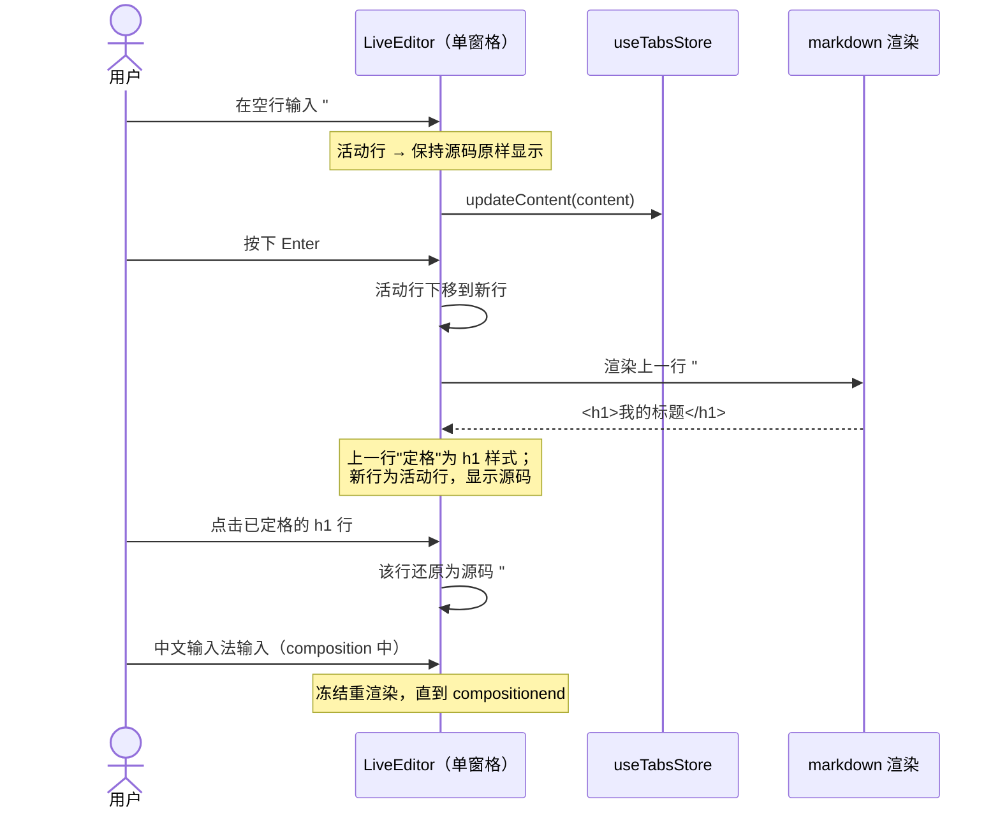
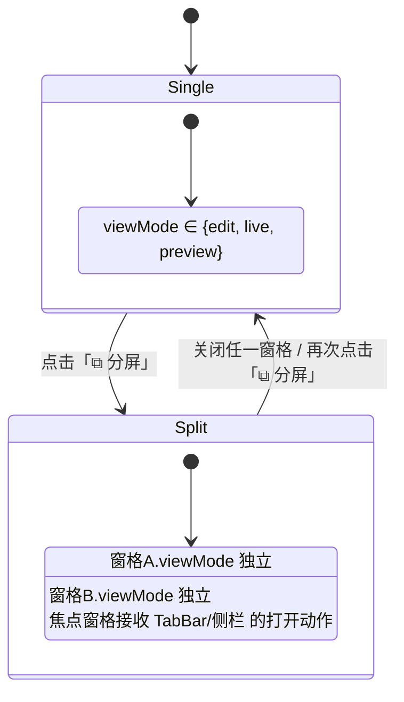

> ⚠️ **文档状态（2026-08-10）**：本文件是 PureMark **iter2 的需求基线**（Live Preview + 文件级分屏 + 主题明暗/跟随系统）。其规划**已全部在真实代码中落地**，可当作已实现功能的规格说明。**当前唯一权威认知总览 = `docs/项目认知与现状总览.md`**（含功能落地核对表与遗留债），凡冲突以它为准。

# PureMark 第二轮迭代 · 增量 PRD（Iteration 2）

> 文档类型：**简单 PRD（增量 / delta）**
> 作者：许清楚（产品经理）
> 基线版本：MVP v0.1.0（`docs/system_design.md` v1 已实现）
> 语言：中文 ｜ 技术栈：Tauri 2 + React 18 + Vite 5 + TypeScript + zustand + marked + highlight.js + Tailwind CSS 4
> 本文档只描述**本轮新增 / 变更**的部分，未提及的 MVP 行为一律保持不变。

---

## 0. 项目信息与本轮范围

| 项 | 内容 |
| --- | --- |
| Project Name | `puremark` |
| 迭代代号 | `iter2` |
| 本轮主题 | **写作体验升级**：单屏实时渲染 + 文件级分屏对照 + 主题明暗自适应 |
| 交付形态 | 桌面应用增量版本（Windows `.exe`），无新增后端能力 |
| 不在本轮范围 | 导出 HTML/PDF、演讲模式、云同步、插件系统、替换（Replace）功能 |

### 原始需求复述（用户澄清对话原文精神）

1. **实时编辑**：「不要分屏实时刷新，要单屏，比如在输入一行 markdown 语法的文字之后，点击回车换行，自动完成格式渲染。」
2. **分屏**：「不是这种分屏，是文件之间的分屏，支持同一个文件分屏进行前后对照，也支持不同文件分屏对照。」
3. **主题**：明 / 暗切换 **+ 跟随系统**。

---

## 1. 产品目标

| # | 目标 | 说明 | 成功衡量 |
| --- | --- | --- | --- |
| **G1** | **所见即所写**：消灭「源码区 ↔ 预览区」的视觉割裂 | 用户在**单一窗格**内写作，敲完一行按回车即定格为渲染样式，下一行继续写源码；不再需要靠分屏才能看到效果 | 编写一篇含标题/列表/加粗/引用的文档，全程无需切换视图；渲染定格延迟 < 80ms（P95） |
| **G2** | **可对照的工作区**：把「分屏」还原为编辑器应有的语义 | 工作区可左右两窗格，既能**同文件前后对照**（长文写作时看着前文写后文），也能**不同文件对照**（照着 A 写 B） | 三步内完成「同一文件分屏」与「两个不同文件分屏」；两窗格滚动互不干扰 |
| **G3** | **不刺眼的长期陪伴**：主题明 / 暗 / 跟随系统 | 设置中三选一；`auto` 实时跟随 OS `prefers-color-scheme`，无需重启 | 切换 OS 深色模式后 App 在 1s 内跟随；全部界面（含预览、代码块、弹层）无残留亮色 |

三个目标正交：G1 改「单窗格内怎么渲染」，G2 改「工作区有几个窗格」，G3 改「全局配色」。

---

## 2. 用户故事

### 2.1 实时编辑（单屏 Live Preview）

| ID | 用户故事 |
| --- | --- |
| US-1.1 | 作为写作者，我希望**输入 `## 小节标题` 后按回车，这一行立刻变成渲染后的标题样式**，光标落到下一行继续写源码，这样我不用分屏也能看到成文效果。 |
| US-1.2 | 作为写作者，我希望**把光标点回某一行已渲染的内容时，这一行自动还原成 Markdown 源码**并可直接编辑，改完移开光标又定格回渲染态。 |
| US-1.3 | 作为写作者，我希望 `**粗体**`、`*斜体*`、`~~删除线~~`、`` `行内代码` ``、`[链接](url)`、列表、任务列表、引用、分割线**都能在非活动行隐藏语法标记、只显示排版结果**，让文档看起来就像最终成品。 |
| US-1.4 | 作为中文写作者，我希望**用输入法打字时（拼音候选未上屏）界面不闪烁、不错位、不吞字**，回车上屏后再正常渲染。 |

### 2.2 分屏（文件级多窗格对照）

| ID | 用户故事 |
| --- | --- |
| US-2.1 | 作为长文作者，我希望**把当前文件左右分屏成两个窗格看同一份内容**，左边停在第 2 章、右边写第 7 章，两边滚动独立，在任一侧的编辑都实时反映到另一侧。 |
| US-2.2 | 作为翻译/整理者，我希望**左窗格打开 A.md、右窗格打开 B.md**，照着 A 的内容写 B。 |
| US-2.3 | 作为使用者，我希望**拖拽中间的分隔条调整左右宽度**，双击分隔条恢复 50/50，关闭其中一个窗格即回到单窗格。 |
| US-2.4 | 作为使用者，我希望**每个窗格可以各自选择渲染模式**（源码 / 实时 / 预览），比如左边"实时"写、右边"预览"看纯净成稿——这样也能复现旧版「左源码右预览」的用法。 |

### 2.3 主题（明 / 暗 / 跟随系统）

| ID | 用户故事 |
| --- | --- |
| US-3.1 | 作为夜间写作者，我希望**在设置里把主题切到"深色"**，整个应用（顶栏、侧栏、编辑区、预览、代码块、弹层、状态栏）立即变暗。 |
| US-3.2 | 作为使用者，我希望**选择"跟随系统"**后，Windows 切换深/浅色时 App 自动跟随，无需重开。 |
| US-3.3 | 作为使用者，我希望**主题选择被记住**，下次启动仍是我选的那一项。 |
| US-3.4 | 作为使用者，我希望**深色下代码块的语法高亮依然清晰可读**，不出现黑底深灰字。 |

---

## 3. 需求池（P0 / P1 / P2）

> P0 = 本轮必须交付；P1 = 本轮有余力则做 / 下轮首选；P2 = 记录备选。
> 「变更类型」：🆕 新增 ｜ 🔧 改造现有 ｜ ♻️ 复用现有

### P0 — 必须交付

| ID | 需求 | 变更类型 | 涉及现状 |
| --- | --- | --- | --- |
| **R-01** | 新增窗格渲染模式 **`live`（实时编辑）**：单窗格内联渲染，**行级**活动单元——光标所在行显示 Markdown 源码，其余行显示渲染结果 | 🆕 | `EditorPane.tsx` 当前为裸 `<textarea>` |
| **R-02** | `live` 模式下按 **Enter** 换行时，上一行**必须立即定格为渲染样式**（这是用户原话的核心验收点） | 🆕 | — |
| **R-03** | `live` 模式下光标（点击 / 方向键 / Home-End）进入已渲染行时，该行**还原为源码**并可编辑 | 🆕 | — |
| **R-04** | `live` 模式 P0 语法覆盖：ATX 标题 h1–h6、段落、**粗体 / 斜体 / 删除线 / 行内代码 / 链接**、无序列表、有序列表、任务列表、引用、分割线 | 🆕 | ♻️ 渲染规则复用 `lib/markdown.ts` + `styles/preview.css` |
| **R-05** | `live` 模式**中文输入法（IME）保护**：`compositionstart`→`compositionend` 期间不触发重渲染、不移动光标、不丢字 | 🆕 | 硬性质量门槛 |
| **R-06** | **文档内容始终是纯 Markdown 源码**；`live` 模式不得往文件里写入任何 HTML；保存 / 脏标记 / 自动保存草稿逻辑与 MVP 完全一致 | 🔧 约束 | ♻️ `useTabsStore` / `useAutoSave` 不变 |
| **R-07** | `live` 模式下 **Ctrl+Z / Ctrl+Y 撤销重做正常**，撤销粒度以输入片段为单位（不得整行整段回滚） | 🆕 | — |
| **R-08** | `ViewMode` 重定义为**窗格级渲染模式**：`edit`（源码）/ `live`（实时）/ `preview`（预览）；**移除 `split`** | 🔧 破坏性 | `types/index.ts`、`ViewSwitcher.tsx`、`EditorCard.tsx`、`useUIStore` |
| **R-09** | 新增**工作区布局** `WorkspaceLayout = 'single' \| 'split'`（最多 2 个窗格，左右排列） | 🆕 | `Workspace.tsx` |
| **R-10** | **同文件分屏**：对当前文档执行「分屏」，右窗格打开**同一个 buffer**（同 tabId）——内容双向同步、**滚动位置与光标各自独立**，即"前后对照" | 🆕 | ♻️ 复用 `useTabsStore` 单一数据源 |
| **R-11** | **异文件分屏**：焦点落在某个窗格时，从侧栏 / 打开文件 / 标签栏选择的文档在**该窗格**打开，实现左右不同文件对照 | 🆕 | 需引入 `focusedPaneId` |
| **R-12** | **每个窗格独立 `viewMode`**（可左 `live`、右 `preview`），ViewSwitcher 作用于焦点窗格 | 🔧 | `viewMode` 从全局单例下沉到窗格 |
| **R-13** | **可拖拽分隔条**：默认 50/50，拖拽调整比例，单侧最小宽度 240px，双击复位 50/50 | 🆕 | ♻️ 可参考 `.sidebar-resize-handle` 现有实现 |
| **R-14** | **关闭窗格**：每个窗格右上角提供关闭入口，关闭后布局回到 `single` | 🆕 | — |
| **R-15** | `AppConfig.theme` 扩展为 `'light' \| 'dark' \| 'auto'`，默认见待确认 #7 | 🔧 | `types/index.ts`、`useConfigStore.ts` |
| **R-16** | **主题解析层**：`auto` 时通过 `window.matchMedia('(prefers-color-scheme: dark)')` 解析出实际主题，并**监听 change 事件实时切换**；`<html data-theme>` 只写 `light` / `dark` | 🆕 | ♻️ `App.tsx` 已有 `data-theme` 挂载管线 |
| **R-17** | **设置面板新增「主题」三选项**（浅色 / 深色 / 跟随系统），切换即时生效并持久化 | 🔧 | `SettingsPanel.tsx` 当前无该项 |
| **R-18** | **深色主题全量走查**：确保顶栏 / 侧栏 / 标签 / 工具栏 / 编辑区 / 预览区 / 弹层 / 状态栏 / 滚动条 / 分隔条无硬编码亮色残留 | 🔧 | ♻️ `theme.css` 的 `[data-theme="dark"]` 已备好 token |
| **R-19** | **深色下的代码高亮配色**：当前项目未引入任何 hljs 主题样式表，需补一套**基于 CSS 变量的 `.hljs-*` 配色**并随主题切换 | 🆕 | `lib/highlight.ts` 无样式表；`preview.css` 需扩展 |
| **R-20** | **配置迁移**：旧配置中 `theme: 'light'/'dark'` 原样保留；`defaultView: 'split'` 需迁移（见待确认 #3），不得因字段变更导致启动崩溃 | 🔧 | `useConfigStore.load()` |

### P1 — 应做

| ID | 需求 | 说明 |
| --- | --- | --- |
| **R-21** | `live` 模式支持**块级元素**：围栏代码块（整块卡片 + 语法高亮 + 复制按钮）、表格 | 多行块以「块」为活动单元，光标在块内则整块显示源码 |
| **R-22** | **「对照已保存版本」模式**：右窗格以只读方式显示当前文档的 `savedContent`，用于查看未保存改动 | 已有 `EditorTab.savedContent` 字段，成本低 |
| **R-23** | **分屏快捷键**：`Ctrl+\` 分屏 / 取消分屏，`Ctrl+1` `Ctrl+2` 切换焦点窗格 | 扩展 `useHotkeys.ts` |
| **R-24** | **工具栏主题快捷切换按钮**（太阳/月亮图标，在明↔暗间快速切换，不改 `auto` 设置项） | — |
| **R-25** | **布局与主题记忆**：`WorkspaceLayout`、分栏比例、每窗格 viewMode 持久化到 `settings.json` | 扩展 `AppConfig` |
| **R-26** | **一键「源码 / 预览对照」**：一个动作直接进入「分屏 + 左 `edit` + 右 `preview`」，无损复现 MVP 旧 `split` 用法 | 平滑迁移老用户习惯 |
| **R-27** | `live` 模式下**任务列表复选框可直接点击勾选**，回写源码 `- [ ]` ↔ `- [x]` | 高频体验点 |
| **R-28** | 查找（SearchPanel）与状态栏统计在 `live` / 分屏下**行为正确**：作用于焦点窗格 | 现依赖 `editorBridge` 的全局 `activeTextarea`，需适配 |

### P2 — 可选 / 备选

| ID | 需求 |
| --- | --- |
| **R-29** | `live` 模式内联显示本地图片缩略图 `` |
| **R-30** | 分屏支持 >2 个窗格 / 上下分屏 |
| **R-31** | 两窗格**滚动百分比联动**开关（默认关闭，因"前后对照"要求独立滚动） |
| **R-32** | 每个窗格拥有独立的标签条（VS Code 式 tab group） |
| **R-33** | 自定义主题色 / 更多内置配色方案 |
| **R-34** | `live` 模式下 `<kbd>` 等内联 HTML 的渲染支持 |

---

## 4. UI 设计稿 / 交互说明

### 4.1 整体形态（沿用 MVP 骨架，仅工作区内部变化）

```
┌─ Header 40px ────────────────────────────────────────────────────────┐
├─ Sidebar 248px ─┬─ Workspace ─────────────────────────────────────────┤
│ EXPLORER    [‹] │  TabBar: 欢迎.md ×  语法.md ●×  长文.md ×           │
│ [ Open Folder ] │ ┌─ EditorCard ────────────────────────────────────┐ │
│ ▸ 欢迎.md       │ │ Toolbar: ☰ | 新建 打开 保存 | [源码|实时|预览]   │ │
│ ▸ 语法.md ←act  │ │           ⧉分屏          查找 设置              │ │
│ ▸ 长文.md       │ │ ────────────────────────────────────────────── │ │
│                 │ │ 内容区（单窗格 或 左右双窗格，见 4.2 / 4.3）    │ │
│                 │ └─────────────────────────────────────────────────┘ │
├─────────────────┴─────────────────────────────────────────────────────┤
└─ StatusBar 34px: Ln 12,Col 5 · 89 lines · 297 words · 1,248 字 | UTF-8 · Markdown ┘
```

**Toolbar 变更**：
- 分段控件由 `编辑 | 分屏 | 预览` 改为 **`源码 | 实时 | 预览`**（图标建议 `Code2` / `Pilcrow`（或 `Sparkles`）/ `Eye`）。
- 分段控件右侧**新增一个独立的「分屏」图标按钮**（`Columns2`），它**不再是**渲染模式，而是布局开关（按下高亮 = 已分屏）。

### 4.2 单屏实时编辑（`live`）形态

活动单元 = **光标所在行**。示意（`▮` 为光标）：

```
┌──────────────────────────── 编辑区（单窗格） ────────────────────────────┐
│                                                                          │
│   PureMark 使用指南                ← 已定格：h1 渲染样式（28px/700）      │
│   ─────────────────────────────                                          │
│                                                                          │
│   这是一段普通正文，其中有 加粗 和 斜体，还有 行内代码。                 │
│                          ↑ 已定格：** ** 标记隐藏，仅显示排版效果        │
│                                                                          │
│   • 第一项                          ← 已定格：列表符号渲染为圆点          │
│   • 第二项                                                               │
│                                                                          │
│   ## 第二章 快捷键▮                 ← 活动行：显示源码 `## 第二章 快捷键` │
│                                                                          │
└──────────────────────────────────────────────────────────────────────────┘
```

**核心交互序列（用户原话对应的验收路径）**：



**规格细则**：

| 项 | 规格 |
| --- | --- |
| 活动单元粒度 | P0 = **行**；P1 = 多行块（代码块 / 表格）整块 |
| 定格触发 | 光标离开该行（Enter / 点击他处 / 上下方向键 / 失焦） |
| 还原触发 | 光标进入该行（点击 / 方向键 / 查找跳转） |
| 语法标记 | 非活动行**完全隐藏**（`#`、`**`、`~~`、`` ` ``、`[]()`）；活动行完整显示 |
| 列表符号 | 非活动行渲染为 `•` / `1.` / `☐ ☑`；活动行显示 `- ` / `1. ` / `- [ ] ` |
| 行高与字号 | 复用 `AppConfig.fontFamily / fontSize`，渲染态标题按 `preview.css` 现有层级 |
| 空文档 | 显示占位提示（沿用 MVP 空白纸面行为） |
| 性能 | 只重渲染发生变化的行，禁止全文重排；1 万行文档输入无明显掉帧 |

### 4.3 分屏（文件级多窗格）形态

```
┌────────────────── EditorCard 内容区（layout = 'split'）──────────────────┐
│ ┌── Pane A（焦点，蓝色细边框）──┐║┌── Pane B ────────────────────────┐ │
│ │ 长文.md          [实时] [✕]  │║│ 长文.md          [预览] [✕]      │ │
│ │ ─────────────────────────── │║│ ──────────────────────────────── │ │
│ │ ## 第 2 章                  │║│ ## 第 7 章                       │ │
│ │ 这里是前文内容……▮           │║│ 这里是后文内容……                │ │
│ │                             │║│                                  │ │
│ │ （滚动位置：15%）           │║│ （滚动位置：72%）                │ │
│ └─────────────────────────────┘║└──────────────────────────────────┘ │
│                          可拖拽分隔条（双击复位 50/50）                  │
└──────────────────────────────────────────────────────────────────────────┘
```

**窗格头（Pane Header，新增，约 28px）**：左侧显示该窗格当前文档名（脏标记圆点沿用 TabBar 规范），右侧为**该窗格的渲染模式分段控件**与**关闭窗格按钮**。

> 若架构师认为窗格头会挤压写作空间，可退化为：模式分段控件仍留在全局 Toolbar（作用于焦点窗格），窗格头仅保留文件名 + 关闭按钮。此为可接受的实现弹性。

**两种对照场景的操作路径**：

| 场景 | 操作路径 | 结果 |
| --- | --- | --- |
| **同文件前后对照** | 打开 `长文.md` → 点击工具栏「⧉ 分屏」 | 右窗格打开**同一 buffer**：内容双向同步、脏标记共享、**滚动与光标独立** |
| **不同文件对照** | 已分屏 → 点击右窗格使其获得焦点 → 在侧栏点 `B.md` | 右窗格切换为 `B.md`，左窗格不动 |
| **复现旧「左源码右预览」** | 分屏 → 左窗格设为「源码」、右窗格设为「预览」 | 等价于 MVP 的 `split`（P1 提供 R-26 一键入口） |

**布局与模式的关系**：



**边界规则**：
- 最多 2 个窗格（P0）；已分屏时再点「分屏」= 取消分屏。
- 关闭窗格**不关闭文档标签**，只是收起该视图。
- 关闭一个文档标签时，若两个窗格都在显示它，两个窗格同时释放（右窗格随之关闭，退回 `single`）。
- 分屏状态下**只有焦点窗格**驱动状态栏的 Ln/Col 与查找面板。
- 两窗格**默认不做滚动联动**（"前后对照"的前提就是独立滚动）。

### 4.4 设置面板 · 主题选项

```
┌──────────── 设置 ───────────────────── ✕ ┐
│                                          │
│  主题                                     │  ← 新增（置于最上方）
│  ┌────────┬────────┬────────────┐        │
│  │ ☀ 浅色 │ ☾ 深色 │ ⚙ 跟随系统 │        │  三段控件，复用 .segment 样式
│  └────────┴────────┴────────────┘        │
│  选「跟随系统」时下方灰字提示：           │
│  「当前跟随系统：深色」                   │
│                                          │
│  字体          [ 系统默认 (Inter)  ▾ ]   │  （现有）
│  字号（14px）  [————●—————]              │  （现有）
│  默认视图      [ 实时  ▾ ]               │  （选项改为 源码/实时/预览）
│  显示侧边栏    [✓]                       │  （现有）
│  自动保存草稿  [✓]                       │  （现有）
└──────────────────────────────────────────┘
```

**主题解析规则**：

| `config.theme` | `<html data-theme>` 取值 | 监听 |
| --- | --- | --- |
| `light` | `light` | 无 |
| `dark` | `dark` | 无 |
| `auto` | 由 `matchMedia('(prefers-color-scheme: dark)').matches` 决定 → `dark` / `light` | **必须**监听 `change` 事件，OS 切换时实时更新，无需重启 |

---

## 5. 与现有 MVP 的衔接 / 冲突说明

### 5.1 ⚠️ 核心冲突：`split` 一词的语义碰撞

| | MVP 现状 | 用户本轮定义 |
| --- | --- | --- |
| 「分屏」指什么 | `ViewMode = 'split'`，同一文档的**左源码 + 右预览** | **工作区左右两个窗格**，装同一文件或不同文件 |
| 归属层级 | 窗格内的渲染方式 | 工作区的布局方式 |

**推荐处理方案（PM 建议，请架构师复核）—— 概念分层，而非二选一：**

| 层 | 概念 | 取值 | 归属 |
| --- | --- | --- | --- |
| 工作区层 | `WorkspaceLayout` 🆕 | `single` \| `split` | `useUIStore`（或新建 `usePanesStore`） |
| 窗格层 | `ViewMode` 🔧 | `edit` \| `live` \| `preview` | 每个 Pane 独立持有 |

**理由**：
1. **零功能损失** —— 旧的「左源码右预览」= 分屏 + 左 `edit` + 右 `preview`，能力完全保留，还更灵活（可以左 `live` 右 `preview`）。
2. **语义正确** —— 用户说的分屏本就是布局概念，把它塞进 `ViewMode` 是 MVP 的历史误设。
3. **改动可控** —— `ViewMode` 只是删一个值加一个值；`Workspace.tsx` / `EditorCard.tsx` 引入 Pane 抽象，不触碰数据层。

**替代方案（不推荐）**：保留 `split` 为「源码+预览」，另起 `dualPane` 布局 —— 会导致「分屏」在 UI 上出现两处含义不同的入口，用户认知负担高。

### 5.2 破坏性变更清单（需架构 / 工程重点关注）

| 变更 | 影响文件 | 迁移动作 |
| --- | --- | --- |
| `ViewMode` 删除 `'split'`、新增 `'live'` | `src/types/index.ts` | 全局类型收敛 |
| 分段控件文案与图标变更 | `ViewSwitcher.tsx` | `编辑→源码`、`分屏→实时`、新增布局按钮 |
| `viewMode` 从全局单例下沉为窗格属性 | `useUIStore.ts`、`EditorCard.tsx` | `useUIStore.viewMode` 语义变为「焦点窗格的模式」或整体迁至 Pane 模型 |
| `EditorCard` 内 `.editor-split` 50/50 硬布局 | `EditorCard.tsx`、`styles/layout.css` | `.editor-split` 改为可变 `flex-basis` + 新增 `.pane-resize-handle`（可参考 `.sidebar-resize-handle`） |
| `AppConfig.defaultView` 旧值可能是 `'split'` | `useConfigStore.ts` | 加载时做迁移映射（见待确认 #3） |
| `AppConfig.theme` 增加 `'auto'` | `types/index.ts`、`useConfigStore.ts`、`App.tsx` | 旧值合法，向后兼容 |
| `editorBridge` 假设「全局唯一 textarea」 | `lib/editorBridge.ts`、`SearchPanel.tsx`、`Toolbar` 格式化链路 | **`live` 模式可能不再是 textarea + 分屏后存在 2 个编辑器** → 建议抽象为 `EditorHandle`（`getValue/getSelection/replaceRange/focus`），由焦点窗格注册 |
| `useEditorStats` / StatusBar 依赖单一 `activeId` | `StatusBar.tsx` | 改读「焦点窗格的 tab」 |

### 5.3 可直接复用的现有资产（降本项）

| 资产 | 复用方式 |
| --- | --- |
| `lib/markdown.ts`（marked 配置）| `live` 模式的行级渲染直接调用，**不引入第二套渲染规则**，保证 `live` 与 `preview` 视觉一致 |
| `styles/preview.css` | `live` 模式的定格样式直接套用同一套 h1–h4 / 列表 / 引用 / 代码卡片样式 |
| `PreviewPane.tsx` | 分屏右窗格的 `preview` 模式**原样复用**，含代码高亮 + 复制按钮 |
| `styles/theme.css` 的 `[data-theme="dark"]` | 深色 token 已完整覆盖，主题需求主要是补「auto 解析 + 设置入口」 |
| `App.tsx` 的 `data-theme` 挂载 | 已存在（`document.documentElement.dataset.theme = config.theme`），只需在中间插入 `resolveTheme()` |
| `.sidebar-resize-handle`（`layout.css:119`）| 分屏分隔条的拖拽交互与视觉可直接照搬 |
| `useTabsStore` 单一 buffer 模型 | 「同文件分屏内容双向同步」**天然成立**（两个窗格订阅同一个 tab），无需额外同步机制 |
| `EditorTab.savedContent` | P1「对照已保存版本」的现成数据源 |
| `useAutoSave` / `useHotkeys` / 未保存保护 | 逻辑不变，仅需确认在分屏下 Ctrl+S 作用于焦点窗格文档 |

### 5.4 已识别的实现风险（提请架构评估）

| # | 风险 | 说明 |
| --- | --- | --- |
| RK-1 | **Live Preview 的技术选型是本轮最大不确定性** | 裸 `<textarea>` 无法承载"部分行渲染、部分行源码"。可选路径：① 自研 `contenteditable` 分块编辑器（可控、零依赖，但光标/IME/撤销栈全要自己处理，坑深）；② 引入 CodeMirror 6 + 装饰器（成熟，Obsidian 同款方案，但 +~200KB gzip，与「内存极小」的 Q9 原则有张力）；③ textarea 透明覆盖 + 背后渲染层（成本低但只能做"高亮"不能做真正的排版定格，**不满足 R-02**）。**请架构师给出结论并说明取舍**，若选 ② 需回到用户处确认体积让步。 |
| RK-2 | **IME 与光标定位** | 中文输入法在 `contenteditable` 上的兼容性历来是重灾区（R-05 是硬门槛），需在选型阶段就验证。 |
| RK-3 | **代码高亮无主题样式表** | `lib/highlight.ts` 只注册了语言，项目内**未 import 任何 `highlight.js/styles/*.css`**，深色模式下代码块可能完全无配色区分（R-19）。 |
| RK-4 | **分屏 × Live 的性能叠加** | 两个窗格同时对大文档做行级渲染，需确认渲染的增量粒度。 |
| RK-5 | **窗口最小宽度** | 分屏 + 侧栏（248px）+ 两窗格最小 240px，`tauri.conf.json` 的最小宽度 860px 勉强够用，需实测；必要时侧栏在分屏时可自动折叠。 |

---

## 6. 待确认问题（需用户 / 架构拍板）

| # | 问题 | PM 建议 | 需谁拍板 |
| --- | --- | --- | --- |
| **1** | **Live Preview 的"活动单元"是「行」还是「块」？** 例如光标在一个 3 行的引用块中，是只有当前行显示源码，还是整个引用块显示源码？ | P0 用**行**（简单、符合用户"输入一行→回车→渲染"的原话）；代码块 / 表格等强多行结构 P1 按**块** | 用户 + 架构 |
| **2** | **非活动行是否完全隐藏语法标记？** Typora 风格＝完全隐藏；Obsidian 风格＝当前行显示标记、其他行隐藏 | 建议**完全隐藏**（非活动行），最接近"所见即所得" | 用户 |
| **3** | **默认视图（`defaultView`）是否改为 `live`？旧配置里存的 `'split'` 怎么迁移？** | 建议默认改为 **`live`**（本轮主打体验）；旧值 `'split'` 迁移为 `'live'`（而非 `edit`，因为老用户选 split 就是想看到渲染效果） | 用户 |
| **4** | **同文件分屏的"前后对照"，对照的是哪两个状态？** ① 同一 buffer 的两个滚动位置（看前文写后文）；② 当前内容 vs 已保存内容 | 建议 **P0 做 ①**（用户原话"同一个文件分屏进行前后对照"更贴近①），**P1 补 ②** 作为附加能力（R-22） | 用户 |
| **5** | **分屏是否需要超过 2 个窗格 / 上下分屏？** | 建议**只做左右 2 个窗格**，其余入 P2 | 用户 |
| **6** | **分屏时标签栏形态**：全局单条 TabBar + 焦点窗格，还是每窗格一条独立 TabBar（VS Code 式）？ | 建议 **P0 用全局单条 + 焦点窗格**（改动小、认知简单），每窗格 TabBar 入 P2 | 用户 + 架构 |
| **7** | **主题默认值**：新安装用户默认 `auto` 还是维持 `light`？ | 建议新装默认 **`auto`**（"跟随系统"是本轮卖点）；已有配置沿用旧值不覆盖 | 用户 |
| **8** | **是否允许为 Live Preview 引入第三方编辑器内核（如 CodeMirror 6，约 +200KB gzip）？** 这会与 MVP 阶段 Q9「运行占用内存极小」的原则产生冲突 | 建议由架构师先做可行性判断：若自研 `contenteditable` 方案能在本轮周期内达成 R-02/R-05/R-07，则自研；否则**向用户申请体积让步** | 架构 → 用户 |
| **9** | **深色下代码高亮的配色来源**：引入 hljs 官方主题 CSS（两套，随 `data-theme` 切换），还是自写一套基于 CSS 变量的 `.hljs-*` 规则？ | 建议**自写 token 化配色**（体积更小、与设计 token 一致） | 架构 |
| **10** | **`live` 模式下的格式化工具栏**：当前 Toolbar 已隐藏 12 个快捷格式按钮（`format.ts` 仍在）。本轮是否要把它们恢复出来并适配 `live` 模式？ | 建议**本轮不恢复**，只保证 `format.ts` 与新 `EditorHandle` 抽象兼容，恢复入下一轮 | 用户 |
| **11** | **状态栏在分屏下显示谁的统计？** | 建议显示**焦点窗格**的 Ln/Col 与文档统计，文件名切换时即时更新 | 用户（低风险，可由架构直接定） |

---

## 附：本轮验收清单（Definition of Done）

- [ ] 在 `live` 模式输入 `# 标题` 后按回车，该行**立即**呈现 h1 渲染样式，光标位于下一行且显示源码
- [ ] 点击已渲染行，该行还原为 Markdown 源码可编辑；移开光标后重新定格
- [ ] 使用中文输入法连续输入 500 字，无丢字、无光标跳动、无闪烁
- [ ] `Ctrl+Z` / `Ctrl+Y` 在 `live` 模式下工作正常
- [ ] 保存后用外部文本编辑器打开文件，内容为**纯 Markdown**，无任何多余 HTML
- [ ] 点击「分屏」，同一文件出现在左右两个窗格；在左侧编辑，右侧同步更新；两侧滚动条独立
- [ ] 分屏后聚焦右窗格，从侧栏点开另一个文件，右窗格切换而左窗格不动
- [ ] 拖拽分隔条可调整比例，双击复位 50/50，关闭窗格回到单窗格
- [ ] 左窗格设「源码」、右窗格设「预览」，效果等同 MVP 旧版分屏
- [ ] 设置面板可切换 浅色 / 深色 / 跟随系统；选「跟随系统」后切换 OS 深色模式，App 自动跟随
- [ ] 深色模式下走查全部界面（含设置弹层、查找面板、代码块、滚动条），无亮色残留、代码高亮可读
- [ ] 重启应用后主题选择被正确记住
- [ ] 旧版本配置文件（含 `theme:'light'`、`defaultView:'split'`）能正常加载、不崩溃
