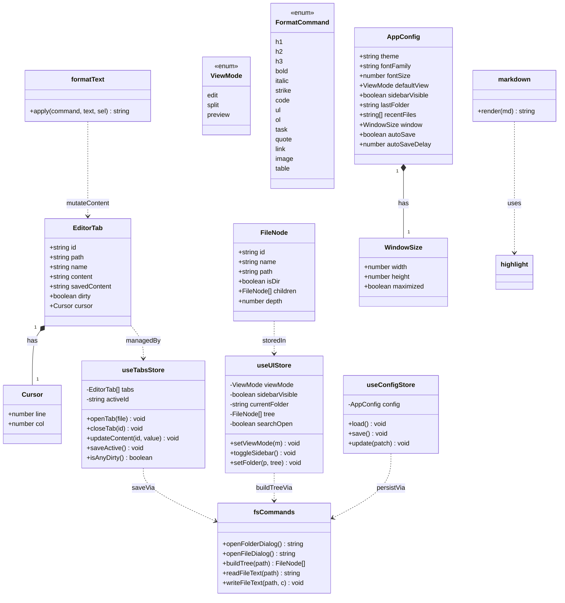
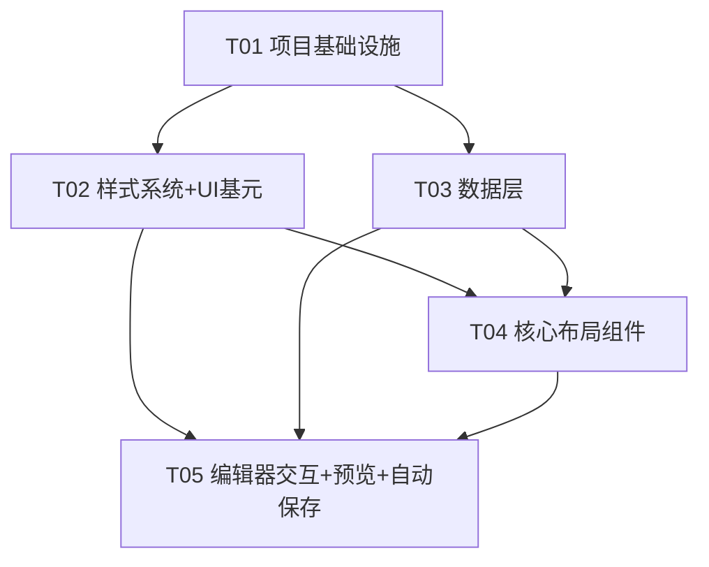

> ⚠️ **文档状态（2026-08-10）**：本文件是 PureMark 的 **v1 架构设计基线**，记录"最初怎么设计"。其中**编辑器内核描述已过时**（原文为受控 `<textarea>`，实际已升级为 CodeMirror 6）；视图模型也已重构为窗格级 `edit/live/preview` + 工作区级 `single/split`。架构分层与文件清单仍有参考价值。**当前唯一权威认知总览 = `docs/项目认知与现状总览.md`**，凡冲突以它为准。

# SoloMD / PureMark — 系统架构设计 + 任务分解（v1）

> 依据：`对齐规格_SoloMD.md`（需求与样式已对齐）。本文件是**唯一实现依据**。
> 技术栈：pnpm + Tauri 2.x（Rust 壳 + 前端 WebView），目标 Windows `.exe`。
> 命名说明：spec 文件标题为 pureMD、team-lead 简报称 SoloMD、spec Q1 决议为 **PureMark**。本文档以 **Q1 决议 PureMark** 为 `productName`，并抽成常量便于改名（详见 §8 待明确 #1）。

---

## Part A：系统架构设计

### 1. 实现方案与技术选型（明确结论）

#### 1.1 前端框架 → **React 18 + TypeScript**
- 理由：① Tauri 2.x 官方 `create-tauri-app` 首选模板，社区示例最多、踩坑最少；② 生态最全——编辑器、marked、lucide-react 均有成熟绑定；③ 组件化天然契合「壳 / 侧栏 / 标签 / 工具栏 / 状态栏」分层 UI；④ 运行期内存差异相对 markdown DOM 体积可忽略，我们用轻量库（marked 非 markdown-it）抵消。Vue/Svelte 亦可，但团队效率与可维护性选 React。

#### 1.2 Markdown 渲染 → **marked**（非 markdown-it）
- 理由（对齐 Q9「轻量、内存极小」）：marked 同步、体积小、API 简单；本项目仅需 GFM（标题/列表/引用/任务列表/表格/删除线）+ kbd + code card，marked 开 `gfm:true` 即覆盖，无需 markdown-it 的庞大插件体系。渲染在 `input` 时同步进行，足够快。

#### 1.3 代码高亮 → **highlight.js**（非 Shiki）
- 理由：Shiki 依赖 WASM + TextMate 全量语法，内存/启动开销大，违背 Q9。highlight.js 按需注册常用语言（js/ts/tsx/python/bash/json/css/html/rust/markdown），体积可控。高亮在预览渲染后对每个 `<pre><code>` 调用 `hljs.highlightElement`。

#### 1.4 状态管理 → **Zustand**（非 Redux/Context）
- 理由：极轻、无 Provider 包裹、按需订阅避免多余重渲染；三个 store 即可：`useTabsStore`（多标签）、`useUIStore`（视图模式/侧栏/文件夹/搜索）、`useConfigStore`（持久化偏好）。

#### 1.5 编辑器内核 → **受控 `<textarea>`**（非 CodeMirror/Monaco）
- 理由：极简 + 轻量。源码视图用原生 textarea，光标 Ln/Col 由 `selectionStart` 计算；工具栏格式化通过文本选区包裹/插入实现；实时预览由 marked 渲染。不引入重型编辑器框架，契合内存极小诉求。（如需行号/源码高亮可 P2 再加。）

#### 1.6 Tailwind v4 + `@theme inline` 落地 token
- 方案：在 `styles/theme.css` 中先定义原始变量 `:root { --primary: #0ea5e9; ... }`，再用 `@theme inline` 把它们映射成 Tailwind 设计 token（`--color-primary: var(--primary)` 等），从而生成 `bg-primary`/`text-foreground`/`border-border`/`rounded-md`/`shadow-2`/`font-mono` 等工具类。布局尺寸（侧栏 248px 等）**不进 @theme**，单独定义为普通 CSS 变量（`--layout-sidebar` 等）经 `w-[var(--layout-sidebar)]` 引用，禁止硬编码数字。深色模式（P2）只需在 `[data-theme="dark"]` 覆盖 `:root` 原始变量，工具类自动跟随——满足 Q4「深色模式通过主题实现」。

#### 1.7 Tauri 2.x 关键能力
| 能力 | 实现 |
|---|---|
| 自定义标题栏 | `tauri.conf.json` → `app.windows[0].decorations:false`；自建 52px Header；Header 加 `data-tauri-drag-region` 拖拽；三键调用 `@tauri-apps/api/window` 的 `getCurrentWindow().minimize()/.toggleMaximize()/.close()` |
| 打开文件/文件夹 | `@tauri-apps/plugin-dialog` 的 `open({directory:true})` / `open({filters:[{name:'Markdown',extensions:['md','markdown']}]})` |
| 文件读写 | `@tauri-apps/plugin-fs` 的 `readTextFile` / `writeTextFile`；文件树由 **1 个自定义 Rust 命令 `build_tree`**（递归 std::fs，仅保留 .md + 含 md 的目录）返回 |
| 配置/草稿持久化 | `@tauri-apps/plugin-store`，文件 `settings.json`，key：`config` / `drafts` / `window-state` |
| 未保存保护 | `getCurrentWindow().onCloseRequested` 拦截；若有 dirty 则 `e.preventDefault()` 并弹 `dialog.ask` 确认；标签关闭同理前端确认 |
| 窗口尺寸 | 初始 1500×830（Q5），最小 860×560；默认不最大化（Q5 未勾选最大化，见 §8 #4）；关闭前记忆尺寸到 `window-state` |

---

### 2. 文件列表及相对路径

```
prueMd/  (Tauri 工程根，pnpm workspace)
├── package.json                      # 前端依赖与脚本（dev/build/tauri）
├── vite.config.ts                    # Vite + @vitejs/plugin-react + @tailwindcss/vite
├── tsconfig.json / tsconfig.node.json
├── index.html                        # 前端入口 HTML
├── src/                              # ============ 前端 WebView ============
│   ├── main.tsx                      # React 挂载 <App/>
│   ├── App.tsx                       # 根组件：加载配置 → 渲染 <AppShell/>，注册全局快捷键/关闭拦截
│   ├── vite-env.d.ts
│   ├── styles/
│   │   ├── theme.css                 # Tailwind v4 @import + :root 原始 token + @theme inline 映射 + dark 覆盖
│   │   ├── layout.css                # 布局尺寸变量（--layout-sidebar/header/toolbar/statusbar）+ 全局 reset
│   │   └── preview.css               # 预览区 Markdown 渲染样式（h1–h4/p/kbd/code card/引用/列表/表格）
│   ├── types/
│   │   └── index.ts                  # 核心类型：FileNode / EditorTab / Cursor / AppConfig / ViewMode / FormatCommand / EditorStats
│   ├── store/
│   │   ├── useTabsStore.ts           # 多标签：tabs[], activeId, openTab/closeTab/updateContent/saveActive/isAnyDirty
│   │   ├── useUIStore.ts             # 视图模式/侧栏显隐/当前文件夹+树/搜索面板开关
│   │   └── useConfigStore.ts         # AppConfig 加载/保存/局部更新（持久化到 store 插件）
│   ├── lib/
│   │   ├── tauri.ts                  # 封装 Tauri API：window 控制、dialog、store 初始化与读写
│   │   ├── markdown.ts               # marked 配置 + render(md)->html（允许 raw HTML 以支撑 <kbd>）
│   │   ├── highlight.ts              # highlight.js 初始化 + 按需注册语言
│   │   ├── fileTree.ts               # （备用）前端侧 readDir 结果→FileNode 树；主路径用 Rust build_tree
│   │   └── format.ts                 # 工具栏格式化纯文本操作：wrapSelection/insertBlock（粗体/标题/列表…）
│   ├── commands/
│   │   └── fsCommands.ts             # 前端↔Rust 薄封装：openFolderDialog/openFileDialog/buildTree/readFileText/writeFileText
│   ├── components/
│   │   ├── AppShell.tsx              # 整体布局：Header + (Sidebar|Workspace) + StatusBar
│   │   ├── Header/
│   │   │   ├── Header.tsx            # 52px 顶栏：logo+产品名（左） + WindowControls（右），带 drag-region
│   │   │   └── WindowControls.tsx    # 最小化/最大化/关闭 三键
│   │   ├── Sidebar/
│   │   │   ├── Sidebar.tsx           # 248px 侧栏容器 + EXPLORER 头 + 折叠按钮
│   │   │   ├── OpenFolderButton.tsx  # 「Open Folder」全宽按钮
│   │   │   └── FileTree.tsx          # 递归渲染 FileNode，点击打开标签
│   │   ├── Workspace/
│   │   │   ├── Workspace.tsx         # 工作区容器：TabBar + EditorCard
│   │   │   ├── TabBar.tsx            # 多标签条：新建/标签/关闭（脏标记圆点）
│   │   │   ├── EditorCard.tsx        # 编辑卡片：Toolbar + 内容区（按 viewMode 切换）
│   │   │   ├── Toolbar.tsx           # 46px 格式化工具栏 12 按钮 + ViewSwitcher + 搜索/设置
│   │   │   ├── EditorPane.tsx        # <textarea> 源码编辑（edit / split 左）
│   │   │   ├── PreviewPane.tsx       # marked 渲染预览（split 右 / preview）
│   │   │   └── ViewSwitcher.tsx      # 编辑/分屏/预览 分段控件
│   │   ├── StatusBar/
│   │   │   └── StatusBar.tsx         # 34px 状态栏：Ln/Col/行数/词数/字数/编码/语言
│   │   ├── dialogs/
│   │   │   ├── UnsavedDialog.tsx     # 未保存确认（封装 dialog.ask）
│   │   │   └── SearchPanel.tsx       # 查找面板（v1 实现基础查找：高亮+跳转，不含替换）
│   │   └── ui/
│   │       ├── Icon.tsx              # lucide 图标统一封装（按需引入）
│   │       └── Button.tsx            # 30×30 圆角图标按钮基元
│   └── hooks/
│       ├── useEditorStats.ts         # 由 textarea value+selection 计算 Ln/Col/行数/词数/字数
│       ├── useHotkeys.ts             # Ctrl+S 保存、Ctrl+W 关标签、Ctrl+N 新建
│       └── useAutoSave.ts            # 防抖自动保存草稿到 store（Q8，autoSave 开关）
└── src-tauri/                        # ============ Rust 壳 ============
    ├── Cargo.toml                    # tauri + 三个插件 + serde
    ├── build.rs                      # tauri-build
    ├── tauri.conf.json               # 窗口配置（decorations:false, 1500×830, min 860×560）+ bundle
    ├── capabilities/
    │   └── default.json              # 权限：core/dialog/fs/store + fs scope "**" + window 拖拽/控制/关闭拦截
    ├── icons/                        # 应用图标（png/ico/icns）
    └── src/
        └── main.rs                   # Builder 注册插件 + 唯一自定义命令 build_tree
```

---

### 3. 数据结构与接口

#### 3.1 核心 TS 类型（`src/types/index.ts`）
```ts
export type ViewMode = 'edit' | 'split' | 'preview';

export interface FileNode {
  id: string;          // 用绝对路径作唯一 id
  name: string;        // 文件/目录名
  path: string;        // 绝对路径（Tauri）
  isDir: boolean;
  children?: FileNode[];// 仅目录有
  depth: number;       // 树层级，用于缩进
}

export interface Cursor { line: number; col: number; } // 1-based

export interface EditorTab {
  id: string;          // uuid
  path: string;        // 绝对路径
  name: string;        // 文件名
  content: string;     // 内存当前内容
  savedContent: string;// 上次持久化内容（dirty 比对基准）
  dirty: boolean;      // content !== savedContent
  cursor: Cursor;
}

export interface WindowSize { width: number; height: number; maximized: boolean; }

export interface AppConfig {
  theme: 'light' | 'dark';     // 默认 'light'
  fontFamily: string;
  fontSize: number;            // px
  defaultView: ViewMode;       // 默认 'edit'（Q7）
  sidebarVisible: boolean;
  lastFolder: string | null;
  recentFiles: string[];
  window: WindowSize;
  autoSave: boolean;           // Q8 默认 true
  autoSaveDelay: number;       // ms，默认 800
}

export type FormatCommand =
  | 'h1' | 'h2' | 'h3'
  | 'bold' | 'italic' | 'strike' | 'code'
  | 'ul' | 'ol' | 'task'
  | 'quote' | 'link' | 'image' | 'table';

export interface EditorStats {
  line: number; col: number; lines: number; words: number; chars: number;
}
```

#### 3.2 Store 接口（Zustand）
```ts
// useTabsStore
interface TabsState {
  tabs: EditorTab[]; activeId: string | null;
  openTab(file: { path: string; name: string; content: string }): void;
  closeTab(id: string): void;            // 关闭前由调用方做 dirty 确认
  updateContent(id: string, value: string): void;
  setCursor(id: string, c: Cursor): void;
  saveActive(): Promise<void>;           // 写回原文件并清 dirty
  saveTab(id: string): Promise<void>;
  isAnyDirty(): boolean;
}

// useUIStore
interface UIState {
  viewMode: ViewMode;            // 全局单例，影响当前激活标签
  sidebarVisible: boolean;
  currentFolder: string | null;
  tree: FileNode[];
  searchOpen: boolean;
  setViewMode(m: ViewMode): void;
  toggleSidebar(): void;
  setFolder(path: string, tree: FileNode[]): void;
  setSearchOpen(b: boolean): void;
}

// useConfigStore
interface ConfigState {
  config: AppConfig;
  load(): Promise<void>;
  save(): Promise<void>;
  update(patch: Partial<AppConfig>): void;
}
```

#### 3.3 前端 ↔ Rust 命令接口（`src/commands/fsCommands.ts` 薄封装）
```ts
openFolderDialog(): Promise<string | null>   // dialog.open({ directory: true })
openFileDialog(): Promise<string | null>     // dialog.open({ filters:[{name:'Markdown',extensions:['md','markdown']}] })
buildTree(path: string): Promise<FileNode[]> // invoke('build_tree', { path })
readFileText(path: string): Promise<string>  // fs.readTextFile
writeFileText(path: string, content: string): Promise<void> // fs.writeTextFile
```
> Rust 侧仅 1 个自定义命令 `build_tree(root: String) -> Vec<FileNode>`（递归 `std::fs::read_dir`，忽略隐藏项，仅保留 .md/.markdown 文件与含 md 的目录，目录优先、同层按名称排序）。其余均走官方插件，无需 invoke。

#### 3.4 类图（详见 `docs/class-diagram.mermaid`）


---

### 4. 程序调用流程（主链路）

> 打开文件夹 → 构建文件树 → 打开文件 → 编辑 → 切换视图 → 保存。详见 `docs/sequence-diagram.mermaid`。

```mermaid
sequenceDiagram
    actor User
    participant UI as Sidebar/UI
    participant Store as useTabsStore/useUIStore
    participant Cmd as fsCommands
    participant Rust as Rust backend
    participant FS as File System
    participant MD as markdown+highlight
    participant Edit as EditorPane(textarea)
    participant Preview as PreviewPane

    Note over User,Rust: 1) 打开文件夹
    User->>UI: 点击 "Open Folder"
    UI->>Cmd: openFolderDialog()
    Cmd->>Rust: dialog.open({directory:true})
    Rust->>User: 选择文件夹
    Rust-->>Cmd: folderPath
    Cmd->>Rust: invoke('build_tree',{path:folderPath})
    Rust->>FS: std::fs::read_dir 递归
    FS-->>Rust: 条目列表
    Rust-->>Cmd: FileNode[] (仅 .md + 含 md 目录)
    Cmd->>Store: useUIStore.setFolder(folderPath, tree)
    UI->>Store: 订阅并渲染 FileTree

    Note over User,Rust: 2) 打开文件（点击树节点）
    User->>UI: 点击 .md 文件
    UI->>Cmd: readFileText(path)
    Cmd->>Rust: fs.readTextFile(path)
    Rust->>FS: 读文本
    FS-->>Rust: content
    Rust-->>Cmd: content
    Cmd->>Store: useTabsStore.openTab({path,name,content})
    Store->>UI: 新增/激活 Tab

    Note over User,Rust: 3) 编辑（实时）
    User->>Edit: 输入文本
    Edit->>Store: updateContent(activeId, value)
    Store->>Store: dirty = content!==savedContent
    Edit->>MD: render(value)
    MD->>Preview: HTML + hljs 高亮
    Preview-->>UI: 渲染预览（split/preview 视图）

    Note over User,Rust: 4) 切换视图
    User->>UI: 点击 编辑/分屏/预览
    UI->>Store: useUIStore.setViewMode(mode)
    UI->>UI: 重排 EditorPane / PreviewPane

    Note over User,Rust: 5) 保存 (Ctrl+S)
    User->>UI: Ctrl+S
    UI->>Store: useTabsStore.saveActive()
    Store->>Cmd: writeFileText(path, content)
    Cmd->>Rust: fs.writeTextFile(path, content)
    Rust->>FS: 写回原文件
    Rust-->>Cmd: ok
    Cmd->>Store: savedContent=content; dirty=false
    UI->>UI: 清除标签脏标记 / 状态栏更新
```

---

### 5. 待明确事项（已尽量自行决断，少量需确认）

1. **产品名不一致**：spec 文件标题/文件夹 → `pureMD`；team-lead 简报 → `SoloMD`；spec Q1 决议 → **`PureMark`**。已采用 Q1 决议 `PureMark` 写入 `productName`/`identifier`，并集中为常量便于改名。**最终拍板产品名为pureMark**

2. **默认视图冲突**：team-lead 简报写「默认分屏」；spec Q7 决议「默认为编辑」。**已采用 spec 决议 = `edit`**。确认默认为编辑.
3. **搜索/设置 v1 范围冲突**：team-lead 说 v1 占位；spec Q6 决议「实现查找」。**已决：v1 实现基础「查找」（SearchPanel，高亮+跳转，不含替换）；设置按钮打开轻量偏好面板（字体/字号/默认视图/自动保存开关），功能最小化。** 请在意。
4. **窗口默认最大化**：Q5 给 1500×830 但未勾「默认最大化」。**已决：默认不最大化，启动 1500×830，记忆尺寸到 `window-state`。**
5. **自动保存草稿存储**：Q8 需要自动保存。**已决：用 store 插件 `settings.json` 的 `drafts` key（路径→内容）存内存草稿防丢失；仅 Ctrl+S 写回原文件，草稿与原文分离。**
6. **Markdown HTML 安全**：本地优先、单用户、文件为用户自有；marked 默认不过滤 HTML（支撑 `<kbd>`）。**v1 不做 sanitize 以保功能**；若顾虑后续可加 DOMPurify（会增加体积，略违轻量）。建议保持不过滤。
7. **代码高亮语言包**：highlight.js 全量较大。**已决：仅注册常用语言（js/ts/tsx/python/bash/json/css/html/rust/markdown）控体积。**
8. **fs 权限范围**：为实现「打开任意文件夹/文件」，fs 能力 scope 设为 `**`（允许任意路径读写）。本地单用户工具可接受；如需更严可改为 dialog 选定后动态授权。已按宽松实现。

---

## Part B：任务分解

### 6. 依赖包列表

```text
# 前端 package.json (dependencies)
- react@^18.3.1                # UI 框架
- react-dom@^18.3.1
- zustand@^4.5.5               # 轻量状态管理（多标签/UI/配置）
- marked@^12.0.2               # Markdown 渲染（轻量，按 Q9 选 marked）
- highlight.js@^11.10.0        # 代码高亮（轻量，按 Q9 选 hljs）
- lucide-react@^0.439.0        # 线性图标
- @tauri-apps/api@^2.1.0       # Tauri 前端 API（window/dialog/event）
- @tauri-apps/plugin-dialog@^2.0.0  # 文件/文件夹选择
- @tauri-apps/plugin-fs@^2.0.0      # 文件读写
- @tauri-apps/plugin-store@^2.0.0   # 配置/草稿持久化

# 前端 package.json (devDependencies)
- @tauri-apps/cli@^2.1.0       # tauri dev/build 命令
- vite@^5.4.0
- @vitejs/plugin-react@^4.3.1
- tailwindcss@^4.0.0           # v4 CSS-first 配置
- @tailwindcss/vite@^4.0.0     # Tailwind v4 Vite 插件（承载 @theme inline）
- typescript@^5.5.4
- @types/react@^18.3.5
- @types/react-dom@^18.3.0

# Rust src-tauri/Cargo.toml
- tauri = "2"
- tauri-build = "2"            # [build-dependencies]
- tauri-plugin-dialog = "2"
- tauri-plugin-fs = "2"
- tauri-plugin-store = "2"
- serde = { version = "1", features = ["derive"] }
- serde_json = "1"
```

### 7. 任务列表（按依赖顺序排列，≤5 个模块任务）

| Task | 名称 | 源文件（含于文件列表） | 依赖 | 优先级 |
|---|---|---|---|---|
| **T01** | 项目基础设施（Tauri 配置 + 前端脚手架 + 依赖） | `package.json`, `vite.config.ts`, `tsconfig.json`, `index.html`, `src/main.tsx`, `src/App.tsx`, `src-tauri/Cargo.toml`, `src-tauri/build.rs`, `src-tauri/tauri.conf.json`, `src-tauri/capabilities/default.json`, `src-tauri/src/main.rs`, `src-tauri/icons/` | — | P0 |
| **T02** | 设计 Token 与样式系统 + UI 基元 | `src/styles/theme.css`, `src/styles/layout.css`, `src/styles/preview.css`, `src/components/ui/Icon.tsx`, `src/components/ui/Button.tsx` | T01 | P0 |
| **T03** | 类型定义 + 状态管理 + Tauri 桥接（数据层） | `src/types/index.ts`, `src/store/useTabsStore.ts`, `src/store/useUIStore.ts`, `src/store/useConfigStore.ts`, `src/lib/tauri.ts`, `src/commands/fsCommands.ts`, `src/lib/fileTree.ts` | T01 | P0 |
| **T04** | 核心布局组件（外壳/顶栏/侧栏/状态栏/工作区容器） | `src/components/AppShell.tsx`, `src/components/Header/Header.tsx`, `src/components/Header/WindowControls.tsx`, `src/components/Sidebar/Sidebar.tsx`, `src/components/Sidebar/OpenFolderButton.tsx`, `src/components/Sidebar/FileTree.tsx`, `src/components/Workspace/Workspace.tsx`, `src/components/Workspace/TabBar.tsx`, `src/components/StatusBar/StatusBar.tsx` | T02, T03 | P0 |
| **T05** | 编辑器交互 + 预览渲染 + 格式化工具栏 + 自动保存 + 集成 | `src/components/Workspace/EditorCard.tsx`, `src/components/Workspace/Toolbar.tsx`, `src/components/Workspace/EditorPane.tsx`, `src/components/Workspace/PreviewPane.tsx`, `src/components/Workspace/ViewSwitcher.tsx`, `src/lib/markdown.ts`, `src/lib/highlight.ts`, `src/lib/format.ts`, `src/hooks/useEditorStats.ts`, `src/hooks/useHotkeys.ts`, `src/hooks/useAutoSave.ts`, `src/components/dialogs/UnsavedDialog.tsx`, `src/components/dialogs/SearchPanel.tsx` | T02, T03, T04 | P0 |

> 依赖说明：T02 与 T03 在 T01 后可并行；T04 依赖 T02（样式）+ T03（数据）；T05 依赖前三。全部为 P0——v1 必备。

### 8. 共享知识（跨文件约定）

- **设计 token 命名**：`@theme inline` 中颜色以 `--color-*` 命名 → 工具类 `bg-primary`/`text-foreground`/`border-border`/`text-muted`；圆角 `--radius-sm/md/lg` → `rounded-sm/md/lg`；阴影 `--shadow-1/2/3` → `shadow-1/2/3`；字体 `--font-sans`/`--font-mono` → `font-sans`/`font-mono`。原始值定义在 `:root`（便于 dark 覆盖）。
- **布局尺寸变量**（不进 @theme）：`--layout-sidebar:248px` / `--layout-header:52px` / `--layout-toolbar:46px` / `--layout-statusbar:34px`，经 `w-[var(--layout-sidebar)]` 等引用，**禁止硬编码数字**。
- **图标约定**：统一 `lucide-react`，经 `components/ui/Icon.tsx` 按需封装；窗口三键 `Minus`/`Square`/`X`，侧栏 `FolderOpen`/`PanelLeftClose`，文件 `FileText`，logo `PenTool`；禁止混用其他图标集。
- **store key 约定**：`@tauri-apps/plugin-store` 文件 `settings.json`，key：`config`（AppConfig）、`drafts`（路径→内容草稿映射）、`window-state`（尺寸/最大化）。
- **路径/编码约定**：所有路径用 Tauri 返回的绝对路径字符串；文件一律 UTF-8 读写；`dirty = content !== savedContent`；内容在内存以 `string` 保存。
- **视图模式**：全局单例存 `useUIStore.viewMode`（非 per-tab），切换即时影响当前激活标签。
- **状态栏统计**：由 `useEditorStats` 从 textarea 的 `value`+`selectionStart` 计算，统一 1-based（行=换行数+1，列=当前行内偏移+1）。
- **脏标记 UI**：标签名前小圆点表示 dirty；状态栏/关闭拦截读取 `useTabsStore.isAnyDirty()`。

### 9. 任务依赖图


